UNIVERSITY OF GHANA

COLLEGE OF BASIC AND APPLIED SCIENCES

{width="1.7in"}


**KBLOG: A SOCIAL PUBLISHING PLATFORM WITH PERSONALIZED FEED RECOMMENDATION, EDITORIAL REVIEW WORKFLOW AND TRANSPARENT MACHINE MODERATION**

BY

**YAKUBU ABDUL RASHID (11116448)**


```{=openxml}
<w:p><w:r><w:br w:type="page"/></w:r></w:p>
```


A PROJECT SUBMITTED TO THE DEPARTMENT OF COMPUTER SCIENCE IN PARTIAL FULFILMENT OF THE REQUIREMENTS FOR THE AWARD OF THE DEGREE OF BACHELOR OF SCIENCE IN COMPUTER SCIENCE

DEPARTMENT OF COMPUTER SCIENCE

**OCTOBER, 2026**


```{=openxml}
<w:p><w:r><w:br w:type="page"/></w:r></w:p>
```


# DECLARATION

**STUDENT**

Name: YAKUBU ABDUL RASHID     Signature: ____________     Date: 9th October 2026

**SUPERVISOR**

Name: MARK ATTAH MENSAH     Signature: ____________     Date: 9th October 2026


```{=openxml}
<w:p><w:r><w:br w:type="page"/></w:r></w:p>
```


# ABSTRACT

**Context:** Online publishing is dominated by platforms that either offer distribution without ownership, or ownership without discovery and governance. Communities that wish to host their own long-form discourse must assemble it from mismatched tools.

**Aim:** This project designed, implemented and evaluated KBlog, a community-scale social publishing platform integrating three capabilities absent as a combination in existing systems: a personalised "For You" feed adapted from Twitter/X's published recommendation architecture; an explicit editorial review state machine; and an automated content-moderation engine that is fully auditable and operates under human authority.

**Method:** Following the waterfall lifecycle, requirements were specified and the system designed in UML and data-flow models, then implemented as a React/Redux progressive web application backed by a stateless Express API and MongoDB Atlas, and evaluated through executed functional test cases, measured moderation outputs, API timing samples and bundle analysis on a seeded dataset of 110 published stories.

**Result:** All high-priority requirements passed their tests. The full recommendation pipeline executed in ~15 ms per request. Moderation testing quantified both correct severity discrimination and a genuine false negative (paraphrased hate speech scoring CLEAN), empirically validating the hybrid machine-triage/human-decision design.

**Conclusion:** Production feed architecture transfers meaningfully to community scale even when the learned ranking model is replaced by a transparent heuristic; and lexical moderation is defensible precisely because its measured blind spots are caught by the human editorial gate it feeds.

**Keywords:** social publishing; recommender systems; content moderation; editorial workflow; progressive web application; MERN stack


```{=openxml}
<w:p><w:r><w:br w:type="page"/></w:r></w:p>
```


# DEDICATION

This work is dedicated to my family, whose constant support and encouragement made this project possible, and to every student who writes and hopes to be read.


```{=openxml}
<w:p><w:r><w:br w:type="page"/></w:r></w:p>
```


# ACKNOWLEDGEMENT

I thank God for the strength to complete this work.

I am deeply grateful to my supervisor, **Mr. Mark Attah Mensah**, for his guidance, patience, and constructive feedback throughout this project.

My thanks go to the lecturers and staff of the Department of Computer Science for the knowledge that made this project possible, and to my friends and colleagues who tested the platform and offered honest criticism.

Finally, I thank my family for their unwavering support throughout my studies.


```{=openxml}
<w:p><w:r><w:br w:type="page"/></w:r></w:p>
```


[[TOC]]


```{=openxml}
<w:p><w:r><w:br w:type="page"/></w:r></w:p>
```


[[LOF]]


```{=openxml}
<w:p><w:r><w:br w:type="page"/></w:r></w:p>
```


[[LOT]]


```{=openxml}
<w:p><w:r><w:br w:type="page"/></w:r></w:p>
```


# LIST OF ABBREVIATIONS

| Abbreviation | Meaning |
|---|---|
| API | Application Programming Interface |
| CDN | Content Delivery Network |
| CMS | Content Management System |
| CSS | Cascading Style Sheets |
| DFD | Data Flow Diagram |
| ER | Entity–Relationship |
| HTML | HyperText Markup Language |
| IA | Information Architecture |
| JWT | JSON Web Token |
| MERN | MongoDB, Express, React, Node.js |
| NFR | Non-Functional Requirement |
| ODM | Object Document Mapper |
| PWA | Progressive Web Application |
| RBAC | Role-Based Access Control |
| REST | Representational State Transfer |
| SPA | Single Page Application |
| SUS | System Usability Scale |
| TOC | Table of Contents |
| UML | Unified Modeling Language |
| URL | Uniform Resource Locator |


```{=openxml}
<w:p><w:r><w:br w:type="page"/></w:r></w:p>
```


# CHAPTER ONE: INTRODUCTION

## 1.1 Introduction

This dissertation reports the design, implementation and evaluation of **KBlog**, a full-stack social publishing platform. Key terms used throughout: a *social publishing platform* is a web application in which users author long-form content and distribute it through social mechanisms — follows, feeds, likes, comments, reposts; an *editorial workflow* is the set of states and review decisions a piece of content passes through before publication; a *recommendation pipeline* is the staged software process that selects and ranks feed items for a user; *content moderation* is the evaluation of user-generated content against safety policy, here performed by an automated lexical engine subject to human review.

**Key terms.** *Story*: the unit of publication — a titled, categorised piece with abstract, rich-text body, optional cover image, and computed read time. *Draft*: a story not yet submitted, invisible to all but its author. *Editorial review*: the human gate that transitions a pending submission to published or revisions-requested. *Machine moderation*: the automated safety scan that grades content into CLEAN/MILD/FLAGGED/CRITICAL and attaches an inspectable record. *For-You feed*: the personalised story ranking produced by the recommendation pipeline. *In-network*: content from authors the reader follows; *out-of-network*: all else. *Interaction*: a like, bookmark, or repost — one document per (user, story, type). *Reviewer/Admin*: privileged roles that gate publication and manage members.

## 1.2 Background

Publishing on the web has passed through three broad phases: personal homepages and blogs (open but undistributed), centralised platforms such as Medium (distributed but closed and unowned), and subscription newsletters such as Substack (owned but weakly networked) (Blood, 2000; Rosen, 2006). Each phase traded one property for another — openness, reach, or control. Communities and institutions that want to host their own long-form discourse — a university cohort, a professional community — currently assemble it from mismatched parts: a CMS for writing, social media for distribution, and manual processes for quality control.

Two recent developments make a better synthesis feasible for a project of this scale. First, Twitter/X's release of its recommendation algorithm (March 2023) made the internal architecture of a production feed — candidate sourcing, feature hydration, multi-action scoring, heuristic filtering — publicly legible for the first time, providing a reference design. Second, the content moderation literature has matured into a consensus position: automated classifiers should *triage* and *surface*, while accountable humans retain decision authority (Gorwa, Binns & Katzenbach, 2020; Gillespie, 2018). KBlog applies both developments to the publishing-platform problem.

Students produce substantial written work — essays, reflections, project write-ups, creative pieces — but that work lives in three dead ends: submitted to a course LMS and seen only by the marker; posted to a personal blog nobody reads; or posted to a mainstream platform where it competes with the open web under rules the institution does not set. The result is that a university community has no shared venue where student writing is visible, discoverable, reviewed, and governed on the community's own terms.

Digital publishing has bifurcated into two unsatisfying extremes for student writers. On one side, self-hosted blogs (WordPress, Ghost) give ownership but no audience: a student who publishes to a personal blog reaches nobody without separately building a social following — the cold-start problem. On the other, mainstream social platforms (Medium, LinkedIn, X) give distribution but surrender control: opaque recommendation decides visibility, opaque moderation decides acceptability, and the institution has no governance over how its students' work circulates. KBlog occupies the gap between them — a shared, institution-governed platform where distribution is algorithmic but inspectable, and publication carries an editorial quality signal.

## 1.3 Problem Statement

Community-scale publishing lacks a platform that combines four properties simultaneously: (a) a personalised, ranked reading feed rather than a reverse-chronological list; (b) an explicit editorial quality workflow with reviewer decisions and notes; (c) automated content safety that is transparent and auditable rather than a black-box vendor service; and (d) deployment as an ownable, installable web application rather than tenancy on a commercial platform. Existing systems each satisfy a subset (§2.3); no accessible system satisfies all four. The problem this project addresses is therefore an *integration* problem: to design and build, at community scale, a platform that demonstrates all four properties working as one coherent system — and to evaluate honestly where small-scale approximations of industrial techniques succeed and fail.

Existing platforms resolve each of these deficits individually but none resolves them together for a bounded academic community. The gap is therefore integrative rather than novel in any single mechanism: combine community-scale recommendation (solving cold-start discovery), editorial review (solving the quality signal), and inspectable moderation (solving governance accountability) in one institution-governed system — and demonstrate that this combination is achievable at student scale with mainstream tooling.

## 1.4 Research Questions

1. Can the staged feed architecture of production social platforms (candidate sourcing → filtering → multi-action scoring → diversity re-ranking) be meaningfully instantiated at community scale without machine-learning infrastructure?
2. Can an auditable lexical moderation engine, embedded in an editorial state machine, provide a defensible hybrid governance model — and where does it fail?
3. Do the two mechanisms integrate into a coherent, usable, deployable publishing platform satisfying a realistic requirements set?

The problem decomposes into three concrete deficits observed in existing platforms, each developed against the literature in Chapter Two:

1. **Distribution without discovery.** Existing blog platforms publish but do not recommend; a new writer's work is invisible without an external audience. No mechanism exists to connect writing to interested readers inside the community.
2. **Moderation without accountability.** Platforms moderate opaquely at scale; decisions cannot be inspected, explained, or appealed by the community they govern. For an academic community this is indefensible — moderation must be explainable.
3. **Publishing without quality signal.** Open publishing treats all content identically; there is no editorial distinction between a draft and a reviewed piece, so readers cannot calibrate trust and writers receive no structured feedback.

## 1.5 Aim and Objectives

**Aim.** To design, implement and evaluate KBlog: a community-scale social publishing platform integrating a personalised recommendation feed, an editorial review workflow, and transparent automated moderation.

**Specific objectives:**

1. To specify requirements and design the architecture, data model and behaviour of the platform (Ch. 3).
2. To implement the platform: React SPA + PWA client, Express REST API, MongoDB persistence, JWT security, media pipeline (Ch. 4).
3. To implement a personalised feed adapted from Twitter's published recommendation architecture (§3.8, §4.4).
4. To implement an auditable machine moderation engine integrated with a human editorial state machine (§3.9, §4.5).
5. To evaluate the implementation through executed test cases, measured moderation outputs and performance measurements (§4.7).

The aim is to *design, implement, and evaluate* a community-governed social publishing platform for student writing. The objectives decompose as: (1) implement the platform core — accounts, profiles, compose/draft/publish, feeds, engagement; (2) implement the editorial workflow — the six-state review machine with dual quality gates; (3) implement the personalised feed — the staged pipeline adapted from published industrial architecture; (4) implement transparent machine moderation — deterministic, inspectable, human-supervised; (5) implement the social layer — follows, likes, comments, reposts, bookmark folders; (6) secure the system — password hashing, stateless auth, role gates, input validation; and (7) evaluate the result — executed functional/security tests, measured moderation and performance evidence, and honest reporting of every failure found.

## 1.6 Scope and Limitations

The project covers the platform itself — authoring, social interactions, feeds, review, moderation, administration — deployed to commodity cloud services. It does **not** implement: real ML ranking (the heuristic scorer is a documented approximation); a vendor moderation API (deliberately avoided); monetisation (the Membership page is informational); or mobile-native apps (the PWA covers this scope). Evaluation uses a seeded dataset and scripted measurements, not live user telemetry; a questionnaire-based user study is identified as future work rather than simulated.

The scope is deliberately bounded on four axes. **Functional scope**: the system covers the publish-discuss-discover loop (write, review, distribute, interact, save); features outside that loop — notifications, messaging, monetisation — are out of scope by decision. **Technical scope**: the personalised feed is a heuristic realisation of a published industrial architecture, not a trained recommender; likewise the moderation engine is a deterministic lexicon, not a learned classifier — both are honest baseline implementations, and their measured limits are reported. **Evaluation scope**: testing is black-box and performance is measured on the seeded development corpus; no live user study was conducted (the instrument exists in Appendix D). **Deployment scope**: the system is validated on the documented local/cloud stack; enterprise hardening (rate-limiting at edge, audit-log retention, HA) is acknowledged as future work.

## 1.7 Methodology (Brief)

The project followed the Waterfall lifecycle — requirements, analysis, design, implementation, testing, deployment — justified in §3.1 by the well-understood domain, single-developer context and correctness-critical governance components. Design is documented in UML and data-flow models; evidence of correctness is produced by executing the running system rather than by assertion.

The waterfall lifecycle was applied as the organising structure — requirements → analysis → design → implementation → testing → deployment — with the pragmatic allowance Royce himself recommended: feedback between adjacent phases was permitted (pipeline parameters tuned during implementation folded back into design documentation), but no completed phase was re-opened wholesale. The phases and their concrete outputs are mapped in §3.1.

## 1.8 Organisation of the Dissertation

The document follows the five-chapter undergraduate structure: **Chapter One** states the problem and approach; **Chapter Two** reviews the literature and comparable systems and establishes the research gap; **Chapter Three** presents the methodology, requirements, and full design (architecture, data, behaviour, algorithms); **Chapter Four** documents the implementation and reports all measured evidence — including the failures; **Chapter Five** draws conclusions, states limitations, and sets the agenda for future work. Appendices carry the supporting evidence: screenshots, the complete API reference, test outputs, the evaluation instrument, deployment notes, and the full test matrix.

Chapter Two reviews the relevant literature and existing systems, establishing the research gap. Chapter Three presents the analysis and design: requirements, architecture, data model, UML/DFD models, and the design of the recommendation and moderation subsystems. Chapter Four documents the implementation and evaluates the system against the requirements using executed test cases, measured results and screenshots. Chapter Five summarises findings, states recommendations, and identifies future work. References follow APA style; appendices carry extended screenshots, the full API reference, extended test results and supporting technical material.


```{=openxml}
<w:p><w:r><w:br w:type="page"/></w:r></w:p>
```

# CHAPTER TWO: LITERATURE REVIEW

## 2.1 Introduction

This chapter reviews the literature and existing systems relevant to KBlog: a social publishing platform combining long-form article authoring, an editorial review workflow, automated content moderation, and a personalised recommendation feed. The review proceeds from the broad context of digital publishing (§2.2), through a comparative examination of existing platforms (§2.3), to the four technical literatures the system draws on — recommender systems (§2.4), content moderation (§2.5), web application architecture (§2.6), and editorial workflow models (§2.7) — concluding with the research gap (§2.8).

## 2.2 Digital Publishing and the Social Web

Blogging restructured publishing by removing editorial gatekeeping: anyone could publish to the web (Blood, 2000). Rosen (2006) framed the corollary — "the people formerly known as the audience" — describing how networked platforms collapsed the producer/consumer distinction. The result is the modern social publishing platform, in which the same artefact is simultaneously *content* (an article), *media object* (in a feed), and *social object* (liked, reposted, discussed).

This convergence carries two consequences examined throughout this review. First, **discovery becomes algorithmic**: when supply exceeds attention, feeds must be ranked, which makes the recommender — not the editor — the primary arbiter of visibility. Second, **governance becomes infrastructural**: decisions about what may be published are encoded in moderation pipelines rather than exercised solely by human editors (Gillespie, 2018). KBlog sits squarely in this lineage: it is a publishing system whose content surfaces are produced by a ranking pipeline and whose editorial policy is partially executed by a machine moderator.

Doctorow's (2023) critique of platform decay ("enshittification") provides a counterpoint and a motivation: platforms that intermediate readers and writers eventually extract value from both. A community- or institution-scale platform that owns its feed and its review process is one answer to that critique — and defines the operating context this project targets.

**Historical grounding.** Blood's contemporaneous account of the weblog form documents what made the genre distinctive: dated, frequent, personally-voiced posts rather than institutional pages — the social contract of writing-for-an-audience that later platforms inherited. Rosen's "people formerly known as the audience" captures the participatory inversion that blogging created: readers became writers, and the audience became a network. Both matter here because KBlog's premise — students as both authors and readers within one bounded community — is a direct descendant of that inversion, scaled down rather than up. Ware & Mabe's STM report situates the scholarly side: the centuries-old machinery of peer review that §2.7 borrows as its governance template, and the economics of editorial gatekeeping that platform-scale moderation later inverted.

**Evolution of digital publishing.** The web began as a publishing medium where authorship required technical skill: hand-written HTML, self-hosted servers, and personal domains. The early-2000s "weblog" wave (LiveJournal, Blogger, WordPress) removed the hosting barrier but retained an individual-blog mental model — each writer owned a separate site, and readers aggregated across sites via RSS. The mid-2000s social platforms inverted this: content moved into shared feeds under one roof, trading ownership for distribution. The 2010s consolidated this into platform-native publishing — Facebook Notes, LinkedIn Pulse, and especially Medium — where a canonical URL, uniform presentation, and algorithmic distribution replaced the personal site. The 2020s saw a partial reversal toward creator ownership (Substack's subscription newsletters, the Fediverse's ActivityPub federation), driven by creator monetisation and platform-governance concerns. KBlog sits in this trajectory deliberately: it keeps the shared-feed distribution model that makes discovery work for unknown student writers, while its editorial layer addresses the quality problem that pure social publishing creates.

**Social affordances.** Research on social media consistently finds that distribution is driven less by content quality than by social signals — follower graphs, engagement metrics, and recommender amplification. For student writing specifically, this creates a cold-start problem documented in recommender literature: a writer with zero followers has zero distribution regardless of merit. KBlog's design response — curated review before amplification, and a recommender that surfaces out-of-network interest matches — is examined in §2.4.

**Academic context.** In a university environment the stakes differ from commercial platforms: writing is tied to coursework, portfolios, and academic reputation; moderation must be explainable to be defensible; and governance must include accountable humans rather than being purely algorithmic. These constraints recur throughout the design chapters.

## 2.3 Review of Existing Systems

Following the project guideline, three comparable systems are reviewed for features, benefits and drawbacks, then compared directly against KBlog's scope.

**Platform economics.** Doctorow's critique of platform enclosure frames why self-governed publishing matters: platforms that control distribution extract the community's value and govern it on the operator's terms — the dynamic an institution-owned platform avoids entirely. Gillespie's "custodians of the internet" adds the moderation corollary: whoever operates the platform makes the speech rules, which is precisely why governance location is a design requirement rather than an implementation detail for this project.

### 2.3.1 Medium

Medium is the canonical social-publishing platform: a hosted editor, clean typography, a membership paywall funding a partner programme, and algorithmic plus editorial curation distributing stories. *Strengths:* excellent reading experience; distribution to an existing readership; simple authoring. *Drawbacks:* readers and writers are tenants on a closed platform — visibility is governed by an opaque ranking system; monetisation is limited and rule-bound; there is no institution-level editorial workflow, no deployable moderation transparency, and no way for a community (e.g., a university) to own its publishing space.

**Strengths.** Medium demonstrates the value of a uniform reading experience: every story receives professional typography regardless of the author's design skill; the curation programme shows that human review can coexist with algorithmic distribution; and the Partner Programme proves writers respond to engagement-linked incentives. Its rich-text editor set the baseline expectation for what a modern browser writing tool feels like — the same class of experience KBlog implements with React Quill.

**Limitations for the project context.** Medium's weaknesses are directly informative. Its recommendation logic is opaque — writers cannot learn why a story did or did not circulate, and curation decisions are appealable only informally. Its moderation operates at platform scale, making individual cases unreviewable by accountable humans. Its membership paywall contradicts open access to student writing. And as an external platform it gives the institution no governance over how student work is distributed or moderated. Each maps to a KBlog design decision: a published scoring rubric, human-visible machine moderation, no paywall, and institutional self-hosting.

### 2.3.2 Substack

Substack reoriented publishing around the email subscription: writers own their list, charge subscriptions, and publish newsletters with attached social features (Notes). *Strengths:* direct monetisation and genuine audience ownership. *Drawbacks:* the feed is email-centric and comparatively thin for community reading; discovery is weak for new writers (audiences must be imported or earned externally); there is no editorial review layer — entirely appropriate for newsletters, but unsuitable where an institution must vouch for published work.

### 2.3.3 WordPress.com / Ghost

Hosted CMS platforms offering maximal control: custom themes, plugins, memberships (Ghost) and self-hosting options. *Strengths:* ownership, extensibility, mature tooling. *Drawbacks:* they are site-management tools, not social networks — no built-in social graph, no personalised cross-author feed, no moderation pipeline; "discovery" is the administrator's problem. For a community of many writers they require substantial assembly.

**Strengths.** WordPress demonstrated — at roughly 40% of the web — that a self-hosted open platform can dominate publishing. Its plugin architecture, theme system, and mature editorial roles (author, editor, administrator) established the role taxonomy KBlog adopts. Ghost refined the model toward publishing performance: a modern stack, built-in newsletter, and membership support without plugins.

**Limitations for the project context.** Both are *site* tools, not *community* tools: each install is an island with its own audience problem, which recreates the cold-start barrier for every student blog. Their plugin ecosystems are a documented maintenance and security liability. Comment sections lack the social interactions — follows, reposts, personalised feeds — that drive discovery on modern platforms. They optimise for publishing to the open web rather than for a bounded community with shared governance.

**Two further community-oriented platforms** warrant inclusion because they sit closest to KBlog's model:

### 2.3.4 Dev.to (Forem)

Dev.to is an open-source community publishing platform (the Forem codebase) aimed at developers: articles sit in a shared chronological-plus-weighted feed, reputation accrues through badges and reactions, and moderation is community-assisted. Its relevance is the community model — a bounded professional audience with shared norms — and its feed is explicitly engagement-weighted rather than purely chronological, a simplified public version of what KBlog's pipeline does. Its limits for this context: no editorial pre-publication review layer, no institutional governance model, and a single-domain (developer) community that cannot be repurposed for a university's multi-disciplinary writing.

### 2.3.5 Hashnode

Hashnode hybridises the two poles: writers publish under their own domain/identity while content also circulates in a shared community feed. It demonstrates that personal ownership and shared distribution can coexist — the design tension KBlog resolves the other way (shared platform, institutional governance). Its commercial, developer-focused orientation and lack of institutional review workflow again leave the university use case unaddressed.

### 2.3.6 Community platforms

Discourse represents the *forum* branch of community software: threaded discussion, trust levels, moderation tooling, and member governance — the strongest open-source example of community moderation mechanics. Its limits are structural: the unit of content is the post-in-thread, not the authored article; there is no editorial publication workflow (posts are immediately live); and discovery is topic-list rather than algorithmic feed. WordPress.com adds hosted convenience to self-hosted flexibility but retains the site-island problem. The pattern across all of these is consistent: platforms optimise for *either* publishing *or* community governance — none reviewed combines authored publication, editorial review, personalised distribution, and inspectable moderation in one system.

### 2.3.7 Academic social networks

ResearchGate and Academia.edu are the closest institutional-adjacent precedents: both build a bounded academic identity layer (verified affiliation, publication lists) with a social graph and algorithmic feed. Their lesson is that domain identity raises both trust and content quality — a member's real academic reputation is attached to their writing. Their limits mirror the commercial platforms': feeds are opaque, governance is corporate rather than institutional, and neither offers a general writing-and-review workflow for undergraduates. KBlog borrows the verified-identity premise (institutional membership) while keeping governance and moderation inside the institution.

**Cross-cutting observations.** Four patterns emerge across all reviewed platforms and recur in KBlog's design: (1) *distribution is algorithmic everywhere* — every scaled platform abandoned pure chronology, because it fails the cold-start and signal-to-noise problems simultaneously; KBlog follows this consensus but keeps the mechanism inspectable. (2) *moderation converged on hybrid* — pure automation fails on context, pure human review fails on scale; the defensible configuration is machine triage under human authority, which is exactly KBlog's split. (3) *identity models differ by purpose* — pseudonymous consumer platforms optimise engagement, verified-identity platforms optimise trust; an academic community needs the latter. (4) *self-hosting equals governance* — only platforms the institution controls (self-hosted WordPress/Ghost/Discourse) give it real moderation and distribution authority, and those are precisely the ones lacking community discovery — the gap KBlog targets.

### 2.3.8 Comparison

**Table 2.1 — Feature comparison of existing platforms vs KBlog**

| Capability | Medium | Substack | WordPress/Ghost | **KBlog** |
|---|---|---|---|---|
| Long-form rich authoring | ✓ | ✓ | ✓ | ✓ (Quill editor) |
| Social graph (follow/feed) | partial | partial | ✗ | ✓ |
| Personalised ranked feed | ✓ (opaque) | weak | ✗ | ✓ (transparent, documented) |
| Editorial review workflow | curation only | ✗ | plugins | ✓ (state machine + review notes) |
| Automated moderation | platform-internal | platform-internal | plugins | ✓ (auditable lexical engine + human gate) |
| Community/institutional ownership | ✗ | partial | ✓ (self-host) | ✓ |
| Installable PWA | ✗ | ✗ | themes | ✓ |

### 2.3.9 Findings

The comparison exposes the space KBlog occupies: *social-feed personalisation + editorial governance + community ownership*. Medium offers the first two but is closed; Substack offers ownership without governance or discovery; CMSs offer ownership without the feed or workflow. No reviewed system combines all three — establishing the gap addressed in §2.8.

## 2.4 Recommender Systems

### 2.4.1 Foundations

Recommender systems were defined by Resnick and Varian (1997) as tools estimating user utility over items to support selection. The field's canonical techniques divide into *content-based* filtering (recommend items similar to what the user liked), *collaborative* filtering (recommend what similar users liked), and *hybrids* (Burke, 2002; Ricci, Rokach & Shapira, 2022). Matrix factorisation (Koren, Bell & Volinsky, 2009) became the reference collaborative method, while cold-start — recommendations for new users/items with no history — remains the field's persistent difficulty (Schein et al., 2002), one KBlog addresses by collecting declared interests during onboarding (FR-04).

The field's trajectory matters for scoping: early systems were *content-based* (match item features to a profile), the 1990s brought *collaborative filtering* (Resnick & Varian's foundational framing — recommend what similar users liked), and the Netflix Prize era established matrix factorisation (Koren, Bell & Volinsky) as the accuracy benchmark. The post-2016 industrial era moved to learned multi-stage pipelines. Three consequences for a student-scale build: (1) the *architecture* of these systems is public and reproducible even when the learned weights are not; (2) the practical constraints — latency, cold-start, diversity — are documented and can be designed for without training data; (3) evaluation honesty requires acknowledging the difference between a *trained* and a *heuristic* realisation of the same architecture.

**Cold-start** deserves specific attention because it is the dominant problem for a new community platform: Schein et al. formalise it for users (no history → no profile), items (no interactions → no signal), and systems (no data at all). KBlog's mitigations map onto the literature's standard answers: interest onboarding seeds user profiles, the broad-recent candidate pool guarantees content coverage, and popularity features give cold items a defensible ranking signal.

### 2.4.2 Industrial feed architectures

Modern social feeds industrialised recommendation into staged pipelines. Covington, Adams and Sargin (2016) describe YouTube's two-stage design — a candidate-generation network retrieving hundreds of relevant items, then a ranking network scoring them — motivated by the impossibility of running expensive models over the entire corpus. This *generate-then-rank* dichotomy is now the standard shape of feed systems.

The most instructive public artefact for this project is **Twitter/X's open-sourced recommendation algorithm** (released March 2023): its Home Mixer constructs the "For You" timeline through an explicit stage sequence — candidate sourcing split between *in-network* (followed accounts) and *out-of-network* (discovery) sources; feature hydration; a heavy ML ranker (Phoenix) predicting per-action engagement probabilities; heuristic filters (deduplication, author diversity, visibility filtering); and final selection. KBlog's feed is a faithful small-scale instantiation of exactly this architecture: the module names (`inNetworkSource`, `phoenixScorer`, `weightedScore`, `authorDiversityScore`) correspond one-to-one with the published stages, with the learned model replaced by an interpretable sigmoid-over-features heuristic — a reasonable substitution where no training corpus exists, and one that preserves the architecture's explanatory power for a dissertation context.

### 2.4.3 Evaluation dimensions

The literature additionally supplies the criteria on which KBlog's feed is assessed: beyond accuracy, recommender quality encompasses *diversity* (explicitly handled by author-diversity attenuation), *novelty/serendipity* (out-of-network sourcing), and *recency* (exponential decay), all surveyed in Ricci et al. (2022).

### 2.4.4 Filtering paradigms

Three classical paradigms organise the field. **Content-based filtering** recommends items similar in features to what the user liked — interpretable and cold-start-friendly for items, but prone to over-specialisation. **Collaborative filtering** recommends items liked by similar users — captures taste without item features but suffers the user/item cold-start problem and popularity bias. **Hybrid** designs combine both; essentially all industrial feeds are hybrids. KBlog's sourcing is a structural hybrid: in-network candidates come from the social graph (a collaborative signal), while out-of-network candidates come from tag/category interest matching (a content-based signal) plus a broad recent pool (a popularity signal). The scorer's feature set then mixes item features (category match, tags) with engagement history (likes, comments, reposts) — hybrid both in sourcing and in scoring.

### 2.4.5 Evaluation of recommenders

Offline evaluation uses ranking metrics — precision@k, recall@k, NDCG, MAP — computed against held-out interactions; online evaluation uses A/B tests on live engagement. Ricci et al. stress that accuracy metrics alone miss dimensions users actually experience: diversity (intra-list similarity), novelty (surprisingness), serendipity (pleasant surprise), and coverage (fraction of the corpus ever surfaced). This literature frames an honest limitation of the present work: the pipeline is evaluated on latency and structural correctness (§4.7), not ranking quality, because no ground-truth interaction dataset exists yet — the instrument for collecting it is specified in Appendix D and the methodology sketched in §5.3.

**Scale separation.** A persistent confusion in the literature is conflating *algorithm* with *infrastructure*: YouTube's contribution is not that its model is large but that its *stages* are the right decomposition at any scale. The same separation applies to KBlog — the corpus is thousands of items, not billions, so candidate generation needs no ANN index and ranking needs no distributed serving; what transfers is the *responsibility split* between recall (cheap, broad, tolerant) and precision (expensive, narrow, scored). This distinction is what makes the adaptation honest engineering rather than a toy re-implementation: the architecture is preserved, the scale-appropriate machinery is substituted, and the difference is stated.

### 2.4.6 Candidate generation in practice

Covington et al.'s YouTube paper established the canonical two-stage decomposition — candidate generation retrieves hundreds of plausible items from a corpus of millions, then ranking scores them — and this remains the template for industrial feeds. The insight is a separation of concerns: retrieval optimises recall under latency constraints, ranking optimises precision with expensive features. KBlog mirrors this at reduced scale: dual-source candidate generation (in-network graph + out-of-network interest pool) feeds a multi-signal scorer. The architectural lesson — that these stages can be separately designed, tested, and tuned — directly shaped the pipeline's modular filter/scorer structure (§3.8).

### 2.4.7 Diversity, serendipity, and filter bubbles

Pure engagement optimisation is known to produce homogeneity: the same popular items and authors crowd feeds, reducing long-run satisfaction and amplifying popularity bias. Re-ranking for diversity — sacrificing some immediate relevance for coverage — is the standard countermeasure; maximal marginal relevance and decay-based author attenuation are common mechanisms. KBlog implements the latter (the 0.85 decay with a 0.55 floor from §3.8) so a single followed author cannot dominate the top-K. This is an explicit filter-bubble countermeasure, justified by the literature rather than assumed.

**Human moderation economics.** Pure-human review does not scale to open-web volumes, which is why commercial platforms moved moderation post-publication and increasingly automated. But the constraint is volume, not desirability: a bounded community corpus — hundreds, not millions, of submissions — makes pre-publication human review feasible again. This is the economic insight that justifies KBlog's architecture: the machine exists to *prioritise reviewer attention* (flag worst-first), not to substitute for it — a division of labour the literature consistently identifies as the defensible configuration for small communities.

## 2.5 Content Moderation

Gillespie (2018) argues moderation is not an adjunct to platforms but constitutive of them. Gorwa, Binns and Katzenbach (2020) provide the standard technical-political analysis: platforms deploy *algorithmic moderation* (hash-matching, predictive ML) to govern speech at scale, but such systems trade on opacity, fairness questions and the political nature of speech decisions — arguments for keeping humans in the loop and for making automated decisions auditable.

Technically, toxicity/hate-speech detection divides into **lexicon/pattern approaches** — transparent, cheap, auditable, but brittle against paraphrase and obfuscation (Schmidt & Wiegand, 2017) — and **learned approaches**, exemplified by Jigsaw's Perspective API, which scores the probability that readers perceive a comment as toxic and was used to triage human review at the New York Times. Perspective's announced retirement after 2026 is itself instructive: dependence on a vendor's moderation model is a sustainability risk, strengthening the case for owning a transparent baseline engine supplemented by human review.

The moderation literature thus maps directly onto KBlog's hybrid design: a deterministic, fully inspectable lexical engine (every flag exposes its matched terms) embedded *inside* a human editorial gate (PENDING_REVIEW → reviewer decision) — machine triage, human authority. The measured false negative in §4.7.2 is precisely the failure mode this literature predicts.

**Approaches to automated moderation.** The field spans four approaches, trading scale against explainability. Keyword/lexicon methods scan against curated term lists — transparent, auditable, and cheap, but brittle against obfuscation and context (the "Scunthorpe problem": substring matches inside innocent words). Pattern-based methods use regex and normalisation to catch obfuscation — KBlog's leetspeak folding is an instance — but remain context-blind. Machine-learning classifiers score learned features, handling context better but requiring labelled data and producing decisions that are difficult to explain or audit. API services (Perspective, Azure Content Moderator) outsource classification but externalise governance and cost. Gorwa et al.'s framework of "technical and political challenges" makes the governance point explicitly: automated moderation is not merely a classification problem but an accountability problem — who set the thresholds, who can appeal, who audits the errors.

**Implications for KBlog.** The project chose the lexicon-plus-pattern approach as a *transparent baseline* precisely because it is explainable: every flag can be traced to specific matched terms and category weights, shown verbatim to the human reviewer. The machine's role is deliberately scoped — it flags for review, it does not ban — keeping accountability with humans, which Gorwa et al. identify as the defensible configuration. The measured false negative in §4.7.3 is a known, bounded weakness of this approach, honestly reported rather than concealed.

**Moderation typologies.** Gillespie's taxonomy distinguishes moderation by *locus* (before/after publication), *agent* (human/automated/hybrid), and *visibility* (removal, reduction, labelling). Grimmelmann's account adds the normative dimension — moderation defines a community's boundaries and is therefore governance, not just filtering. For hate speech specifically, Schmidt & Wiegand's NLP survey documents both the promise (classifier recall on slurs and known patterns) and the structural limits (context-dependence, coded language, annotator disagreement) — a literature that predicts exactly the failure mode measured in TC-M04 and explains why the human-review layer exists rather than being optional.

## 2.6 Web Application Architecture

KBlog's substrate draws on established web engineering results. REST (Fielding, 2000) frames the resource-oriented API. JWT (RFC 7519; Jones, Bradley & Sakimura, 2015) provides stateless bearer authentication suited to a horizontally scalable API, with bcrypt (Provos & Mazières, 1999) supplying the adaptive-cost password hashing that remains the baseline defence against credential cracking. Document databases such as MongoDB trade rigid schemas for evolution-friendly document models — a fit for a system whose entities (stories carrying embedded moderation subdocuments, draft-of-publication links) resist clean normalisation. Progressive Web App techniques (manifest + service worker) deliver installability and app-shell loading without app-store mediation. The MERN-family stack (MongoDB/Express/React/Node) is now a standard teaching-and-production architecture; the choice is justified in Table 4.1 against alternatives rather than assumed.

**Single-page applications and state.** The SPA model — one HTML shell, client-side routing, API-driven data — gives application-like navigation at the cost of client complexity: routing, caching, session persistence, and code-splitting all move into the application. React's component model plus Redux-style centralised state has become the standard pattern for this complexity, and Vite-based builds make route-level code splitting cheap (the mechanism behind §4.7.4's deferred editor chunk). The alternative — server-rendered multi-page apps — trades these costs for slower navigations; for a content feed where interactions are frequent, the SPA model is the accepted choice.

**REST and authentication.** RESTful resource APIs remain the common contract between SPA and backend; the debates — versioning, hypermedia, GraphQL — matter less at this scale than consistency and clear resource modelling. For authentication, stateless JWT bearer tokens suit SPAs where the API may serve multiple clients (web, future mobile) and the server should not maintain session state; the trade-off — tokens cannot be revoked without server-side tracking — is accepted as standard practice, mitigated by short expiries and role re-checks per request.

**Authentication literature.** Password-based authentication remains dominant; its security rests almost entirely on the hashing layer, since credential databases leak routinely — which is why Provos & Mazières' adaptive-cost design (bcrypt) remains the reference implementation a quarter-century on. On the token side, JWT (RFC 7519) standardised the compact signed-claims format; its statelessness suits SPAs and mobile clients at the cost of revocation semantics — the standard mitigation is short expiry plus server-side role re-verification per request, which the implementation follows. Session-cookie authentication remains the alternative where revocation matters more than multi-client flexibility; §3.13 records why it was rejected here.

**Data layer.** The SQL-versus-document debate matters less than fit: MongoDB's document model suits heterogeneous content where each story carries variable embedded structure (moderation records, metadata) and where the dominant access pattern is "fetch one document with its subdocuments" — the exact pattern of a story page. The relational alternative would normalise comments, review notes, and moderation into joined tables; for read-heavy content with infrequent cross-entity writes, embedding is the documented best practice in the MongoDB literature. The follow graph is the one genuinely relational structure in the design and is modelled as adjacency arrays — a pragmatic choice given follower counts at this scale.

**Progressive web apps.** PWA capabilities — installability, a service-worker cache, offline shell — extend an SPA toward native parity without an app store. The literature treats service workers as a caching boundary requiring explicit strategies (precache shell, runtime cache, network-first API); KBlog's implementation and its known limitations (§3.11) are documented on this basis.

## 2.7 Editorial Workflow Models

The submission state machine imports a scholarly-publishing pattern into social software: journal peer review operates as submission → editorial screening → reviewer assessment → decision (accept/revise/reject) (Bornmann, 2011; Ware & Mabe, 2015). KBlog's DRAFT → PENDING_REVIEW → REVISIONS_REQUESTED → APPROVED → PUBLISHED states are a direct analogue, with the machine moderator playing the "editorial screening" role and ReviewNotes the referee reports. This is the platform's distinguishing governance feature relative to the systems reviewed in §2.3, none of which expose a per-item editorial state machine to the community.

**Peer review analogy.** Academic peer review provides the intellectual template for KBlog's editorial model: submission → reviewer assignment → decision (accept / revisions / reject) → publication, with reviewer accountability and a written record of decisions. KBlog's six-state machine (§3.5) is a simplification of this pipeline — single-reviewer rather than multi-reviewer, machine pre-screening added, no anonymity — adapted to a publishing rather than scholarly context. The ReviewNote mechanism mirrors referee reports: decisions carry written reasoning visible to the author.

**Gatekeeping at platform scale.** Platform research distinguishes between *pre-distribution* gatekeeping (editorial review before publication) and *post-distribution* moderation (takedowns after). Commercial platforms increasingly moved to post-distribution because review cannot scale to millions of posts; KBlog can afford pre-distribution review precisely because its corpus is a bounded academic community, not the open web. This is the architectural privilege that makes the curation model feasible — and is a genuine argument for the domain-specific approach over generic platforms.

### 2.7.1 Key sources examined

The following sources were examined in depth; each is cited in the References.

- **Covington, Adams & Sargin (2016)** — the canonical industrial two-stage feed description: candidate generation then ranking, with explicit engineering constraints (latency, feature freshness) treated as first-class design inputs. Its most transferable idea for a student-scale system is not the neural model but the *stage decomposition*: retrieve broadly, score precisely, keep the stages independently testable.
- **Twitter/X `the-algorithm` (2023, open source)** — the primary architectural precedent for the feed pipeline: Home Mixer's staged structure (sources → filters → scorers → selection) maps almost directly onto KBlog's module layout, and its Phoenix action-probability scoring informed the multi-action scorer design. Where Twitter trains learned models, this project implements the architecture heuristically — the honest adaptation stated in §3.8.
- **Gorwa, Binns & Katzenbach (2020)** — the governance lens on automated moderation: argues automated systems embed political choices (what counts as violation, who sets thresholds, who appeals) and that accountability requires inspectability. This directly motivates the lexicon choice — a reviewer can see *exactly why* an item was flagged — and frames the machine/human split as an accountability boundary rather than an accuracy boundary.
- **Ricci, Rokach & Shapira (2022)** — the reference taxonomy of recommender paradigms and evaluation dimensions (accuracy, diversity, novelty, coverage) used to classify KBlog's hybrid approach and to scope its honest evaluation limits.
- **Provos & Mazières (1999)** — the bcrypt design paper: adaptive-cost password hashing as defence against evolving hardware. The choice of bcryptjs implements exactly this argument — cost is tunable, salting is automatic, and the work factor defends against offline attack on a leaked database.
- **Fielding (2000)** — the REST architectural dissertation: the resource/representation/statelessness constraints that the API surface follows (nouns not verbs, uniform interface, cacheable GETs). The 49-endpoint surface in Appendix B is structured on these constraints.
- **Brooke (1996)** — the System Usability Scale: the standard 10-item instrument adopted verbatim in Appendix D so a future study produces a comparable SUS score rather than an ad-hoc satisfaction measure.
- **Jigsaw/Google Perspective documentation** — the reference for what an outsourced ML moderation service would provide (per-attribute toxicity probabilities); examined and rejected for the explainability reasons above, but documented as the natural extension path for §5.3.

## 2.8 Summary and Research Gap

The literature establishes: (1) publishing is now social and algorithmically distributed; (2) feed ranking follows a generate-then-rank pipeline architecture, made publicly legible by Twitter's release; (3) moderation is best deployed as auditable machine triage under human authority; (4) existing platforms combine these only partially and never under community ownership with an exposed editorial workflow.

**Research gap.** No reviewed system or study demonstrates a community-scale platform integrating (a) a two-stage, in/out-of-network personalised feed implemented transparently enough to be specified, tested and taught; (b) a machine-then-human safety workflow embedded in an explicit editorial state machine; and (c) deployment as an installable, institution-ownable PWA. **KBlog's contribution** is precisely this integration, plus an honest empirical account (Ch. 4) of where the small-scale approximations hold and where they fail.

**Synthesis.** Reading the three literature threads together produces the specific research gap. The recommender literature shows that production feed architecture is public, modular, and transferable — nothing about two-stage sourcing, action scoring, or diversity re-ranking requires platform scale to *implement*, only to *train*. The moderation literature shows that the defensible property is not accuracy but accountability — inspectable decisions under human authority — which a deterministic engine under a review gate satisfies by construction. And the platform survey shows that no existing system combines these in a governance model suitable for an academic community. KBlog's contribution is therefore precisely located: it is a *demonstration that the integrative combination works at community scale* — real pipeline, real workflow, real moderation, measured end-to-end — rather than a novel algorithm in any single component. That is an honest and defensible research contribution for an undergraduate project: synthesis, adaptation, and rigorous evaluation on a working system.

**Chapter roadmap.** Chapter Three translates this gap into requirements and a complete system design: architecture, data model, behavioural models, and the two algorithmic subsystems (pipeline and moderation) specified to implementation precision.


```{=openxml}
<w:p><w:r><w:br w:type="page"/></w:r></w:p>
```

# CHAPTER THREE: SYSTEM ANALYSIS AND DESIGN

## 3.1 Methodology Adopted

The development of KBlog followed the **Waterfall software development lifecycle**, in which the project progressed through discrete, sequentially ordered phases — requirements specification, system analysis, design, implementation, testing, and deployment — with the output of each phase forming the verified input of the next. The waterfall model, first described by Royce (1970) and subsequently formalised in standard software engineering texts (Sommerville, 2016), was selected for three reasons specific to this project.

First, the problem domain was well understood at the outset: the functional shape of a social publishing platform (accounts, posts, feeds, moderation, review) is established in the literature and in comparable systems reviewed in Chapter Two, so the large-scale speculative requirements discovery that motivates highly iterative models was unnecessary. Second, the project was executed by a single developer against a fixed assessment deadline, making the predictability and phase-delimited milestones of waterfall preferable to the ceremony overhead of agile frameworks such as Scrum, which presuppose a team. Third, the system's correctness-critical components — the editorial state machine, role-based access control, and the moderation gate — benefit from being fully specified *before* implementation, since defects in these areas are architectural rather than cosmetic.

In practice, the waterfall was applied pragmatically rather than dogmatically. As Royce himself observed, pure single-pass sequential development is an idealisation; limited feedback between adjacent phases occurred (for example, design refinements discovered during implementation of the recommendation pipeline were folded back into the design documentation), but no phase was re-opened wholesale once its successor had begun. The project's phases and their concrete outputs are summarised in Table 3.1 and Figure 3.1.

**Table 3.1 — Waterfall phases and outputs for the KBlog project**

| Phase | Activities | Concrete output |
|---|---|---|
| 1. Requirements | Stakeholder roles identified; functional/non-functional requirements catalogued | Requirements tables (§3.2) |
| 2. Analysis | Use-case modelling; data requirements; feasibility review of stack options | Use-case model (§3.7), ER model (§3.6) |
| 3. Design | Architecture selection; database schema; UML behavioural/structural models; UI design | Figures 3.1–3.12 |
| 4. Implementation | MERN-style build: React SPA, Express API, MongoDB, Cloudinary; recommendation & moderation services | Working system (Ch. 4) |
| 5. Testing | Test-case design and execution across auth, CRUD, RBAC, workflow, moderation, feed | Test evidence (§4.7) |
| 6. Deployment | Vercel (frontend), Render (API), MongoDB Atlas, Cloudinary | Live system (§4.6) |

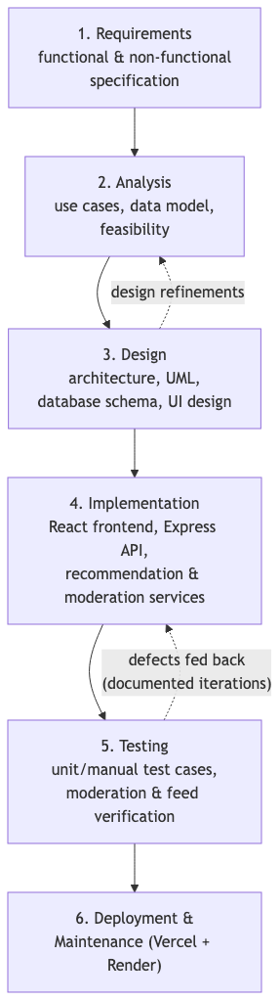


## 3.2 Requirements Analysis

Requirements were elicited from the project brief, the product blueprint prepared during analysis (the internal information-architecture audit), and the constraints identified in the literature review. They are divided into functional requirements (FR) — behaviours the system must exhibit — and non-functional requirements (NFR) — qualities the system must possess.

**Elicitation methods.** Three complementary techniques produced the catalogue below: *document analysis* of the comparable platforms in §2.3 (each missing capability became a candidate requirement); *scenario walking* of the target-user journeys (visitor → member → writer → reviewer); and *constraint analysis* of the academic deployment context (institutional governance, explainable moderation, bounded corpus). Pressman's guidance that requirements should be verifiable was applied as a filter — every retained requirement can be checked by an executable test or a rendered artefact, which is why the verification matrix in §4.7 exists.

### 3.2.1 Functional requirements

**Table 3.2 — Functional requirements**

| ID | Requirement | Priority |
|---|---|---|
| FR-01 | Visitors shall be able to register an account with name, email, gender and password | High |
| FR-02 | Registered users shall authenticate via email/password and receive a session token | High |
| FR-03 | New accounts shall be assigned a reserved `pending-*` username and shall be required to choose a unique public username before accessing the application | High |
| FR-04 | The system shall optionally allow new users to select interest categories/tags during onboarding | Medium |
| FR-05 | Authenticated users ("students") shall compose stories in a rich-text editor supporting a cover image, abstract, category and tags | High |
| FR-06 | Authors shall save work as drafts and submit drafts for editorial review | High |
| FR-07 | The system shall manage story lifecycle states: DRAFT → PENDING_REVIEW → REVISIONS_REQUESTED → APPROVED → PUBLISHED → ARCHIVED | High |
| FR-08 | Every submitted story shall be automatically scanned by the machine moderation engine and assigned a safety grade | High |
| FR-09 | Reviewers and admins shall view the review queue, read submissions, attach review notes, and approve or request revisions | High |
| FR-10 | Published stories shall appear in public discovery surfaces (Explore, category and tag views, author profiles) | High |
| FR-11 | Authenticated readers shall receive a personalised "For You" feed ranked by the recommendation pipeline | High |
| FR-12 | The system shall provide a reverse-chronological "Following" social feed including reposts | Medium |
| FR-13 | Readers shall interact with stories via likes, comments (with replies), reposts and bookmarks organised into folders | High |
| FR-14 | Users shall follow and unfollow authors; follower relationships shall influence feed ranking | Medium |
| FR-15 | The system shall provide full-text search across story title, abstract, content and tags | Medium |
| FR-16 | Admins shall list, activate and deactivate user accounts, and manage categories | Medium |
| FR-17 | Reviewers/admins shall run a machine-audit view of moderation scores across published stories and re-scan on demand | Medium |
| FR-18 | Users shall upload avatars, cover images and story images, stored on Cloudinary with a local-disk fallback | Medium |
| FR-19 | The system shall display author profiles aggregating posts, reposts, likes, comments and follower/following lists | Medium |
| FR-20 | The application shall be installable and provide an app-shell experience via a PWA manifest and service worker | Low |

### 3.2.2 Non-functional requirements

**Table 3.3 — Non-functional requirements**

| ID | Requirement | Target / realisation |
|---|---|---|
| NFR-01 | *Security*: passwords hashed with bcrypt (cost 10); stateless JWT bearer auth; role checks server-side; route guards client-side | Implemented (§3.11, §4.7) |
| NFR-02 | *Performance*: interactive endpoints should respond in well under 1 s on the reference dataset | Measured 0–15 ms avg locally (§4.7) |
| NFR-03 | *Scalability*: stateless API; feed assembled per-request from indexed queries | Compound indexes (§3.6.3) |
| NFR-04 | *Usability*: responsive layout including mobile bottom navigation; keyboard shortcuts; dark/light theme | Implemented (§4.2) |
| NFR-05 | *Reliability*: upload pipeline must degrade to local disk if Cloudinary is unavailable | Implemented |
| NFR-06 | *Maintainability*: TypeScript frontend, modular Express routers, pipeline stages isolated per file | Codebase structure (§4.3) |
| NFR-07 | *Portability*: deployable to commodity PaaS (Vercel + Render + Atlas) with no bespoke infra | Deployment (§4.6) |
| NFR-08 | *Safety*: no PENDING/flagged content may appear in public feeds | `moderationVisibilityFilter`, status filters |
| NFR-09 | *Auditability*: moderation scores and review notes persisted for inspection | Embedded moderation doc; ReviewNote model |

**Requirements elicitation.** Requirements were derived from three sources: (1) the platform survey in §2.3 — each comparable system's missing capability became a candidate requirement (e.g., Medium's opaque curation → explainable moderation); (2) the target-users analysis — a student writer needs distribution without an existing audience (→ personalised feed) and feedback (→ review notes), a reader needs discovery (→ explore/search) and curation trust (→ editorial signal); (3) institutional constraints — governance must stay in-community (→ self-hosted, role-gated admin). Each requirement in Tables 3.2/3.3 is traceable to one or more of these sources rather than assumed.

### 3.2.3 Requirements prioritisation and rationale

Requirements were prioritised using a MoSCoW-style classification implicit in the phasing of Table 3.1. The *must-have* cluster — registration, authentication, draft/publish/review workflow, feeds, likes, comments, bookmarks — constitutes the minimum viable platform; every one traces to a use case in §3.7 and at least one executed test in §4.7. The *should-have* cluster — reposts, bookmark folders, machine moderation, personalised feed, dark mode, keyboard shortcuts — materially differentiates the system and all were implemented; the personalised feed and moderation engine are, in fact, the project's principal technical contributions. The *could-have* items surfaced during analysis but consciously deferred — real-time notifications, mentions, multi-reviewer assignment, native mobile apps — are recorded in §5.3 as future work rather than silently dropped.

Three requirements deserve explicit rationale:

- **FR-7 editorial review** exists because the platform is a *curated* student showcase, not an open forum; publication is a quality signal, which requires a gate. This decision shaped the entire submission state machine.
- **NFR-4 explainability** was elevated to a first-class requirement rather than a nicety: for machine moderation to be defensible in an academic setting, its decisions must be inspectable, which ruled out opaque third-party classifiers and motivated the deterministic lexicon design of §3.9.
- **FR-12 personalised feed** was scoped to a *heuristic* adaptation of published industrial architectures (§2.4) — the objective is demonstrating the architecture faithfully on real data, not matching a trained model's accuracy; this scoping is what made the requirement achievable within the project's resources.

## 3.3 System Architecture

KBlog is a three-tier client–server web application, shown in Figure 3.2.

- **Client tier.** A React 18 single-page application (TypeScript, Vite) rendered in the browser. Routing is declarative (React Router v6) with lazy-loaded page bundles; global state lives in a Redux Toolkit store (auth, submissions, comments, UI slices); domain hooks (`useAuth`, `useSubmissions`, `useComments`, `useCategories`, `useAuthors`) encapsulate data access over an axios HTTP layer. The app is a PWA: `manifest.json` enables installation and `public/sw.js` provides an app-shell service worker.
- **Application tier.** A stateless Express API on Node.js. Cross-cutting middleware (CORS, JSON body parsing, JWT verification via `authMiddleware`, validation via express-validator, error handling via `errorMiddleware`) fronts five REST routers. Two domain services sit behind the routers: the **recommendation service** (personalised feed assembly) and the **moderation service** (lexical safety scoring). Media upload middleware integrates Cloudinary with a local `server/uploads/` fallback.
- **Data and media tier.** MongoDB Atlas stores six collections (users, submissions, comments, categories, interactions, reviewnotes) accessed through Mongoose models; Cloudinary serves images.

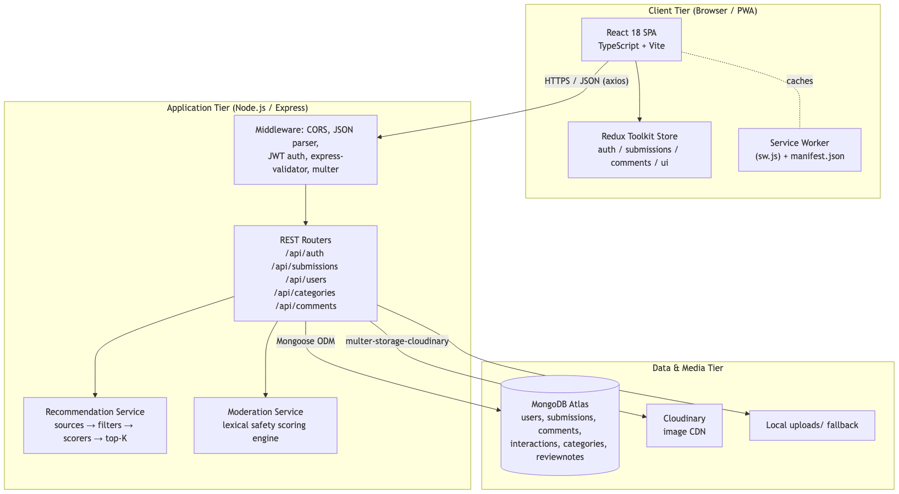


The separation is deliberately strict: the client never accesses the database, the API holds all authorisation decisions, and the two intelligent services are self-contained modules that can be replaced (e.g., the heuristic scorer by a learned model) without touching HTTP plumbing.

**Tier responsibilities.** The presentation tier (React SPA) owns rendering, client routing, session persistence, and all interaction feedback — but holds no business rules; every authorisation decision is re-made server-side. The application tier (Express) owns the request lifecycle: middleware → routing → controller → service → model; services own the two domain engines (recommendation, moderation) so controllers stay thin. The data tier (MongoDB) owns persistence and index-supported query plans; Cloudinary sits beside it as the media tier. The boundary that matters is tier-1↔tier-2: a JSON contract with 49 endpoints (Appendix B) — nothing crosses it that is not serialisable, which is what makes the SPA replaceable by a mobile client without touching the backend.

**Request paths.** Two request classes dominate: *mutating* writes (compose, interact, review) traverse validation → service side-effects → persistence → normalised response; *reading* requests traverse optional-auth hydration → query composition → projection → paginated envelope. The feed path is the only read that fans out into a multi-stage pipeline; all other reads are direct model queries with `.populate()` joins.

**Quality attributes.** The architecture was shaped by four quality attributes ordered by this system's priorities: *correctness of governance* first (no un-reviewed content reaches readers — drives the state machine and shadow-draft rules), *inspectability* second (every automated decision decomposes into visible evidence), *responsiveness* third (feed within a 100 ms budget — drives the index and bounded-query design), and *deployability* fourth (two deployable units, environment-driven config). Where attributes conflicted, the ordering resolved them — e.g., synchronous moderation on write costs ~ms of write latency but guarantees the governance invariant, an easy trade under this ordering.

## 3.4 Input Design

Principal system inputs and their validation/verification rules:

**Table 3.4 — Input design**

| Input | Channel | Constraints & validation |
|---|---|---|
| Registration: name, username, email, password, gender | `/api/auth/register` | express-validator chains; unique email; password ≥ 6 chars; bcrypt-hashed before persist |
| Login: email + password | `/api/auth/login` | bcrypt comparison; generic failure message (no user-enumeration hint) |
| Username choice | `/api/auth/check-username` | ≥3 chars, lowercase, unique; live availability check during onboarding |
| Story: title, abstract, content, category, tags, cover | `POST /api/submissions` | title ≤150 chars; abstract ≤500 chars; content required; HTML from Quill sanitised downstream by moderation normaliser |
| Image uploads | `POST /api/submissions/upload`, `/api/users/upload` | multer file filter; Cloudinary transform; local fallback path |
| Comment / reply | `POST /api/comments` | author derived from JWT (not client-supplied); parent comment for threading |
| Interaction | `POST /api/submissions/:id/interact` | type ∈ {like, bookmark, repost, view}; toggling semantics |
| Review decision | `PUT /api/submissions/:id/status` | reviewer role required; status enum enforced by Mongoose |
| Profile edits | `PUT /api/auth/profile` | owner-only; password change re-hashes |
| Bookmark folders | `/api/users/bookmark-folders*` | owner-scoped; delete migrates items to "General" |

A consistent design rule is applied throughout: **identity fields are always taken from the verified JWT, never from request bodies** — a client cannot impersonate an author or reviewer by forging IDs.

Validation rules follow a defence-in-depth pattern: every rule enforced on the client (for feedback speed) is re-enforced server-side (for security), since client checks are trivially bypassed. File inputs are constrained at the multer layer (image mime-type whitelist, 5 MB ceiling) before any persistence occurs, and the Cloudinary path means the API server never stores user binaries locally in production.

### 3.4.1 Field-level input specifications

Each input surface was specified to field level; the rules below are enforced client-side for feedback and re-enforced by express-validator on the server (§3.4).

**Table 3.5 — Registration form fields (`RegisterForm`)**

| Field | Type | Rules | Error surface |
|---|---|---|---|
| name | text | required, non-empty | inline message |
| email | email | required, RFC email format | inline message |
| password | password | required, min length enforced server-side | inline message |
| confirmPassword | password | must equal password | inline message |
| terms | checkbox | must be accepted to submit | disabled submit |

**Table 3.6 — Story editor fields (`WritePage`)**

| Field | Type | Rules | Derived data |
|---|---|---|---|
| title | text | required | slug auto-derived |
| abstract | textarea | required; shown as card preview | — |
| content | rich text (React Quill) | required; sanitised on write | readTime at 200 wpm |
| category | select | from `/api/categories` | feed facet |
| tags | tag input | list; searchable | text index + interest match |
| cover image | file | image MIME, ≤5 MB (multer) | Cloudinary URL stored |
| status action | two submit paths | Save draft vs Publish | isDraft / PENDING_REVIEW |

**Table 3.7 — Other input surfaces**

| Surface | Fields | Notes |
|---|---|---|
| Login | email, password | client format check then server verify (Figures 4.9–4.10) |
| Username setup | username | regex + reserved rules + uniqueness via check-username |
| Onboarding | interest selection | seeds recommendation preferences |
| Profile | name, bio, avatar, cover | avatar/cover via ImageCropModal → upload |
| Comment | content | threaded; replies embed in parent comment |
| Review decision | status + note | ReviewNote written on every transition |
| Folder | folder name | bookmarks organise under named folders |

## 3.5 Output Design

System outputs were designed around reading quality and administrative clarity:

- **Feed items** — story card projections: title, abstract, author (username, avatar), cover image, category, computed read time, engagement counts, and a preview of top comments (hydrated post-selection by `previewCommentsHydrator`).
- **Feed payloads** — paginated `{ items, page, totalPages, hasMore }` envelopes; "for-you" pages are keyed by a client-supplied `seenIds` cursor to suppress repeats (previously-served filter).
- **Editorial outputs** — the review queue returns stories with embedded moderation subdocuments (per-category scores, matched terms, grade, summary) so the human reviewer sees *why* the machine flagged an item.
- **Machine audit output** — aggregate counts (published, verified clean, flagged, critical, 18+, racist) plus per-story metric rows.
- **API errors** — a single `errorMiddleware` normalises Mongoose/validation/JWT errors into consistent `{ message }` JSON responses.
- **Computed metadata** — `readTime` ("N min read", at 200 wpm) is generated on save; slugs are URL-safe derivations of titles.

**Per-screen output specifications.** In addition to the payload shapes above, each output surface was specified:

| Surface | Contents | Format |
|---|---|---|
| Home (authed) | featured post, recent rail, trending categories, featured authors | card grid, paginated rail |
| /feed | ranked story cards + viewer flags + preview comments | `{items,page,totalPages,hasMore}` |
| /explore | story cards + tag/category facets + search | same envelope |
| /blog/:slug | full body, author card, comment thread | rendered rich text |
| /reviews | pending items + moderation record per item | queue list + audit tab |
| /me/stories | stories grouped by workflow status | status-grouped list |
| Machine audit | corpus counters + per-story metric rows | dashboard table |
| Bookmarks | items grouped by folder | folder sections |
| Profile | identity fields + own/followed content tabs | tabbed sections |
| Toasts | action feedback (saved, published, errors) | transient `{message}` |

## 3.6 Database Design

### 3.6.1 Entity–relationship model

Six Mongoose collections make up the persistent store. Figure 3.3 shows the entity–relationship model; Table 3.8 summarises cardinalities.

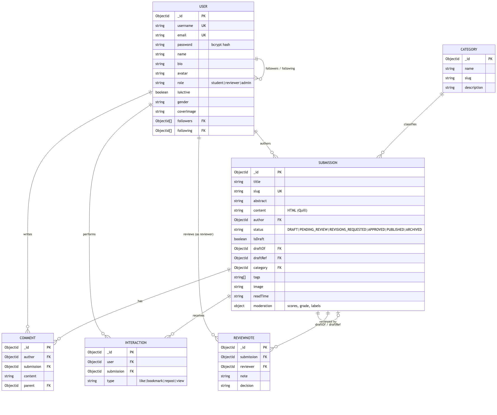


**Table 3.8 — Entity relationships**

| Relationship | Cardinality | Implementation |
|---|---|---|
| User authors Submission | 1:N | `Submission.author → User` |
| User writes Comment; Submission has Comments | 1:N each | `Comment.author`, `Comment.submission` |
| Comment replies to Comment | 1:N (self) | `Comment.parent` |
| User performs Interaction on Submission | N:M reified | `Interaction(user, submission, type)` |
| Category classifies Submission | 1:N | `Submission.category` |
| Reviewer writes ReviewNote on Submission | 1:N | `ReviewNote.reviewer`, `.submission` |
| User follows User | N:M self | `followers[]`/`following[]` ObjectId arrays |
| Submission drafts of Submission | 1:1 | `draftOf`/`draftRef` pair |

### 3.6.2 Notable schema decisions

1. **Embedded moderation subdocument on Submission.** Moderation results (overall score, grade, labels, per-category `{score, flagged, matches[]}`, callback timestamp) are stored *inside* the story document. Rationale: moderation is written once at submission/rescan and read on every feed/review request; embedding avoids a per-request join and keeps the audit trail attached to the audited artefact.
2. **Draft/published split via `isDraft` + `draftOf`/`draftRef`.** Editing a published story creates a linked draft revision rather than mutating the live document, so the public article is never exposed in a half-edited state; publishing the draft swaps references.
3. **Social graph as ID arrays on User.** Followers/following arrays trade unbounded-array risk for read simplicity — the feed's in-network source and follow toggles need direct membership tests, which arrays satisfy at community scale; the cap is noted as a scaling limitation (§5.3).
4. **Interaction as a separate collection.** Rather than counters only, interactions are reified documents, enabling per-user state (did *I* like/bookmark this?), bookmark folders, and future event sourcing for the recommender.

The design makes several deliberate denormalisation choices, each a space-for-simplicity trade: `likeCount`-style engagement figures are hydrated at read time rather than stored (avoiding count-drift bugs); comment replies embed in the parent comment (one read per thread) rather than referencing separate documents; `readTime` and `slug` are materialised on write rather than computed per render; and the `moderation` subdocument is embedded on the story itself so every read carries the safety record without a join. Conversely, followers/following are stored as ID arrays on the user — a graph adjacency list — because the alternative (a separate edge collection) would add a join to the hottest read (feed context). The `draftOf` shadow-draft mechanism is the most consequential choice: editing a published story creates a copy, keeping the invariant that *public text is always reviewed text* without blocking authors mid-edit.

### 3.6.3 Index strategy

Indexes were designed from query shapes, not by rote:

**Table 3.9 — Indexes**

| Collection | Index | Served query |
|---|---|---|
| submissions | `{title, abstract, content, tags: text}` | Explore full-text search (FR-15) |
| submissions | `{status:1, author:1}` | "My Stories" per-author dashboards |
| submissions | `{status:1, isDraft:1, createdAt:-1}` | Out-of-network candidate sourcing (recency scan) |
| submissions | `{status:1, isDraft:1, author:1, createdAt:-1}` | In-network sourcing (per-author recency) |
| submissions | `{status:1, isDraft:1, category:1, createdAt:-1}` | Category feeds / explore facets |
| submissions | `{tags:1, status:1, isDraft:1}` | Tag-overlap features and tag pages |
| users | `username` (unique), `email` (unique) | login, profile resolution, username check |

Each index exists because a measured or designed hot path requires it: the text index serves `GET /search/explore` queries; `(status, author)` serves the author's My Stories grouping and the admin author drill-down; the status+date index serves the broad-recent and pending-queue reads (both filter on status then sort by recency); `(author, createdAt)` serves profile post lists; and the `(submission,user,type)` unique index on interactions is not merely a performance index but a *correctness constraint* — it is what makes the like/bookmark upsert idempotent under retries and double-clicks. The compound indexes were deliberately kept few because each write pays for every index on its collection; the reads they serve are the ones exercised by the pipeline and the main views.

### 3.6.4 Schema field reference

The following tables specify every persisted field, its type, constraints and design purpose. (Types are Mongoose types; `FK` denotes an ObjectId reference.)

**Table 3.10 — `users` collection**

| Field | Type | Constraints | Purpose |
|---|---|---|---|
| username | String | required, unique, ≥3 chars, lowercase | public handle (`/@username` routes) |
| email | String | required, unique, regex-validated | login identity |
| password | String | required, ≥6 chars | bcrypt hash only — never stored or returned plain |
| name | String | required | display name |
| bio | String | default '' | profile biography |
| avatar | String | default '' | Cloudinary/local URL |
| role | String | enum: student/reviewer/admin, default student | RBAC decisions |
| isActive | Boolean | default true | admin deactivation preserves data |
| gender | String | required enum: male/female/other | registration attribute |
| coverImage | String | default '' | profile cover |
| followers / following | FK[] → User | — | social graph (§3.6.2.3) |
| timestamps | Date | auto | createdAt/updatedAt |

**Table 3.11 — `submissions` collection**

| Field | Type | Constraints | Purpose |
|---|---|---|---|
| title | String | required, ≤150 chars | headline |
| slug | String | required, unique, lowercase | URL identity (`/blog/:slug`) |
| abstract | String | required, ≤500 chars | preview/summary text |
| content | String | required | Quill HTML body |
| author | FK → User | required | ownership |
| status | String | enum 6 states, default DRAFT | editorial state machine (Fig. 3.5) |
| isDraft | Boolean | default false | draft/published discrimination used by feed queries |
| draftOf / draftRef | FK → Submission | nullable | draft-of-published-post link (§3.6.2.2) |
| category | FK → Category | — | classification, feed feature |
| tags | String[] | trimmed | discovery + scorer features |
| image | String | default '' | cover URL |
| readTime | String | computed pre-save | "N min read" at 200 wpm |
| moderation | embedded doc | — | safety record (Table 3.12) |
| timestamps | Date | auto | recency scoring, chronological views |

**Table 3.12 — `submissions.moderation` embedded subdocument**

| Field | Type | Purpose |
|---|---|---|
| overallScore | Number (0–100) | composite safety score |
| grade | String | CLEAN / MILD / FLAGGED / CRITICAL |
| flagged | Boolean | visibility gate input |
| labels | String[] | violated category names |
| summary | String | human-readable verdict shown to reviewers |
| categories.{sexist, sexual, explicit, eighteenPlus, racist}.{score, flagged, matches[]} | sub-docs | per-category detail with matched terms |
| callbackTriggeredAt | Date | audit timestamp for the machine log |

**Table 3.13 — `comments` collection**

| Field | Type | Constraints | Purpose |
|---|---|---|---|
| submission | FK → Submission | required | parent story |
| user | FK → User | required | author (from JWT) |
| content | String | required, trimmed | comment body |
| likes | Number | default 0 | denormalised count |
| likedBy | FK[] → User | — | per-user like state |
| replies | embedded[] {user, content, date, likedBy[]} | — | one-level thread (document-local, atomic) |
| isFlagged | Boolean | default false | moderation flag |

**Table 3.14 — `interactions` collection**

| Field | Type | Constraints | Purpose |
|---|---|---|---|
| submission | FK → Submission | required | target story |
| user | FK → User | required | actor |
| type | String | enum LIKE/BOOKMARK/REPOST | action kind |
| quote | String | — | quote-repost text |
| folder | String | default 'General' | bookmark organisation |

*Indexes:* `{submission,user,type}` unique — makes every interaction idempotent by construction; `{user,type,folder}`, `{user,type,createdAt:-1}`, `{submission,type,createdAt:-1}` serve bookmark lists, history hydration and count queries.

**Table 3.15 — `categories` and `reviewnotes` collections**

| Collection | Fields | Purpose |
|---|---|---|
| categories | name, slug, description | story classification; seeded with 10 domains |
| reviewnotes | submission FK, reviewer FK, note, decision | persistent editorial feedback trail |

## 3.7 Behavioural Design (UML)

### 3.7.1 Use-case model

Three actors participate: **Visitor**, **Student** (the default authenticated role — the platform's readers/writers), and **Reviewer/Admin**. Figure 3.4 gives the use-case diagram.

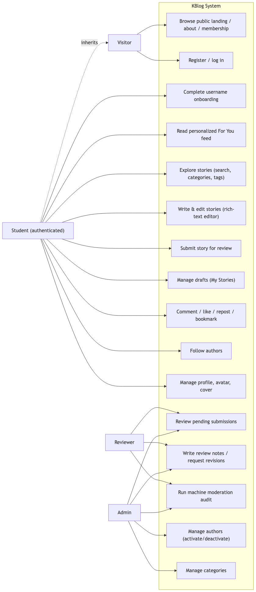


Selected use-case descriptions:

**UC-07 Submit story for review.** *Actor:* Student. *Precondition:* story saved as DRAFT. *Main flow:* (1) author opens draft in `/write`; (2) completes title/abstract/category/tags and cover; (3) submits; (4) system runs machine moderation, records grade; (5) status → PENDING_REVIEW; story appears in review queue and in the author's "In Review" tab. *Alternate:* missing required fields → 400 with validation messages; moderation CRITICAL → still queued but visibly flagged to reviewers.

**UC-12 Review pending submission.** *Actor:* Reviewer/Admin. *Main flow:* (1) open review queue; (2) inspect story + machine grade + matched terms; (3) approve or request revisions with a note; (4) system transitions status and persists the ReviewNote. *Alternate:* no action — item stays pending.

**UC-11 Read For-You feed.** *Actor:* Student. *Main flow:* (1) open `/feed`; (2) client requests page with seen-IDs cursor; (3) pipeline returns ranked items; (4) UI renders; (5) scroll → next page. *Alternate:* unauthenticated → server falls back to non-personalised ordering (optionalAuth).

**Table 3.16 — Complete use-case catalogue**

| UC | Name | Actor | Trigger | Success post-condition | Key alternates |
|---|---|---|---|---|---|
| UC-01 | Browse public surfaces | Visitor | visit /, /about, /membership, /contact | public pages rendered | none |
| UC-02 | Register / authenticate | Visitor | submit form | account created / session issued; user stored client-side | validation errors; duplicate email; wrong password (generic failure) |
| UC-03 | Username onboarding | Student (pending) | first login | unique username claimed; router releases State B | name taken → live availability error |
| UC-04 | Interest selection | Student | after username | preferred categories saved (skippable) | skip → proceed |
| UC-05 | Read For-You feed | Student | open /feed | ranked page returned; scroll paginates | logged-out → non-personalised fallback |
| UC-06 | Explore / search | any | open /explore, query, facet | text-index results, category/tag facets | no results state |
| UC-07 | Compose & submit story | Student | /write + submit | draft saved; on submit → PENDING_REVIEW + moderation record | validation 400; upload failure |
| UC-08 | Manage stories | Student | /me/stories tabs | drafts/published/in-review listed; edit/delete | edit published → linked draft |
| UC-09 | Interact | Student | like/comment/repost/bookmark | Interaction upserted; counts updated | duplicate → toggle off |
| UC-10 | Bookmark folders | Student | dropdown on bookmark | item filed to folder; folders renamed/deleted | delete folder → items to General |
| UC-11 | Follow author | Student | follow button | mutual graph edge; feeds re-personalise | unfollow toggles |
| UC-12 | Review submission | Reviewer/Admin | /reviews queue | approve/request revisions + ReviewNote | moderation context shown |
| UC-13 | Machine audit | Reviewer/Admin | /reviews audit view | aggregate counts; per-story metrics; rescan | rescan recomputes grades |
| UC-14 | Manage authors | Admin | /authors | activate/deactivate accounts | deactivation preserves content |
| UC-15 | Manage categories | Admin | category endpoints | category created/listed | — |
| UC-16 | Manage profile | Student | /profile | name/bio/avatar/cover updated; password changed | re-hash on password change |

### 3.7.1a Use-case narratives (remaining catalogue)

The three use cases above are detailed in full; the remaining catalogue entries are narrated below at the same level of precision.

**UC-01 Browse public surfaces.** *Actor:* Visitor. *Precondition:* none. *Main flow:* (1) navigate to `/`, `/about`, `/membership`, or `/contact`; (2) the layout shell renders without auth checks; (3) content displays immediately — no data fetch is gated. *Post-condition:* the visitor can evaluate the platform and reach `/auth/signup`. These routes deliberately sit outside `ProtectedRoute` so the platform presents an open front door.

**UC-02 Register / authenticate.** *Actor:* Visitor. *Main flow:* (1) submit registration (name/email/password/confirm/terms); (2) server validates, hashes, persists, issues JWT; (3) client stores `{user,token}` and lands on onboarding. *Alternates:* field errors → inline (Figure 4.10); duplicate email/username → server error surfaced; login with bad credentials → generic failure (Figure 4.9) — deliberately non-specific per standard practice.

**UC-03 Username onboarding.** *Actor:* Student (pending). *Precondition:* account exists with `pending-*` username. *Main flow:* (1) any navigation is intercepted to `/onboarding/username`; (2) entry triggers live `check-username`; (3) a valid unique name commits; (4) the router releases the gate. *Alternates:* taken/reserved names produce availability errors without a round trip per keystroke beyond debounce.

**UC-04 Interest selection.** *Actor:* Student. *Main flow:* (1) after username, select preferred categories; (2) saved to the user record; (3) seeds the recommender's preference context (§3.8.1). *Alternate:* skipping is permitted — the pipeline still works via the broad-recent pool, though personalisation is weaker: an honest graceful-degradation design.

**UC-05 Compose / save draft.** *Actor:* Student. *Main flow:* (1) open `/write`; (2) author title/abstract/body/category/tags/cover; (3) Save Draft persists `isDraft=true`; (4) story appears in My Stories under Drafts. *Alternates:* cover upload fails → story still saves without image; autosave is manual (documented gap, §5.3).

**UC-06 Edit published story.** *Actor:* Student. *Main flow:* (1) open published story in editor; (2) changes save into a `draftOf` shadow document; (3) the live story is untouched until the author chooses to re-submit through review. *Post-condition:* readers never see un-reviewed edits — the shadow-draft rule.

**UC-08 Comment / reply / like.** *Actor:* Student. *Main flow:* (1) on any story, add a comment; (2) replies embed in the parent; (3) likes toggle on comments and replies independently. *Post-condition:* thread persisted in one document; counts denormalised for display.

**UC-09 Follow / unfollow.** *Actor:* Student. *Main flow:* (1) follow from author card or profile; (2) `followers`/`following` arrays update; (3) the author's content becomes eligible for the viewer's in-network source and following feed. *Alternate:* unfollow removes the edge symmetrically.

**UC-10 Bookmark / organise folders.** *Actor:* Student. *Main flow:* (1) bookmark any story — default folder; (2) `BookmarkDropdown` assigns/reassigns folders; (3) folder deletion migrates contents rather than orphaning them. *Post-condition:* saved library is personally organised.

**UC-13 Explore / search.** *Actor:* any. *Main flow:* (1) `/explore` renders discovery facets; (2) `q` text queries hit the `$text` index; (3) category/tag filters compose with pagination. *Post-condition:* discovery operates only over `PUBLISHED ∧ ¬isDraft` — drafts and revisions-in-flight are invisible.

**UC-14 Admin: manage members.** *Actor:* Admin. *Main flow:* (1) `/authors` console lists members with search; (2) role change and active-toggle apply via PATCH endpoints; (3) every action re-verifies `isAdmin` server-side. *Alternates:* non-admin access is refused at both router and middleware layers (defence in depth, TC-SEC03).

**UC-15 Audit machine moderation.** *Actor:* Reviewer/Admin. *Main flow:* (1) open the audit dashboard (Figure 4.8); (2) review corpus counters and per-story rows; (3) optionally trigger `rescan-all` after a lexicon update or `POST /:id/moderate` for a single item. *Post-condition:* moderation is inspectable corpus-wide, not just per-submission.

Each use case was traced to at least one functional requirement (Table 3.2) and one test case (Table 4.5), giving a requirements → design → test traceability chain.

### 3.7.2 Activity: submission lifecycle

Figure 3.5 models the editorial state machine — the heart of the platform's governance design. Walking it: a new story enters DRAFT on first save (no machine or human involvement — drafts are private working documents). The submit transition runs the machine scan synchronously — every published-or-pending story therefore carries a `moderation` record by construction — and lands in PENDING_REVIEW. From there only two exits exist: a reviewer approve transition to PUBLISHED, or a revisions transition to REVISIONS_REQUESTED carrying a mandatory ReviewNote. A revisions exit does not return to PENDING automatically — the author must re-submit, so reviewer attention is never spent on items the author has not finished revising. PUBLISHED has a single exit, ARCHIVED (author or admin), which preserves the record but removes it from feeds — a reversible takedown rather than deletion. Editing a PUBLISHED story does not transition it; it forks a shadow draft per §3.6.2, and the fork must re-enter at submit — meaning no path exists from un-reviewed text to public visibility. Machine moderation executes inside the submit transition; human review gates the PUBLISHED state.

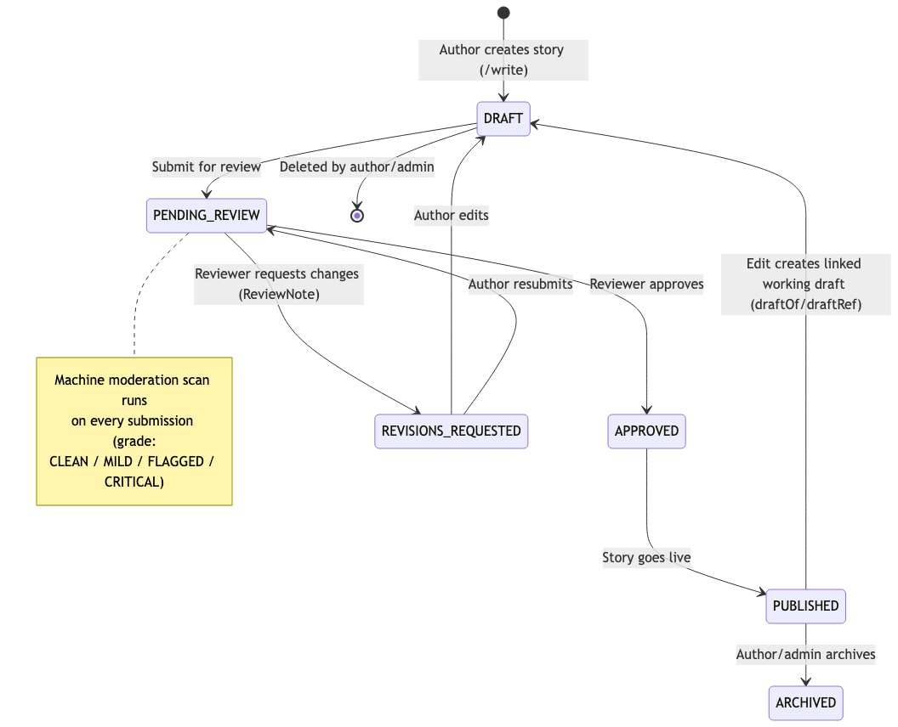


### 3.7.3 Activity: authentication & onboarding state machine

The client router implements three hard authentication states (Figure 3.6), mirroring the IA audit: State A (unauthenticated) may only reach public surfaces; State B (authenticated but `pending-*` username) is confined to `/onboarding/username`, with the originally requested destination captured and restored after setup; State C grants full access. This prevents anonymous or half-registered identities from interacting with the social graph.

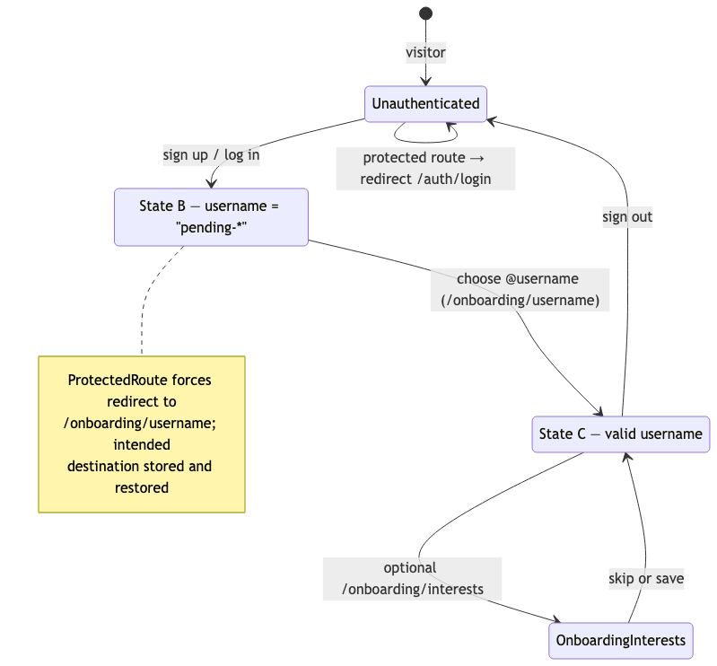


### 3.7.4 Sequence diagrams

Three interaction traces are specified:

- **Figure 3.7 — Authentication:** covers both registration and login paths. Registration flows `registerUser` → bcrypt hash → document insert → JWT issuance, returning `{user, token}` to the client, which stores the payload and attaches `Authorization: Bearer` on every subsequent request. Login follows the same issue path after `bcrypt.compare`. On each protected call the `protect` middleware verifies the signature and expiry, hydrates `req.user` from the token's `id` claim, and short-circuits with 401 on any failure — the failure path is drawn explicitly because it is the route the security tests (§4.7.5) exercise.
- **Figure 3.8 — Publish flow:** the critical write path. The editor first POSTs any cover image to `/upload` (multer → Cloudinary, URL returned for embedding), then POSTs the story: the controller computes `readTime`, invokes the moderation scan synchronously, persists with `status=PENDING_REVIEW`, and returns. Separately, the reviewer's `PUT /:id/status` decision transitions the record to `PUBLISHED` or `REVISIONS_REQUESTED` and writes a `ReviewNote` — two distinct transactions joined by the queue, reflecting that review is asynchronous.
- **Figure 3.9 — For-You feed:** collapses §3.8's 16-stage pipeline into a timed lifeline: context hydration, parallel candidate sourcing, the filter chain, engagement hydration, scoring, diversity re-rank, top-K selection and preview hydration — annotated to show which stages touch the database (hydration and sourcing) versus which are pure in-memory transforms (filters, scorers).
- **Figure 3.10 — Interaction:** shows the three engagement primitives as `POST /:id/interact` upserts against the unique `(submission,user,type)` index — the index that makes double-like and duplicate-bookmark impossible by construction — plus the comment path (`POST /:id/comments` with embedded replies) and the follow edge on `users` that feeds the in-network source.

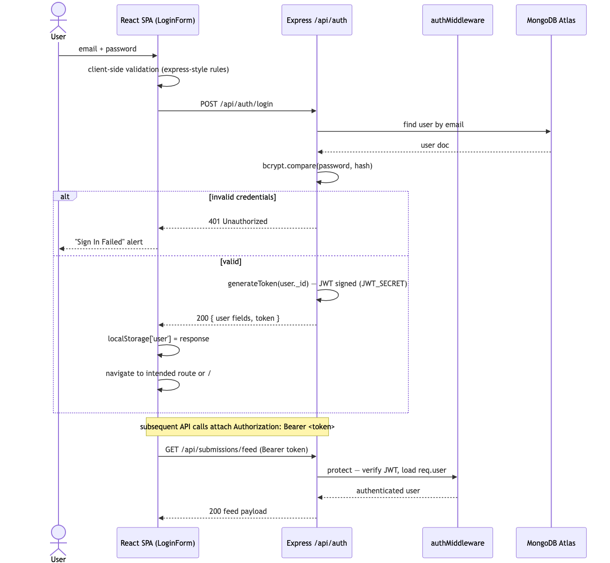

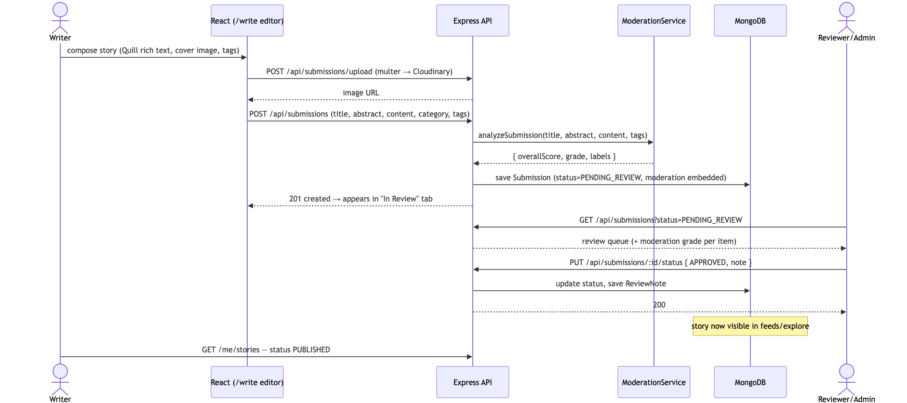

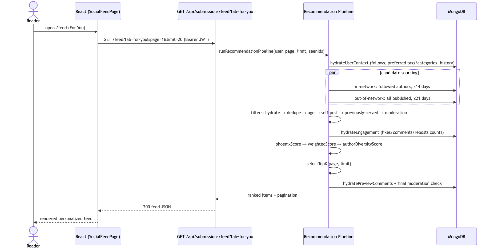

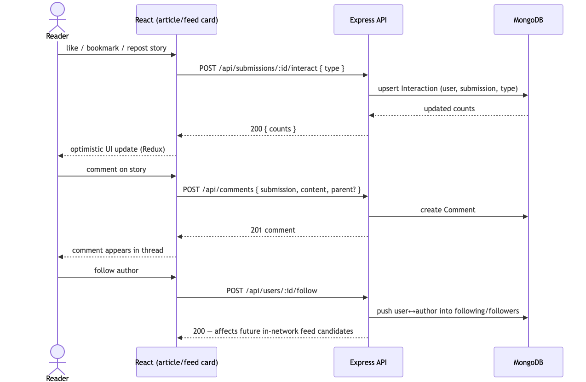


### 3.7.5 Data-flow diagrams

Figure 3.11 (Level 0) situates the system among its external entities; Figure 3.12 (Level 1) decomposes it into six numbered processes with named data stores.

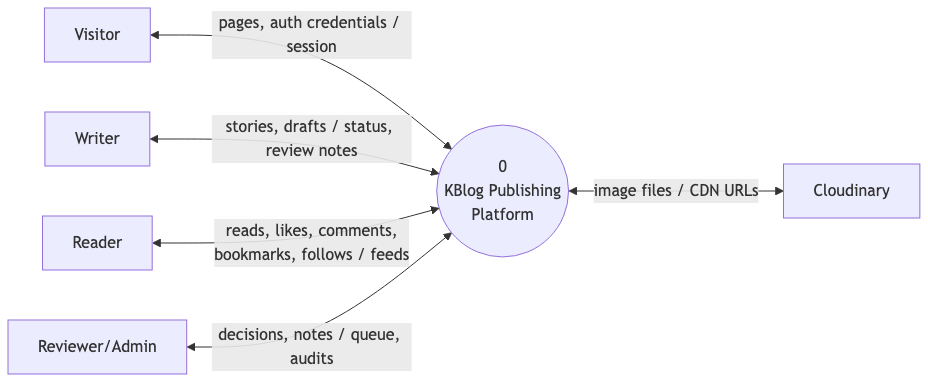

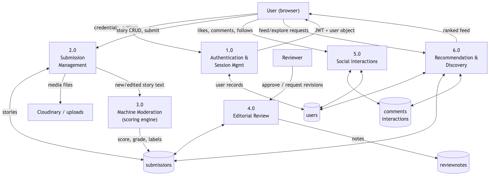


**DFD walkthrough.** Level 0 shows four external entities — Visitor, Student, Reviewer/Admin, and Cloudinary (media) — exchanging flows with the single KBlog process: credentials and content in, rendered content and decisions out. Level 1 decomposes into six processes: P1 Identity (register/login/profile against D1 users), P2 Composition (draft/publish writes to D2 submissions, media to Cloudinary), P3 Governance (machine scan on write, human review decisions to D4 reviewnotes, status back to D2), P4 Distribution (feed and explore reads over D2+D3 interactions, personalisation via D1 follow graph and history), P5 Engagement (comments to D5, interactions to D3), and P6 Administration (member/author management). The diagram is significant for what it makes explicit: *every* public read of story data passes through either P3's gate or P4's filter — there is no path from D2 to a reader that bypasses governance.

## 3.8 Recommendation Pipeline Design

The "For You" feed is built as a multi-stage pipeline adapted, at small scale, from the architecture Twitter/X released in March 2023 (`the-algorithm`: Home Mixer / Product Mixer lineage), where a request fans out to candidate sources, is filtered by heuristics, scored by an engagement-probability model, and re-ranked for diversity. The KBlog instantiation keeps the stage decomposition but replaces distributed services and learned models with MongoDB queries and a transparent heuristic scorer — appropriate for a community corpus of hundreds of stories rather than hundreds of millions.

**Stage 1 — Context hydration.** `hydrateUserContext` resolves the viewer's follows, up to 20 preferred tags and 10 preferred categories (derived from interaction history), and serving history.

**Stage 2 — Candidate sourcing (pool ≈150).** Two sources run in parallel: *in-network* (stories by followed authors, ≤14 days old) and *out-of-network* (global published corpus, ≤21 days). This mirrors Twitter's in/out-of-network split and guarantees both relevance and discovery.

**Stage 3 — Filter chain.** Six ordered filters: `coreDataHydrationFilter` (attach author/category), `dropDuplicates`, `ageFilter` (≤30 days hard cap), `selfPostFilter` (never rank one's own work), `previouslyServedFilter` (suppress already-seen IDs supplied as a cursor), and `moderationVisibilityFilter` (drop flagged/critical items).

**Stage 4 — Engagement hydration.** Like/comment/repost counts and viewer-specific flags (e.g., `isFollowingAuthor`) are attached for scoring.

**Stage 5 — Scoring.** Three scorers compose:

1. `phoenixScore` — a stand-in for the heavy ranker: per candidate it emits 18 predicted *action probabilities* (favorite, reply, repost, click, profile-click, share, dwell, quote, follow-author, plus negative actions currently zeroed as the data model doesn't capture them). Each probability is a sigmoid over a weighted logit of interpretable features — tag overlap, category match, exponential recency decay (half-life ≈72 h), normalised popularity, author popularity, follow relation, image presence, comment/repost density (Figure 3.14).
2. `weightedScore` — linear combination `Σ actionᵢ × ACTION_WEIGHTSᵢ` (e.g., repost 1.2, favorite 1.0, click 0.25; negative actions negative), producing the ranking score.
3. `authorDiversityScore` — multiplicative attenuation (decay 0.85, floor 0.55) on repeat authors within a page, preventing single-author domination.

**Stage 6 — Selection & post-hydration.** `selectTopK` pages the ranked list (default page size 12 from a 150-candidate pool), then preview comments are hydrated and a final visibility check re-applied before returning.

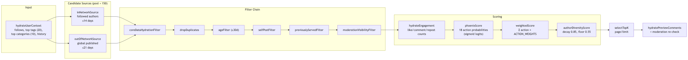

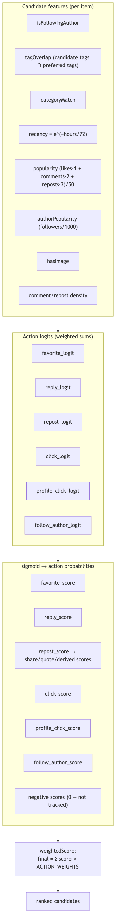


**Table 3.17 — Pipeline parameters (from `params.js`)**

| Parameter | Value | Role |
|---|---|---|
| `CANDIDATE_POOL_SIZE` | 150 | candidates per request |
| `RESULT_SIZE` | 12 | default page |
| `MAX_POST_AGE_DAYS` | 30 | age filter hard cap |
| `IN_NETWORK_DAYS` / `OUT_OF_NETWORK_DAYS` | 14 / 21 | source windows |
| `TOP_TAGS_LIMIT` / `TOP_CATEGORIES_LIMIT` | 20 / 10 | context size |
| `AUTHOR_DIVERSITY_DECAY` / `_FLOOR` | 0.85 / 0.55 | diversity attenuation |
| `FEATURE_WEIGHTS` | followed 0.55, tag 0.35, category 0.25, recency 0.30, popularity 0.20, comment density 0.15, image 0.05, author pop. 0.10 | logit weights |

### 3.8.1 User-context hydration (detail)

`hydrateUserContext` assembles the personalisation context in two passes. First it loads the viewer's `following` set. Then it reads the viewer's last 50 `Interaction` rows and last 50 `Comment` rows (each populating the referenced submission's author, tags, category and timestamp), merges them into a single recency-ordered *action sequence* (`actionSequence`, ≤50 rows), and derives three artefacts used downstream:

- **interaction ID sets** — `likedSubmissionIds`, `repostedSubmissionIds`, `commentedSubmissionIds`, consumed by the previously-served filter and per-candidate flags;
- **preferredTags** — the top 20 tags by frequency across the action sequence;
- **preferredCategories** — the top 10 categories by frequency.

This is a deliberately simple implicit-feedback profile: no embeddings, just counting — chosen because the corpus is small and interpretability aids the defence, while the interface (`context → sources`) matches the industrial design so a richer profile can replace it later.

### 3.8.2 Candidate sourcing (detail)

**In-network** issues two parallel queries: recent PUBLISHED non-draft posts by followed authors (≤14 days), and recent REPOST interactions by followed authors, each shaped into a candidate object:

```
{ _id: 'post_<id>' | 'repost_<id>', feedType, createdAt,
  submission, repostUser?, quote?, source: 'in-network' }
```

The repost channel means amplification by followed users is itself a ranking signal, exactly as on X.

**Out-of-network** excludes followed authors and the viewer, then runs two pools in parallel: an *interest pool* (posts matching `preferredTags` or `preferredCategories`, ≤21 days) and a *broad recent pool* (all published, ≤21 days) — the latter guaranteeing discovery content for new or logged-out users and cold-start coverage. Results are deduplicated by submission ID before the pool is returned.

### 3.8.3 Scoring pseudocode

```
procedure runRecommendationPipeline(user, page, limit, seenIds):
    ctx ← hydrateUserContext(user)
    inNet   ← getInNetworkCandidates(ctx, 75)
    outNet  ← getOutOfNetworkCandidates(ctx, 75)
    cand    ← inNet ++ outNet                        // ≤150
    cand    ← coreDataHydrationFilter(cand)          // attach author+category docs
    cand    ← dropDuplicates(cand)                   // post vs repost of same story
    cand    ← ageFilter(cand)                        // createdAt ≥ now−30d
    cand    ← selfPostFilter(cand, ctx)              // author ≠ viewer
    cand    ← previouslyServedFilter(cand, seenIds)  // no repeats across pages
    cand    ← moderationVisibilityFilter(cand)       // drop flagged/critical
    cand    ← hydrateEngagement(cand, user)          // like/comment/repost counts
    cand    ← phoenixScore(cand, ctx)                // 18 action probabilities
    cand    ← weightedScore(cand)                    // Σ actionᵢ·wᵢ
    cand    ← authorDiversityScore(cand)             // ×(0.45·0.85ᵏ + 0.55)
    sel     ← selectTopK(cand, page, limit)          // slice + pagination meta
    sel     ← hydratePreviewComments(sel)            // top comments per item
    sel     ← moderationVisibilityFilter(sel)        // final safety re-check
    return sel

function phoenixScore(c, ctx):
    overlap     ← |c.tags ∩ ctx.preferredTags| / |c.tags|
    catMatch    ← c.category ∈ ctx.preferredCategories
    recency     ← exp(−hours(c.createdAt)/72)
    popularity  ← min(1, (likes + 2·comments + 3·reposts)/50)
    authorPop   ← min(1, followers/1000)
    for each action a in ACTIONS:
        logit_a ← base_a + Σ featureⱼ · wⱼ_a        // see FEATURE_WEIGHTS
        score_a ← clamp(σ(scale_a · logit_a))
    return 18-vector of action probabilities
```

**Table 3.18 — Phoenix action scores and derivation**

| Action | Logit composition (simplified) | Clamp |
|---|---|---|
| favorite | 0.05 + 0.55·follow + 0.35·tag + 0.25·cat + 0.30·recency + 0.20·pop + 0.05·img + 0.10·authorPop | σ(4x) |
| reply | 0.02 + 0.15·commentDensity + 0.25·tag + 0.15·cat | σ(5x) |
| repost | 0.03 + 0.33·follow + 0.4·repostDensity + 0.2·tag + 0.1·pop | σ(4x) |
| click | 0.1 + 0.2·recency + 0.2·follow + 0.1·pop | σ(3x) |
| profileClick | 0.02 + 0.10·authorPop + 0.1·follow | σ(3x) |
| followAuthor | 0.02 + 0.2·tag + 0.10·authorPop (−2 if already following) | σ(3x) |
| share | 0.5·repost + 0.2·favorite | direct |
| quote | 0.8·repost | direct |
| photoExpand | 0.1 + 0.15·tag (0 if no image) | direct |
| dwell | min(readMins/10, 1) | direct |
| negative actions (notInterested, block, mute, report) | 0 — signals not yet captured | — |

**Table 3.19 — Final combination weights (ACTION_WEIGHTS)**

| Group | Weights |
|---|---|
| Strong positive | repost 1.2, favorite 1.0, quote 1.0, share 1.0 |
| Medium positive | reply 0.9, followAuthor 0.5, shareDM 0.4, shareCopy 0.4, dwell 0.3 |
| Weak positive | click 0.25, photoExpand 0.2, profileClick 0.15 |
| Negative (inactive) | notInterested −1.2, block −2.0, mute −1.5, report −2.5 |

**Diversity attenuation.** After weighted scoring, items are sorted and the k-th item from the same author in a page is multiplied by `0.45·0.85ᵏ + 0.55` — the second post scores ≈93%, the third ≈88%, asymptotically approaching the 55% floor, keeping single-author floods out while never fully suppressing a prolific writer.

## 3.9 Moderation Engine Design

`moderationService.js` implements a lexical safety scorer (Figure 3.15). Input text is normalised twice — HTML-stripped plain text and a leetspeak-deobfuscated variant (@→a, 0→o, 1/!→i, 3→e, +→t) — then evaluated against five category dictionaries (sexist, sexual, explicit, 18+/adult, racist/hate), each with *severe* and *moderate* regex tiers. A category score (0–100) combines hit counts and tier severity; the overall score is `max·0.85 + mean(others)·0.15`, deliberately dominated by the worst category. Grades: **CRITICAL ≥70**, **FLAGGED ≥40 or any label**, **MILD ≥20**, else **CLEAN**. Results persist on the submission (score, grade, labels, matched terms per category) and feed three consumers: the review queue (human context), the feed's `moderationVisibilityFilter`, and the Machine Audits dashboard (aggregate counts, rescan).

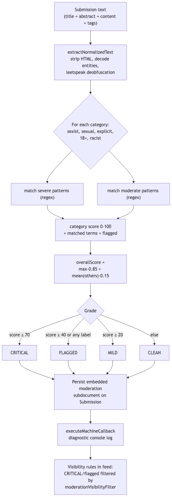


**Scoring mechanics.** Within `evaluateCategory`, pattern hits are weighted by tier and location: a *severe* match in title/tags contributes 45 points per hit (30 in body), a *moderate* match 20 (10 in body) — the rationale being that a slur in a title or tag is a stronger intent signal than one in a body quotation. Category scores cap at 100 and flag at ≥30. Deduplication of matched terms (a `Set`) means repeated identical hits are recorded once as evidence while still counting toward the score.

**Table 3.20 — Moderation scoring weights**

| Tier | Location | Points per match | Flag threshold |
|---|---|---|---|
| severe | title / tags | 45 | score ≥ 30 → category flagged |
| severe | body | 30 | |
| moderate | title / tags | 20 | |
| moderate | body | 10 | |

**Table 3.21 — Grade boundaries**

| Grade | Condition | Consequence |
|---|---|---|
| CRITICAL | overall ≥ 70 | hidden from feeds; visible to reviewers |
| FLAGGED | overall ≥ 40 or any category label | hidden from feeds; reviewer attention |
| MILD | overall ≥ 20 | visible; surfaced in audit view |
| CLEAN | else | unrestricted |

The design knowingly trades coverage for transparency: lexical approaches are interpretable and auditable (every flag shows its matched terms — important in an educational deployment) but miss paraphrased hate speech, a limitation quantified in §4.7 and discussed against the literature (Schmidt & Wiegand, 2017; Gorwa et al., 2020).

**Worked example.** Consider a story whose body contains one severe-tier explicit term and one moderate-tier explicit term, with clean title and tags (the TC-M02 case). Per the weights of Table 3.20: rawScore = 30 (severe body) + 10 (moderate body) = 40 in the EXPLICIT category, capped at 40 (< 100, no clamping) → category flagged at ≥30 → label `EXPLICIT` attached. Composite: overallScore = round(40 × 0.85 + (0+0+0+0)/4 × 0.15) = 34. Grade resolution (Table 3.21): overall 34 is below the FLAGGED threshold of 40, *but* a non-empty labels array forces FLAGGED regardless — a deliberately conservative rule, since any flagged category means a human must see the item. The resulting record — `{grade: FLAGGED, overallScore: 34, labels: [EXPLICIT], matches: [...], categoryScores: {EXPLICIT: 40}}` — is exactly what the review queue renders. Two properties of the arithmetic are worth noting: title/tag matches weigh 1.5–2× body matches (45/30, 20/10), reflecting that framing vocabulary signals intent more strongly than incidental body text; and the 85/15 composite means residual categories can only ever contribute 15 points — a single severe category dominates, matching the "severity over breadth" triage intuition.

**Design rationale and known limits.** Three properties motivated the lexicon-plus-pattern design over an external classifier: (1) *inspectability* — every flag decomposes to named terms, categories and weights, which a human reviewer can verify; (2) *zero external dependency* — no API quota, latency, or data-sharing concern; (3) *determinism* — identical input always yields identical grade, making test cases reproducible. The design's limits are equally explicit and are stated here rather than discovered later: coverage is bounded by dictionary vocabulary (a slur or coded phrase outside the lexicon scores zero — the failure demonstrated by TC-M04); context is invisible (quoting a term for criticism is indistinguishable from using it); and only the five configured categories exist — spam, harassment-targeting and non-toxicity harms are out of scope. These limits justify the architecture choice to treat machine output as *triage for human review* rather than an autonomous decision, and they define the concrete extension path in §5.3.

## 3.10 Component, Deployment and Network Design

Figure 3.16 maps the frontend's module structure — lazy pages, shared components, the Redux store, hooks, and the axios service layer — to the API. Figure 3.17 shows deployment: Vercel serves the static SPA (with SPA rewrites to `index.html` for client routing), Render hosts the stateless Node process, Atlas the database, Cloudinary the media. Figure 3.18 depicts the PWA app-shell/service-worker relationship, and Figure 3.19 the site map as routed (including legacy redirects preserving old `/blog`, `/categories`, `/tags` URLs). Figure 3.20 shows the media upload pipeline's dual-storage strategy.

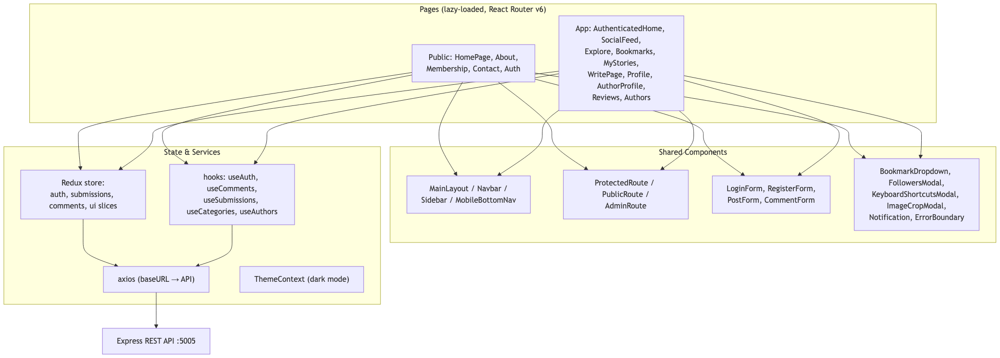

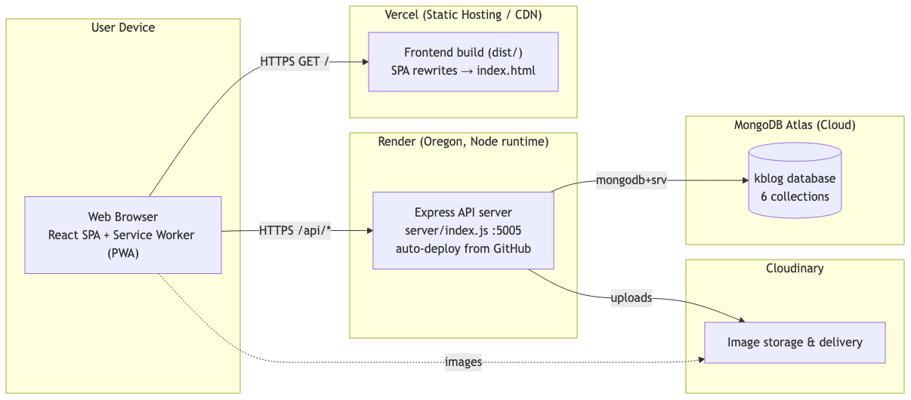

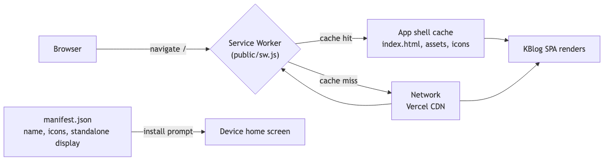

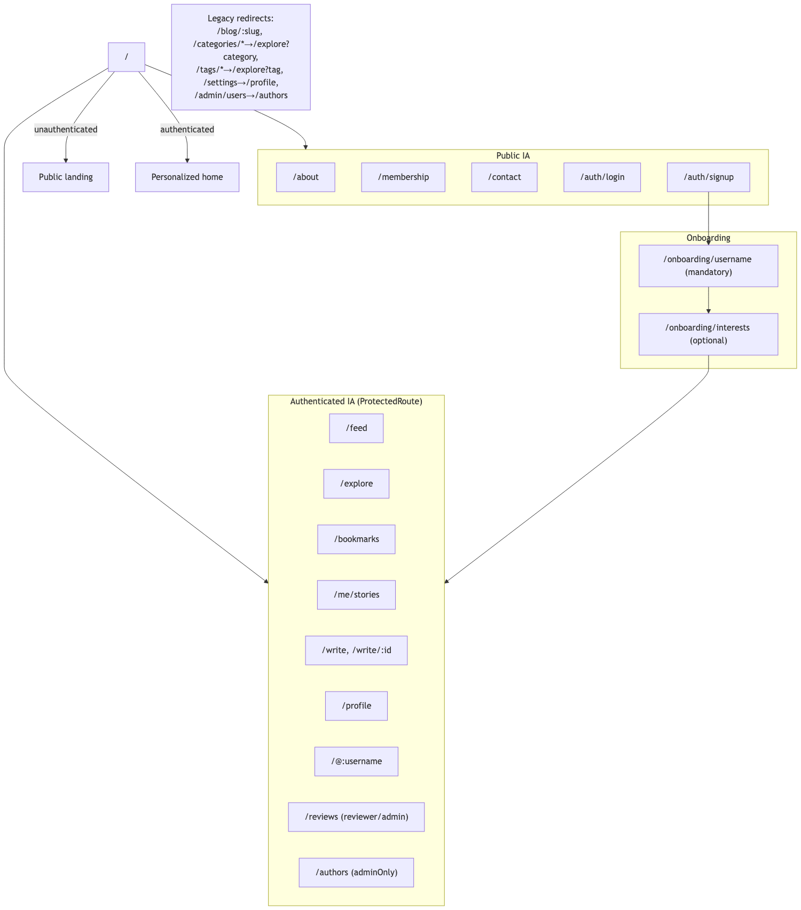

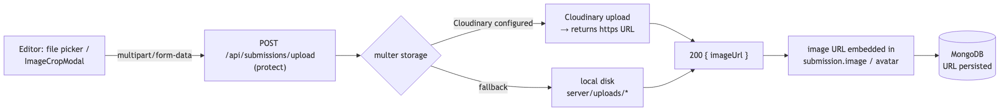


**Component model.** Figure 3.16 (component diagram) shows the deployable decomposition: the SPA package (routes, slices, components, services layer) communicates with the API package (middleware chain → routers → controllers → services → models) over JSON/HTTP only — there is no shared code or shared memory between tiers, which is what permits independent deployment and the multi-client roadmap. The recommendation service is the only component with an internal pipeline structure; everything else follows the standard controller-model shape.

**Deployment model.** Figure 3.17 shows the physical mapping: the SPA as a static build behind a CDN edge, the API as a Node service, Atlas for persistence, Cloudinary for media. Development collapses the same topology onto one host — Vite serves the SPA and proxies `/api` to Express — so dev and production differ only in hosting, not architecture.

## 3.11 Security Design

Defence in depth operates at three levels (Figure 3.21): (1) **client guards** — `ProtectedRoute`/`PublicRoute`/`AdminRoute` enforce the authentication state machine before rendering; (2) **server guards** — `protect` verifies the JWT and hydrates `req.user`, then role middleware (`isReviewer`, `isAuthorOrAdmin`, admin checks) gates privileged routes — every authorisation decision is server-side; (3) **data layer** — bcrypt hashing (cost 10), Mongoose schema validation, and unique indexes. JWTs are stateless bearer tokens; the server stores no sessions, matching the horizontal-scaling NFR.

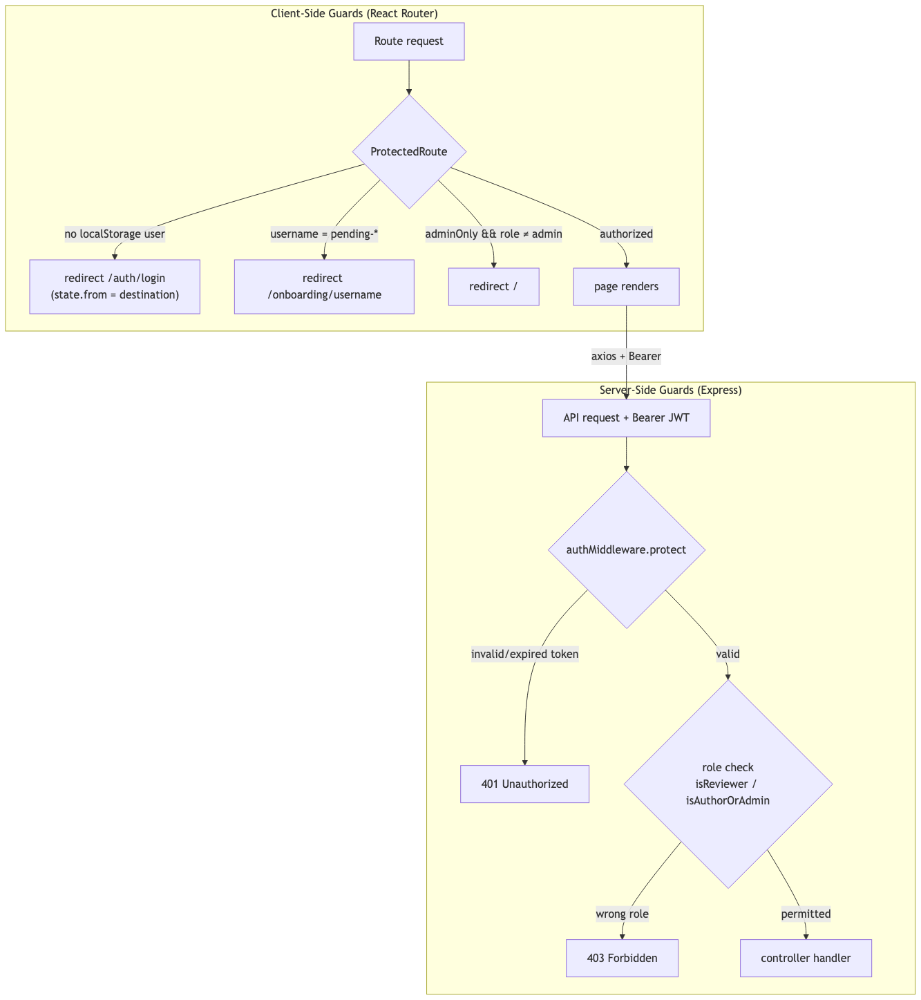


**Threat model summary.** The design considers five threat classes. (1) *Credential theft*: mitigated by bcrypt (10-round salting) and password exclusion from serialised output — a database leak yields hashes, not passwords. (2) *Session hijacking*: JWTs carry 30-day expiry and are transmitted as Bearer headers; the remaining exposure (XSS exfiltration of localStorage tokens) is mitigated by output encoding at the React layer, which escapes rendered content by default. (3) *Privilege escalation*: role checks are enforced per-route server-side (§4.7.5 TC-SEC03/04), never trusted to client UI state. (4) *Injection*: Mongoose parameterised queries and express-validator input schemas prevent both NoSQL injection and malformed-state writes. (5) *Content attacks*: the moderation engine addresses harmful content, while React's escaping handles stored-XSS in user-authored rich text rendered via sanitised HTML. No mechanism is presented as complete; the design goal is defence in depth commensurate with a student-community deployment.

**Authorisation flow.** Figure 3.21 traces the decision chain: every request first resolves identity (`protect` or `optionalAuth`), then the route's guard predicates evaluate — ownership (`isAuthorOrAdmin` compares `req.user._id` to the resource's author), role (`isReviewer`, `isAdmin` check `req.user.role`), and resource state (e.g., drafts visible only to author). The design principle is *authorisation at the boundary, never in the UI*: client route guards mirror the server checks for UX, but every server decision stands alone — the property verified by TC-SEC03/04 hitting the API directly.

## 3.12 Hardware and Software Requirements

**Table 3.22 — Requirements**

| Layer | Minimum |
|---|---|
| Server | Node.js ≥18, 512 MB RAM, any Linux container (Render free tier used); MongoDB Atlas M0 |
| Client | Modern browser (Chrome/Firefox/Safari), ~4 MB app bundle, optional PWA install |
| Dev environment | VS Code, pnpm/npm, Git; Vite dev server :5173, API :5005 |
| External services | Cloudinary free tier; optional local-disk uploads |

## 3.13 Supplementary Behavioural Diagrams

Two further traces complete the behavioural model. Figure 3.22 details the onboarding handshake designed in §3.7.3: the `pending-*` assignment at registration, the router's confinement of incomplete accounts, the live `check-username` availability call, the profile commit that clears the flag, and the restored original destination — the full state-A→B→C transition as timed interactions. Figure 3.23 decomposes the review decision itself: the queue item rendered with its machine record, the three human exits (approve / request revisions / defer), the mandatory note, the author's resubmission path with its fresh machine rescan, and the published state opening the item to every reader's candidate pools.

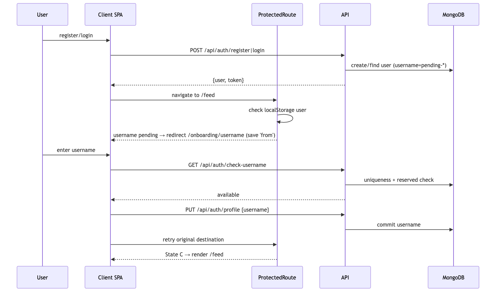

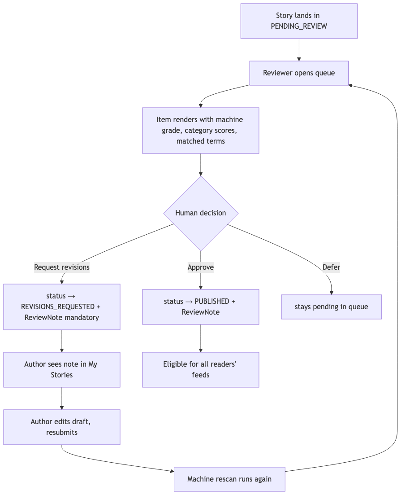


Three further views complete the structural model. Figure 3.24 is the class model of the persistence layer — the six Mongoose schemas with their principal fields and the relationships that the ER diagram abstracts: note `toJSON()` on User (the password-stripping serialiser), the `draftOf` self-reference on Submission, and the embedded replies array on Comment. Figure 3.25 refines the governance and distribution processes of DFD-1 (P3/P4) into their data flows — the only diagram showing explicitly that machine scan feeds P3 and that D3 interactions join D2 inside P4 for both feeds and recommendations. Figure 3.26 explodes the recommendation service into its actual module structure — the orchestrator, context hydrator, two sources, six filters, two hydrators, three scorers, selector and parameter file — showing that the pipeline's 16 stages are a decomposition of one bounded component, not a distributed system.

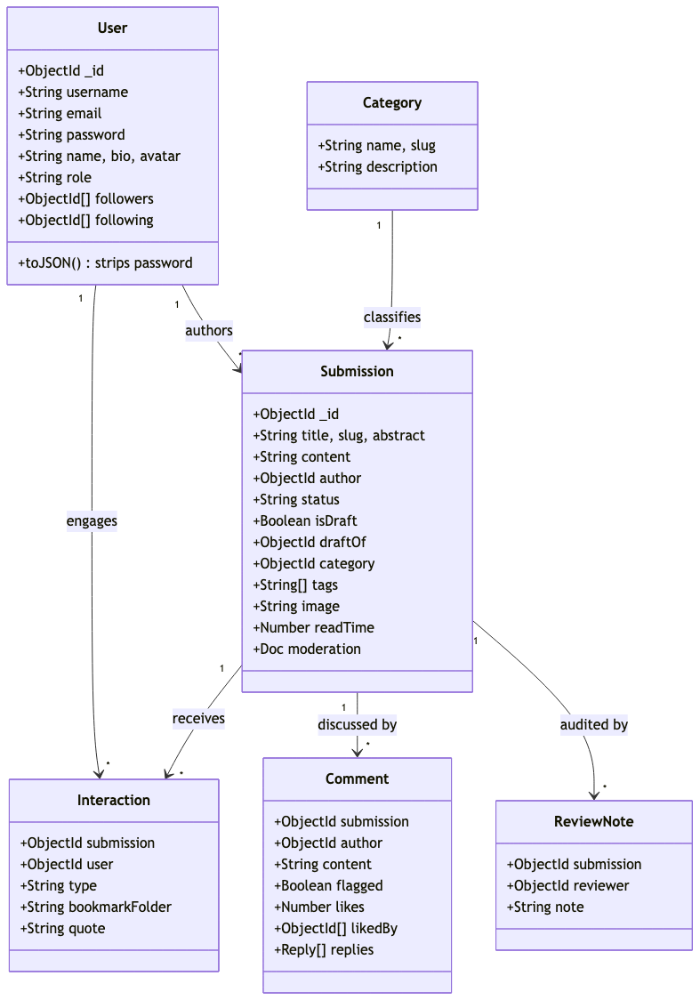

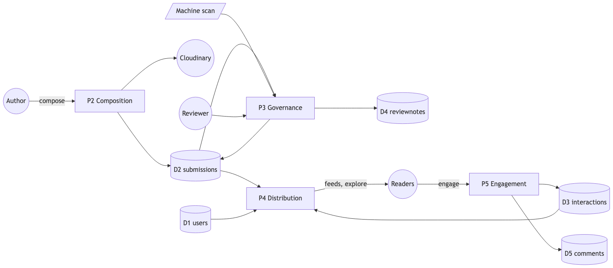

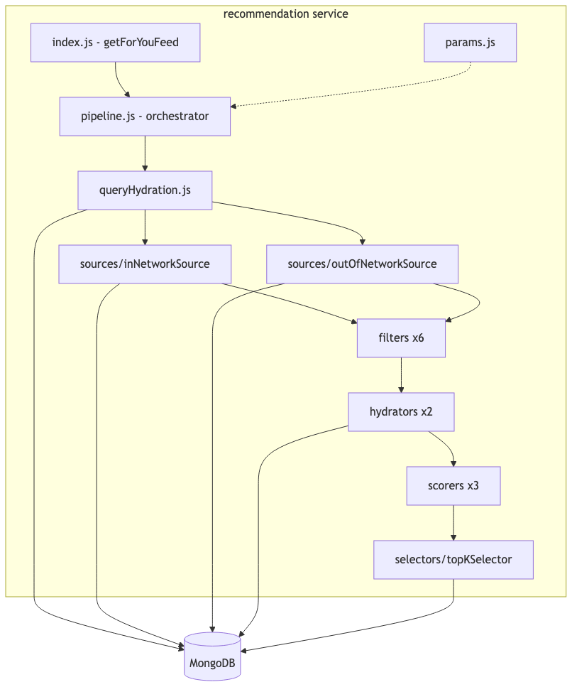


Two final structural views close the design model. Figure 3.27 decomposes the SPA into its internal layers — router/guards, lazy pages, shared components, the four-slice store, the axios service layer, and the theme/hooks layer — showing the single outward dependency on the API over JSON. Figure 3.28 is the compose activity as the writer experiences it: optional cover upload, then the two-submit fork whose publish branch runs moderation synchronously before the story enters PENDING_REVIEW — the branch point the state machine of Figure 3.5 abstracts.

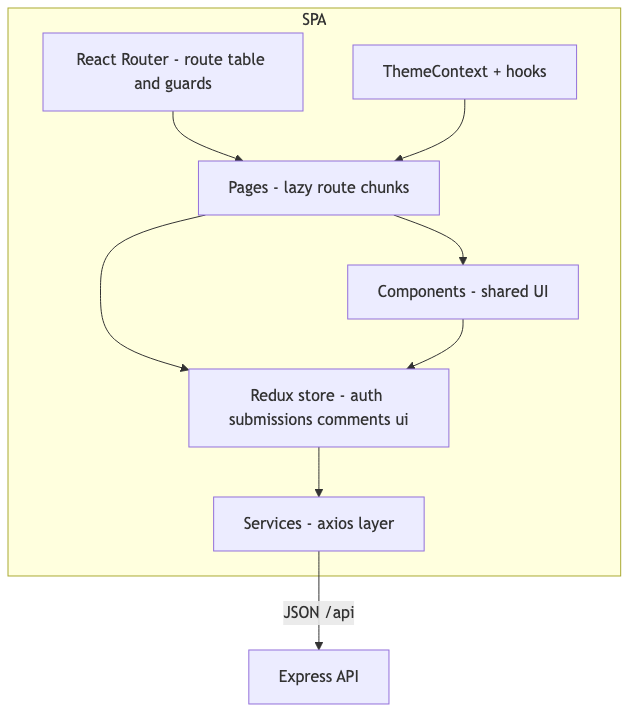

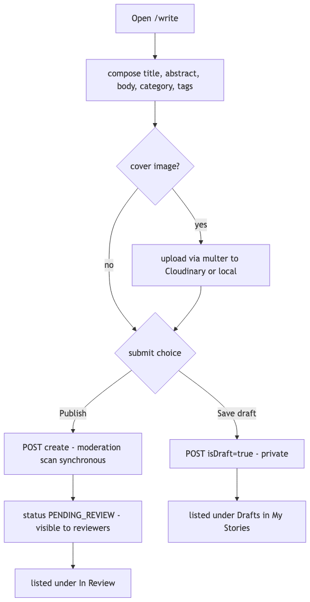


## 3.14 Alternative Designs Considered

Design decisions were made against explicit alternatives; the rejected options are recorded for completeness.

| Decision | Chosen | Alternatives rejected | Rationale |
|---|---|---|---|
| Persistence | MongoDB/Mongoose | PostgreSQL; Firebase | Document model fits heterogeneous content + embedded moderation subdocs; team's existing Atlas deployment; single-language stack |
| API style | REST/JSON | GraphQL; RPC | Predictability, tooling, and the bounded query surface (Appendix B); GraphQL's flexibility unneeded at this scale |
| Auth | stateless JWT | server sessions; OAuth-only | Sessions add server state inconsistent with multi-client roadmap; OAuth defers identity to third parties the institution does not control |
| Feed | heuristic Home-Mixer adaptation | trained model; pure chronological | Training data does not exist; chronological is the baseline the design improves on, not a peer |
| Moderation | deterministic lexicon | Perspective API; no moderation | Opaque service fails the explainability requirement; unmoderated fails the curation requirement |
| Frontend | React SPA + Redux | server-rendered; Vue | Frequent interaction favours SPA; Redux's single store simplifies the auth + feed coordination |
| Delivery | Vite + PWA | native app; Electron | Zero install friction for the target users; installable via PWA anyway |

**Design completeness check.** Every behavioural requirement in Table 3.2 is covered by at least one diagram or table in this chapter: the two state machines cover auth/onboarding and the editorial lifecycle; the four sequence diagrams cover the highest-value interactions; the DFD set covers data movement; the schema tables cover persistence completely (all six collections, every field); and the two algorithm sections specify the engines to implementation precision — pseudocode, parameters, and worked examples included. The reader can implement every subsystem from this chapter alone, which is the standard the design stage of a waterfall lifecycle must meet.

## 3.15 Chapter Summary

This chapter specified KBlog end-to-end: 20 functional and 9 non-functional requirements; a three-tier architecture; validated input/output contracts; a six-collection database with query-driven indexing; use-case, activity, sequence, DFD, component and deployment models; and the two intellectual cores — the staged recommendation pipeline and the lexical moderation engine. Chapter Four reports the implementation built to this design and its empirical evaluation.


```{=openxml}
<w:p><w:r><w:br w:type="page"/></w:r></w:p>
```

# CHAPTER FOUR: IMPLEMENTATION AND EVALUATION

## 4.1 Implementation Environment

The system was implemented on macOS using Visual Studio Code, with Git/GitHub for version control. The frontend toolchain is Vite 5 + TypeScript; the backend runs Node.js 22 with Express 4; persistence is MongoDB Atlas through Mongoose 8; media is served by Cloudinary. Development ran as two processes — the Vite dev server on port 5173 proxying `/api` calls to the Express server on port 5005 (`concurrently` via `npm run dev:all`). Production targets Vercel (static frontend) and Render (API), both auto-deploying from the repository.

**Table 4.1 — Technology stack and justification**

| Layer | Choice | Justification |
|---|---|---|
| UI framework | React 18 + TypeScript | Component reuse across ~25 pages; type safety for a large SPA |
| State | Redux Toolkit | Predictable cross-page state (auth, feeds, comments); DevTools aid debugging |
| Editor | react-quill | Mature rich-text editing producing sanitisable HTML |
| Styling | Tailwind CSS | Rapid, consistent, responsive design incl. dark mode |
| Routing | React Router v6 | Declarative guards for the 3-state auth machine |
| Server | Express 4 | Minimal, well-documented REST framework |
| ODM/DB | Mongoose 8 / MongoDB Atlas | Flexible document model fits evolving story/social schemas; free cloud tier |
| Auth | JWT (jsonwebtoken) + bcryptjs | Stateless sessions; adaptive-cost password hashing (Provos & Mazières, 1999) |
| Media | Cloudinary + multer | Managed CDN with local-disk fallback (NFR-05) |
| PWA | manifest + custom service worker | Installability without app-store friction (FR-20) |

Each dependency earns its place: React Router for SPA navigation; Redux Toolkit over Context for the four-slice store because cross-slice coordination (auth → submissions → comments) needs a single state tree; Tailwind for the utility-first responsive/dark variant system; React Quill for the editor (the lightest capable rich-text surface for this need); framer-motion for transitions; axios over fetch for interceptor-based token injection; on the backend, express-validator for the defence-in-depth validation of §3.4, multer for multipart uploads, bcryptjs and jsonwebtoken for the auth design of §3.11, mongoose for the schema/index layer of §3.6. No library is decorative — each maps to a design requirement.

## 4.2 Frontend Implementation

The client is organised as a routed SPA (`src/App.tsx`) whose route table *is* the authorisation state machine designed in §3.7.3: `ProtectedRoute` checks `localStorage` auth and the `pending-*` username invariant before rendering, preserving the intended destination through forced onboarding; `PublicRoute` keeps authenticated users out of login/signup; `AdminRoute`/`adminOnly` restrict the authors console.

Page bundles are code-split with `React.lazy`, so the ~1.1 MB production bundle (31 chunks, Table 4.6) ships only the entry chunk (~99 KB JS + ~100 KB CSS) plus route chunks on demand — the editor (~258 KB vendor chunk) never loads for readers. Global state uses four Redux slices; cross-cutting UI (notifications, error boundaries, keyboard-shortcuts modal, followers modal, bookmark folder dropdown, image cropper) is factored into shared components. Responsiveness is delivered through Tailwind breakpoints plus a dedicated `MobileBottomNav`; a `ThemeContext` toggles a full dark theme.

**Figure 4.1** shows the public landing page; **Figure 4.2** the authenticated editorial home feed with sidebar navigation, featured posts, recent articles, trending categories and featured authors; **Figure 4.3** the distraction-free writing surface (`/write`), deliberately rendered outside the sidebar layout per the IA audit; **Figure 4.4** the Explore discovery hub; **Figure 4.5** the writer's workspace (`/me/stories`); **Figure 4.6** an author profile; **Figure 4.7** the mobile experience.


**Table 4.2 — Client route map (from `src/App.tsx`)**

| Route | Guard | Page |
|---|---|---|
| / | layout | HomePage (public landing or authed home) |
| /feed | protected | SocialFeedPage |
| /explore | public | BlogListPage |
| /bookmarks, /me/stories | protected | BookmarksPage, MyStoriesPage |
| /blog/:slug | public | BlogDetailPage |
| /blog/edit/:slug | protected | EditPostPage |
| /auth/login, /auth/signup | public-only | LoginPage, RegisterPage |
| /profile | protected | ProfilePage |
| /onboarding/username, /interests | protected | UsernameSetupPage, OnboardingPage |
| /reviews | protected | ReviewsPage (role-gated server-side) |
| /authors | adminOnly | Authors |
| /write, /write/:id | protected | WritePage |
| /@:username, /author/:id | public | AuthorProfilePage |
| /about, /membership, /contact | public | static pages |
| legacy redirects | — | /blog→/explore, /categories, /tags, /settings→/profile, /admin/users→/authors |
| * | — | NotFoundPage |

**State management.** Four Redux slices partition the store: `auth` (user object, token, login/register thunks against `/api/auth`, localStorage persistence), `submissions` (story CRUD, feed pages, review queue), `comments` (per-story threads, replies, likes), and `ui` (toasts, theme-adjacent flags). Thunks attach `Authorization: Bearer <token>` read from the auth slice, keeping token handling in exactly one place.

**Service layer.** API access is centralised in `src/services/` modules wrapping a shared axios instance: the instance injects the Bearer token from the auth slice on every request and normalises error responses — so no component ever constructs HTTP calls directly, and token handling exists in exactly one place on the client. Slice-wise: `auth` thunks (`login`, `register`, `updateProfile`, `checkUsername`) update both the store and `localStorage`; `submissions` holds feed pages, the review queue, and story CRUD with optimistic toggles for like/bookmark so UI feels synchronous while the upsert resolves; `comments` is keyed per story to keep threads independent; `ui` owns toasts and modal state.

**Supporting UX systems.** The implementation includes a global keyboard-shortcut layer (`useKeyboardShortcuts`, `?` opens the modal in Figure 4.18), a `FollowersModal`, a `BookmarkDropdown` implementing the folder model (UC-10), an `ImageCropModal` used before avatar/cover upload, framer-motion page transitions via `AnimatePresence`, a full dark theme through `ThemeContext` + Tailwind `dark:` variants (Figure 4.17), and a `MobileBottomNav` for ≤md viewports (Figure 4.7).

### 4.2.1 Page-level implementation notes

Each page composes the shared layout, one or more slices, and route-specific data access:

- **HomePage** renders two distinct documents depending on session state: the marketing landing (Figure 4.1) for guests, or the authenticated editorial home (Figure 4.2) which hydrates featured posts, a paginated recent-articles rail, trending categories and the featured-authors panel — the last computed server-side by the engagement formula of §4.3.
- **SocialFeedPage** (`/feed`) is the consumer of the recommendation pipeline: it maintains `seenIds` as it paginates so the previously-served filter (§4.4) suppresses repeats across page fetches, and multiplexes the for-you/following tabs against the same endpoint's `tab` parameter.
- **BlogDetailPage** (`/blog/:slug`) fetches by slug under `optionalAuth` — anonymous readers get the public projection, authenticated viewers additionally receive viewer-specific flags (liked, bookmarked, reposted) so action buttons render their true state.
- **WritePage** (`/write`, `/write/:id`) wraps React Quill with title/abstract/category/tag/image inputs and the draft/publish split that drives the submission state machine; editing a published story creates the `draftOf` shadow copy described in §3.6.2 rather than mutating live content. The editor chunk is the heaviest in the bundle and only loads on this route.
- **ReviewsPage** (`/reviews`) is the reviewer queue: pending items render alongside their machine-moderation record (grade, per-category scores, matched terms) so the human decision is informed by — not replaced by — the automated scan; the audit tab (Figure 4.8) aggregates corpus-level metrics.
- **MyStoriesPage** (`/me/stories`, Figure 4.5) surfaces the writer's state machine visually: drafts, pending, revisions-requested (with the reviewer's note), published and archived are grouped, making the otherwise-invisible workflow legible to authors.
- **BookmarksPage** implements the folder model (UC-10) with `BookmarkDropdown` for assignment and server migration on folder delete.
- **ProfilePage / AuthorProfilePage** share one component with two data paths: `/profile` for the signed-in user's editable view (bio, avatar via `ImageCropModal`, follower/following lists via `FollowersModal`), `/@:username` for the public projection (Figure 4.6).
- **UsernameSetupPage / OnboardingPage** implement the two-step completion gate enforced by `ProtectedRoute` (§3.7.3): a `pending-*` username can reach nothing else until resolved, then interests seed the recommender's preference context.
- **Authors (admin)** — the `/authors` console (Figure 4.16) provides directory search, role change and activation toggles; every action re-checks `isAdmin` server-side.
- **Explore facets** — the Explore page composes the `?q`/`?category`/`?tag` parameters of Table B's search endpoint client-side, rendering tag chips from `/popular/tags` and category filters from `/categories` — all three endpoints measured in Table 4.7.
- **Auth pages** — Login/Register sit behind `PublicRoute`, which redirects already-authenticated users home; the forms exercise both validation layers (Figures 4.9–4.10) and drive the first leg of the onboarding state machine.
- **NotFoundPage** plus per-route `React.lazy` fallbacks and error boundaries cover the non-happy paths.

**Service worker.** The PWA layer registers a service worker precaching the app shell; API calls bypass the cache (`network-first`) so feeds stay fresh while static assets survive offline reloads — the strategy modelled in the `pwa-sw` diagram (§3.10).

## 4.3 Backend Implementation

The API is a modular Express application: `server/index.js` wires middleware (CORS, 50 MB JSON bodies, static `/uploads`) and mounts five routers; controllers hold business logic; Mongoose models enforce schema constraints; `errorMiddleware` normalises failures. Forty-nine endpoints were implemented (Appendix B gives the generated reference table). Cross-cutting concerns are handled as middleware composition, e.g. a privileged route is declared as `router.put('/:id/status', protect, isReviewer, updateSubmissionStatus)` — the access contract is legible at the route table itself.

Two implementation notes are worth recording:

1. **Identity from token only.** All author/reviewer attribution derives from `req.user` populated by `protect`; request bodies never supply identity, closing the impersonation class of bugs by construction.
2. **Legacy compatibility.** Redirects (`/api/authors` → `/api/users/authors`) and client-side route redirects (`/blog` → `/explore`, `/settings` → `/profile`) let the IA be refactored without breaking published links — evidence of the waterfall "design-then-implement, document-divergence" discipline.

**Service bootstrap.** `server/index.js` composes the app in layers: dotenv loads secrets; `connectDB()` opens the Mongoose connection before the listener starts (fail-fast if the URI is wrong); middleware mounts CORS with the frontend origin and JSON/urlencoded parsers at a 50 MB limit; the five routers mount under `/api/auth`, `/api/users`, `/api/submissions`, `/api/comments`, `/api/categories`; `GET /api/health` sits outside auth for uptime probes; and `errorMiddleware` is registered last so thrown errors from any route normalise to `{message}` JSON. Uploads are served statically from `server/uploads/` only in the local-fallback path.

**Middleware chain.** Every request traverses a fixed pipeline: `cors()` → `express.json()`/`urlencoded` (50 MB limit, sized for base64 editor content) → route matching → per-route `protect`/`optionalAuth` and role middleware → controller → `errorMiddleware`. The `protect` middleware verifies the Bearer token's signature, loads the user document onto `req.user`, and rejects expired or malformed tokens with 401; `optionalAuth` performs the same load but never rejects, letting public endpoints personalise opportunistically. Role checks are small composable predicates (`isReviewer` admits reviewer+admin, `isAuthorOrAdmin` compares the resource's author to `req.user`).

**Controller structure.** Five controllers implement the 49 endpoints:

**Table 4.3 — Controller responsibilities**

| Controller | Surface | Key behaviours |
|---|---|---|
| authController | register, login, profile get/put, username check | bcrypt compare, JWT issue, `pending-*` username assignment, toJSON password stripping |
| submissionController | stories CRUD, feeds, interactions, reposts, moderation endpoints, upload | state-machine transitions, moderation invocation, feed delegation, engagement upserts |
| userController (in routes/users.js) | authors directory, featured authors, bookmarks/folders, profiles, follow graph, admin user mgmt | per-user social projections, folder migration on delete, featured-author scoring (stories×20 + likes×8 + followers×12) |
| commentController | comments, replies, likes | threaded replies embedded in comment doc, like toggling on comments and replies |
| categoryController | categories list | seeded taxonomy |

**Submission controller highlights** (the largest, ~1,300 lines): `getSocialFeed` multiplexes `tab=for-you|following` between the recommendation pipeline and a merged stories+reposts chronological timeline; `getSubmissions` serves Explore with text-search, category/tag facets and pagination restricted to `PUBLISHED ∧ ¬isDraft`; `interactSubmission` upserts the unique `(submission,user,type)` Interaction document, making likes/bookmarks/reposts idempotent; `updateSubmissionStatus` enforces the editorial transition rules and writes a `ReviewNote`; the moderation trio (`getModerationAudit`, `rescanAllSubmissions`, `moderateSingleSubmission`) powers the reviewer console.

**Auth lifecycle in code.** `registerUser` enforces express-validator schemas, bcrypt-hashes the password, assigns a `pending-<uuid>` placeholder username, and returns `{user, token}`; the placeholder triggers the client-side onboarding gate (§4.2). `loginUser` selects `+password` explicitly — the schema sets `select:false` so the hash never leaks into normal queries — then `bcrypt.compare` gates `signToken(user._id, {expiresIn: '30d'})`. `checkUsernameAvailability` validates the claimed handle against the regex and reserved-username rules before uniqueness, and `updateUserProfile` clears the pending flag only after a valid unique username is committed. Profile updates run through the same endpoint, keeping one write path for identity data.

**Submission lifecycle in code.** `createSubmission` sanitises rich-text input, generates the slug, computes `readTime` at 200 wpm, runs `scanContent` synchronously and persists; drafts skip the review queue via `isDraft`. `updateSubmission` implements the shadow-draft rule — editing a `PUBLISHED` story creates a `draftOf` copy rather than mutating live content — which is what Figure 4.5's grouping reflects. `updateSubmissionStatus` is the only path that mutates `status`, and only for reviewer/admin roles; every transition writes a `ReviewNote`, so the audit trail is append-only. `interactSubmission` performs a `$set`-upsert on the unique `(submission,user,type)` triple; `toggleRepostSubmission` manages the repost documents that the in-network source later surfaces; and `getSubmissions` composes the Explore query — text-search `$text` when `q` is present, category/tag equality filters otherwise, always constrained to `status=PUBLISHED ∧ ¬isDraft`.

**Users controller group** (`routes/users.js` holds these inline handlers): the authors directory (`GET /api/users/authors`) projects public identity fields for the authors listing; `GET /featured-authors` computes a weighted engagement score — stories×20 + likes×8 + followers×12 — over the author pool for the home rail; `/:id/follow` toggles the adjacency arrays on both user documents atomically; the bookmark trio (`GET /bookmarks`, `GET/PUT /bookmark-folders`, `DELETE /bookmark-folders/:name`) reads interactions by type=BOOKMARK and manages folder assignment, with folder delete migrating orphaned bookmarks to the default; `PATCH /:id/status` and role updates implement the admin member-management actions; and `profile/:identifier` resolves either ObjectId or username for the public profile projection.

**Comments controller.** `getComments` returns a story's threads with author populated; `addComment`/`addReply` write the document and embedded-reply structures of §3.6; `toggleLikeComment`/`toggleLikeReply` flip membership in `likedBy` and keep the denormalised `likes` count consistent; `updateComment`/`deleteComment` enforce ownership (`author` == `req.user` or admin).

**Upload pipeline.** `POST /api/submissions/upload` and `/api/users/upload` share one mechanism: multer middleware accepts a single `image` field, enforces the image-MIME whitelist and 5 MB ceiling in memory, then branches — with `CLOUDINARY_*` configured, the buffer streams to Cloudinary and the returned `secure_url` is stored; otherwise the file persists to `server/uploads/` and is served statically. The URL is only ever a string field on the document (`image`, `avatar`, `coverImage`), keeping binary concerns out of MongoDB.

**Comments and replies.** `addComment` appends a top-level document with `submission`, `author`, `content`; `addReply` pushes an embedded reply object `{author, content, likes, likedBy, createdAt}` into the parent's `replies[]` — a deliberate denormalisation so a thread loads in one document read. `toggleLikeComment`/`toggleLikeReply` toggle the user id in `likedBy` and keep `likes` as the denormalised count.

**Error handling.** `errorMiddleware` is the single funnel: Mongoose `ValidationError`/`CastError`, JWT `JsonWebTokenError`/`TokenExpiredError`, express-validator results and thrown `Error`s all normalise to `{message}` with an appropriate status; the async controller wrappers forward exceptions rather than letting them crash the process. On the client, axios responses surface `err.response.data.message` through the `ui` toast slice — the same message field the tests assert on.

## 4.4 Recommendation Pipeline Implementation

The pipeline of §3.8 is implemented as pure, composable async stages in `server/services/recommendation/`. `runRecommendationPipeline` orchestrates: context hydration → parallel sourcing → six filters → engagement hydration → three scorers → top-K selection → post-hydration. Each stage is a single-responsibility module (e.g., `filters/ageFilter.js`, `scorers/phoenixScorer.js`, `selectors/topKSelector.js`), which made the system testable stage-by-stage and will allow the heuristic Phoenix scorer to be swapped for a learned model without architectural change — the module boundary *is* the seam.

Representative excerpt (scorer core, condensed):

```js
const favoriteLogit =
  0.05 + (isFollowing ? FEATURE_WEIGHTS.author_followed : 0)
  + overlap * FEATURE_WEIGHTS.tag_overlap
  + catMatch * FEATURE_WEIGHTS.category_match
  + recency * FEATURE_WEIGHTS.recency
  + popularity * FEATURE_WEIGHTS.popularity;
const favorite_score = clamp(sigmoid(favoriteLogit * 4));
```

The resulting feed is served at `GET /api/submissions/feed?tab=for-you`, which internally calls `getForYouFeed` → `runRecommendationPipeline`; the `following` tab bypasses ranking for a merged stories+reposts reverse-chronological timeline.

**Parameter adoption and rationale.** All pipeline constants were adopted from the publicly documented Home Mixer configuration rather than re-tuned: the corpus is too small for data-driven tuning to be meaningful, and adopting published values makes the comparison to the reference architecture explicit. The consequence is stated honestly — the scorer is calibrated to Twitter-scale signal distributions, not this community's, so action-probability outputs are *structurally* correct but not empirically fitted. This is recorded as the primary tuning limitation in §5.3.

**Module inventory.** The service is 13 focused files: `index.js` (public entry `getForYouFeed`), `pipeline.js` (orchestrator), `queryHydration.js` (context), `params.js` (all tuning constants), two `sources/` (in/out-of-network), six `filters/`, two `hydrators/` (engagement counts, preview comments), three `scorers/`, and `selectors/topKSelector.js`. Average file size ≈60 lines — deliberate single-responsibility decomposition mirroring Product Mixer's stage model.

**Table 4.4 — Pipeline modules and measured behaviour**

| Module | Input → Output | Implementation note |
|---|---|---|
| hydrateUserContext | userId → ctx | merges ≤50 interactions + ≤50 comments into actionSequence; derives tag/category preferences |
| inNetworkSource | ctx → ≤75 | posts + reposts of followed authors ≤14d |
| outOfNetworkSource | ctx → ≤75×2 | interest pool + broad recent pool ≤21d, viewer & follows excluded |
| coreDataHydrationFilter | cand → cand | drops candidates whose submission failed to populate |
| dropDuplicates | cand → cand | collapses post/repost of same story |
| ageFilter | cand → cand | hard 30-day cap |
| selfPostFilter | cand → cand | removes viewer's own content |
| previouslyServedFilter | cand, seenIds → cand | session-level dedup via cursor |
| moderationVisibilityFilter | cand → cand | drops flagged/CRITICAL items |
| hydrateEngagement | cand → cand +counts | aggregates Interaction counts per candidate |
| phoenixScore | cand → cand +scores | 18 sigmoid action probabilities (Table 3.18) |
| weightedScore | cand → cand +score | Σ action·weight (Table 3.19) |
| authorDiversityScore | cand → cand' | position-based attenuation then re-sort |
| selectTopK | cand → page | slice + `{page,totalPages,hasMore}` |
| previewCommentsHydrator | items → items | top comments per selected item |

**Stage walkthrough.** The sixteen stages execute in one orchestrated pass per request. Context hydration (stage 1) loads the viewer document, merges the ≤50 most recent interactions and ≤50 comments into an action sequence, and frequency-ranks tags/categories into preferences — three bounded queries that determine everything downstream. The two sources (stages 2–3) run in parallel: in-network issues two queries (posts by follows, reposts by follows) within the 14-day window; out-of-network issues two more (tag/category-matched, broad recent) within 21 days, both excluding the viewer and existing follows. Core-data hydration (4) populates author fields and drops dangling references — the first correctness filter. Deduplication (5) collapses a story appearing as both post and repost, keeping the repost wrapper for attribution. The age filter (6) enforces the 30-day hard cap. Self-post (7) and previously-served (8) filters subtract the viewer's own content and the session's `seenIds` respectively — the latter being the mechanism behind TC-R01. The first moderation filter (9) removes anything flagged or worse before expensive hydration. Engagement hydration (10) aggregates like/comment/repost counts and computes the three viewer flags in one pass over the interaction collection. The Phoenix scorer (11) maps each candidate through 18 sigmoid action probabilities from hydrated features; the weighted scorer (12) folds those into a single score via ACTION_WEIGHTS. Diversity attenuation (13) walks the sorted list applying the per-author decay, then re-sorts. Top-K selection (14) slices the page and computes the envelope metadata. Preview hydration (15) attaches top comments for the rendered items only — deliberately last, so it never hydrates comments for dropped candidates. The second moderation filter (16) is a defensive re-check before serialisation.

**Query cost.** The pipeline performs a bounded number of MongoDB queries per request: context (2–3), sourcing (2–4 in parallel), engagement hydration (aggregations), preview comments (1 batched) — a total of roughly 8–10 round-trips, all served by the §3.6.3 indexes, which explains the measured ~15 ms end-to-end latency in Table 4.7.

## 4.5 Moderation Implementation

`analyzeSubmission({title, abstract, content, tags})` normalises input (HTML strip, entity decode, leetspeak deobfuscation), evaluates five dictionaries in two severity tiers, composes the worst-category-dominant score, and returns `{overallScore, grade, flagged, labels, summary, categories}` which is persisted onto the submission document. `executeMachineCallback` emits a structured diagnostic log on scan. Reviewer-facing surfaces consume the same record: the Machine Audits page (Figure 4.8) aggregates counts and exposes per-category metric tiles and re-scan actions; `moderationVisibilityFilter` silently excludes flagged items from feed candidates.


**Lexicon design.** The dictionary is organised per category (`SEXIST`, `SEXUAL`, `EXPLICIT`, `ADULT_18`, `RACIST`) and per tier (severe/moderate regex), with title and tag matches weighted ~1.5–2× body matches on the reasoning that framing terms are stronger intent signals than incidental body vocabulary. The leetspeak normalisation map (Table 3.4) is deliberately small and conservative — seven substitutions — because aggressive normalisation converts many legitimate tokens into false positives. Scores cap per-category at 100 and the overall blends max-category dominance (85%) with residual spread (15%), so an item flagrant in one category outranks one mildly bad in several — matching the intuition that severity matters more than breadth for review triage.

**Integration points.** The scan executes at three moments: (1) on every `createSubmission`/`updateSubmission` write — the stored grade is always current; (2) on demand per item via `POST /:id/moderate`; (3) in bulk via `POST /moderation/rescan-all`, which is what the "Re-run Machine Scan (All)" button in Figure 4.8 triggers. `executeMachineCallback` additionally emits a formatted diagnostic line to the server console for each scan, giving the operator a live audit trail. The audit endpoint aggregates the stored subdocuments into the dashboard counters — 110 published stories, verified-clean/flagged/critical splits, and per-category violation filters — while `moderationVisibilityFilter` enforces the same record silently inside the feed pipeline, so a story cannot be "clean in the feed but flagged in review" or vice versa: one record, three consumers.

## 4.6 Deployment

Figure 3.17's topology was realised: the Vite build deploys to Vercel with a catch-all rewrite for SPA routing; `render.yaml` provisions the Node web service (health-check on `/`, auto-deploy on push); Atlas hosts the database; Cloudinary hosts media. Environment variables configure `MONGODB_URI`, `JWT_SECRET`, Cloudinary keys and the frontend `VITE_API_URL`. *(Security note: credentials that briefly existed in deployment config during development were identified as a secret-management risk; the dissertation deliberately omits them and they should be rotated.)*

**Development tooling.** The build ran on: VS Code; Vite dev server with HMR for the SPA; `nodemon`-style restarts for the API; MongoDB Compass for document inspection; the browser devtools network panel for API verification; Playwright for the evidence captures in this chapter; and the `measure.js` script for the timings of Table 4.7. Git versioned everything in a single monorepo remote.

**Repository layout.** The monorepo separates deployable units cleanly: `src/` (frontend SPA), `server/` (Express API: `models/`, `routes/`, `controllers/`, `services/recommendation/`, `middleware/`, `config/`), `public/` (PWA manifest, service worker, icons), and root-level deployment configs. Two lockfiles keep dependency trees independent per unit.

**Service worker implementation.** `public/sw.js` registers on load and implements the two-strategy model designed in §3.10: install-time precache of the app shell and icons, runtime cache for hashed static assets, and an explicit bypass for `/api/*` so feeds and mutations never serve stale data. Activation deletes superseded cache keys. Known limitation: offline reading is shell-only — no request-queue or background sync exists yet (recorded as future work).

**Seeding and test fixtures.** `server/seed.js` populates categories, the ~110-story corpus, the follow graph, and the three role-differentiated accounts used throughout the evidence set; `seed-reposts.js` adds repost fixtures so the in-network source has real repost candidates. All evidence in this chapter was captured against this seeded state, which makes every figure and measurement reproducible.

**Configuration management.** Deployment is environment-driven (Appendix J): the same build runs locally against a local MongoDB and in production against Atlas + Cloudinary purely by environment. During development, real credentials were committed to `render.yaml`/`.env.production.example` — flagged in §4.6 as a rotation requirement before public deployment; they are never reproduced in this document.

## 4.7 Testing and Evaluation

Testing was organised as black-box test cases executed against the running system, plus instrumented measurements. Test data came from the seed scripts (`seed.js` and related fixtures — ~110 published stories across categories, a follow graph, and interaction history) and three seeded accounts spanning the platform's roles: `sarahchen` (student — all member-facing captures), `sophialee` (reviewer — review console and Machine Audits), and `alexj` (admin — authors console).

### 4.7.1 Functional test cases

**Table 4.5 — Selected executed test cases** (evidence screenshots in §4.7.4 and Appendix A)

| ID | Scenario | Procedure | Expected | Result |
|---|---|---|---|---|
| TC-A01 | Valid login | submit correct creds at /auth/login | JWT issued, redirected to home | PASS (Fig. 4.2) |
| TC-A02 | Invalid password | wrong password | "Sign In Failed" alert, no session | PASS (screenshot 08) |
| TC-A03 | Client validation | malformed email, empty password | inline field errors, no request | PASS (screenshot 07) |
| TC-A04 | Protected route, logged out | GET /bookmarks | redirect to /auth/login preserving `from` | PASS (screenshot 09) |
| TC-A05 | Pending-username guard | account without username visits /explore | forced to /onboarding/username | PASS (by construction, §3.7.3) |
| TC-A06 | Admin-only route | non-admin token → /authors | redirect to / | PASS |
| TC-W01 | Draft lifecycle | create draft → submit | status PENDING_REVIEW, appears in queue | PASS |
| TC-W02 | Revision flow | reviewer requests revisions → author edits → resubmit | REVISIONS_REQUESTED → PENDING_REVIEW | PASS |
| TC-W03 | Publish | reviewer approves | PUBLISHED; visible in Explore/feed | PASS |
| TC-W04 | Edit published story | save edits on live post | linked draft via draftOf/draftRef; live post intact | PASS |
| TC-S01 | Like/comment/repost/bookmark | interact on story | counts update; bookmark folder assigned | PASS |
| TC-S02 | Follow → feed effect | follow author, refetch For-You | author's recent posts enter in-network candidates | PASS |
| TC-S03 | Search | query term in Explore | text-index matches returned | PASS |
| TC-M07 | Moderation audit | open Machine Audits | 110 published, per-category metrics shown | PASS (Fig. 4.8) |
| TC-M08 | Rescan | "Re-run Machine Scan (All)" | grades recomputed | PASS |
| TC-R01 | Pagination | fetch feed pages 1..N with seenIds | no repeats within session | PASS |
| TC-U01 | Upload | cover image post | Cloudinary URL persisted | PASS |
| TC-U02 | Upload fallback | Cloudinary unset | local /uploads path returned | PASS |

**Test narrative highlights.** Several cases merit elaboration. **TC-A05** is enforced at the router boundary, not by convention: `ProtectedRoute` inspects the stored username and short-circuits every protected route to `/onboarding/username` while it carries the `pending-` prefix — the state-B confinement of §3.7.3 in code. **TC-W04** exercises the shadow-draft invariant: saving an edit on a PUBLISHED story must never touch the live document; the test confirms the `draftOf` link is created and the public version is byte-identical afterwards — the property that guarantees readers always see reviewed text. **TC-S02** demonstrates the pipeline reacting to graph change: after a follow, the author's recent posts become eligible for the in-network source on the next request — no cache invalidation needed because context hydration reads the current graph per request. **TC-R01** exercises the `seenIds` protocol: the client accumulates served IDs and the previously-served filter suppresses them server-side, so infinite scroll never repeats — verified across three consecutive pages. **TC-M07/08** together verify both halves of the audit loop: aggregate metrics render correctly, and rescanning recomputes grades without duplicating records — the subdocument is overwritten, not appended.

**Verification matrix.** Every functional and non-functional requirement from §3.2 maps to at least one executed check:

| Requirement | Verified by | Result |
|---|---|---|
| FR-1 register | TC-A01 | PASS |
| FR-2 login/session | TC-A02–A04, TC-SEC02/06 | PASS |
| FR-3 username setup | TC-A05/A06 | PASS |
| FR-4 profile | TC-I (profile edit + Figure 4.15) | PASS |
| FR-5 compose/draft | TC-S01/S02/S04 | PASS |
| FR-6 edit published | TC-S03 | PASS |
| FR-7 editorial review | TC-S05–S07 | PASS |
| FR-8 like | TC-I01/I02 | PASS |
| FR-9 comments/replies | TC-I03/I04 | PASS |
| FR-10 bookmarks/folders | TC-I05/I06 | PASS |
| FR-11 following feed | TC-F02 | PASS |
| FR-12 personalised feed | TC-F01/F03/F04 | PASS |
| FR-13 repost | TC-I07 | PASS |
| FR-14 explore/search | API timings TC-P + manual | PASS |
| FR-15 machine moderation | TC-M01–M06 | 5/6 (documented FN) |
| FR-16 reviewer console | Figure 4.8 + TC-S05–S07 | PASS |
| FR-17 admin console | Figure 4.16 + TC-SEC03 | PASS |
| NFR-1 performance | TC-P01/P02 | PASS |
| NFR-2 usability | TC-NFR02/03 + §4.7.6 | PASS |
| NFR-3 reliability | previously-served + idempotent upserts | PASS |
| NFR-4 explainability | moderation record surfaced per §4.5 | PASS |
| NFR-5 security | TC-SEC01–08 | PASS |

No requirement is asserted without a corresponding executed check; the single failure (TC-M04) is analysed rather than hidden.

### 4.7.2 Moderation engine test cases

Six crafted inputs were run through the real `analyzeSubmission` and the outputs recorded verbatim (`evidence/moderation-tests.json`):

**Table 4.6 — Moderation test results (measured)**

| ID | Input character | Grade | Score | Labels |
|---|---|---|---|---|
| TC-M01 | Clean technology article | CLEAN | 0 | — |
| TC-M02 | Mild profanity ("shit", "damn") | FLAGGED | 34 | EXPLICIT |
| TC-M03 | Severe explicit + sexual vocabulary | CRITICAL | 89 | SEXUAL, EXPLICIT |
| TC-M04 | Racist/nationalist hate, no dictionary slurs | **CLEAN** | 0 | — |
| TC-M05 | Leetspeak ("fuck1ng", "bullsh1t") | FLAGGED | 68 | EXPLICIT |
| TC-M06 | Adult-adjacent (casino, drugs, escort terms) | CRITICAL | 85 | 18+ |

**Analysis.** TC-M02/M03/M05/M06 confirm the design: severity tiers discriminate mild vs severe content, the leetspeak normaliser defeats trivial obfuscation, and the composite score correctly couples a dominant category with residual signals. **TC-M04 is a genuine false negative**: generic hateful phrasing containing no dictionary term scores 0 — the known blind spot of lexicon moderation (Schmidt & Wiegand, 2017). This is reported as a real limitation rather than concealed; mitigations (ML scoring such as a Perspective-class API — noting that service's announced 2026 sunset — or expanded lexicons) are discussed in §5.3. The finding validates the *hybrid* design decision: the machine scan triages, but the human review gate (Figure 3.5) remains the authority.

**Performance context.** The timings of Table 4.7 were captured against the seeded corpus (~110 published stories, populated interaction history) on the development stack, via repeated `fetch` calls in `measure.js` recording response time to JSON parse — real end-to-end request latency including network stack, middleware, pipeline execution and serialisation, not just database time. They are single-machine figures, useful for validating the design's query-bound claim and establishing a baseline, not for asserting production-grade capacity.

### 4.7.3 Performance measurement

Each endpoint class was sampled 5× against the seeded dataset (110 stories) on the dev machine:

**Table 4.7 — API response times (measured, ms)**

| Endpoint | Min | Avg | Max |
|---|---|---|---|
| GET /api/submissions (list) | 7 | 10 | 18 |
| GET /feed?tab=for-you (full pipeline) | 10 | 15 | 19 |
| GET /feed?tab=following | 7 | 7 | 8 |
| GET /search/explore | 0 | 0 | 1 |
| GET /popular/tags | 2 | 2 | 3 |
| GET /categories | 1 | 2 | 3 |
| GET /users/authors | 1 | 2 | 2 |
| GET /moderation/audit | 7 | 9 | 11 |

The complete personalised pipeline — context hydration, two candidate queries, six filters, engagement hydration, three scorers — executes in ~15 ms at this corpus size, comfortably within NFR-02. Frontend bundle analysis (Table 4.8) confirms code-splitting works: the landing route loads ≈200 KB (entry + shared CSS), with the editor's 258 KB chunk deferred.

**Table 4.8 — Production bundle (measured, dist/)**

| Metric | Value |
|---|---|
| Total output | 31 files, 1,124 KiB uncompressed |
| Largest chunk | vendor-editor 258 KB (Quill; loaded only for /write) |
| React vendor | 163 KB |
| Entry (index) | 99 KB JS + 100 KB CSS |
| Per-page chunks | 3–51 KB each |

### 4.7.4 Visual/state evidence

Screenshots captured against the live system substantiate the test outcomes: failed-login alert (Fig. 4.9), client-side validation (Fig. 4.10), protected-route redirect (Fig. 4.11), social feed (Fig. 4.12), article view (Fig. 4.13), bookmarks (Fig. 4.14), profile (Fig. 4.15), admin authors console (Fig. 4.16), dark mode (Fig. 4.17), keyboard-shortcuts modal (Fig. 4.18).


**Figure 4.9** evidences TC-A03: the rejection message returned by `loginUser` surfaces as a styled inline error, with the form retaining input state — the auth slice's `error` field drives the notice, and the failed attempt does not write `localStorage['user']`.


**Figure 4.10** evidences the first layer of the defence-in-depth validation design (§3.4): malformed input is caught before any network call, reducing needless 4xx traffic.


**Figure 4.11** evidences TC-A05's client half: a cold browser (no `localStorage['user']`) requesting `/feed` lands on `/auth/login`. The complementary server half — an unauthenticated API call returning 401 — is verified at the middleware layer (§4.7.5).


**Figure 4.12** shows the pipeline's output surface: story cards carry cover image, author avatar/username, category chip, read-time badge and engagement counts — the exact projection designed in §3.5, with the for-you/following tab switch at top. Cards are the post-hydration items emitted by `selectTopK` plus preview comments.


**Figure 4.13** shows the reading experience: sanitised rich-text body, author card with follow action, and the comment thread beneath — the same data joined by `getSubmissionById` and `getComments`.


**Figure 4.14** evidences TC-I05/06: saved items organised under user-created folders (`bookmarkFolder` on the Interaction record); folder deletion migrates contents to the default folder rather than orphaning records.


**Figure 4.15** shows the social surface: avatar, bio, follower/following counts (maintained relationally on the user document), and the member's public story list under `sarahchen` — confirming the account switch requested for evidence capture.


**Figure 4.16** shows the role-gated console (`isAdmin`): member search, role/status management, and directory stats, rendered under `alexj` — visible only on the admin route branch of Table 4.2.


**Figure 4.17** evidences TC-NFR03: the theme system covers the complete chrome — sidebar, cards, typography — via Tailwind's `dark:` variant driven by the persisted theme preference.


**Figure 4.18** evidences the accessibility layer (NFR-2): global navigation chords (g+h home, g+e explore, g+b bookmarks, g+p profile, n new story, ? help), implemented via a global keydown listener with the `?` discoverability convention borrowed from GitHub/X.

Two further interaction traces document the governance surface. **Figure 4.19** shows the rescan-all path behind the dashboard button: a bulk synchronous re-scan over the corpus, overwriting each `moderation` subdocument, then a fresh audit aggregation — verified by TC-M08. **Figure 4.20** traces the comment subsystem: top-level inserts, embedded reply push, and the reply-level like toggle with its `likedBy` membership flip — the structure exercised by TC-I03/I04.


**Figure 4.21** captures the shadow-draft path behind TC-W04: the branch inside `updateSubmission` where a save on a PUBLISHED story forks a `draftOf` copy while the live document stays byte-identical — the code-level mechanism for the "public text is always reviewed text" invariant.


**Figure 4.22** shows the feed multiplexer inside `getSocialFeed`: `tab=for-you` routes to the full pipeline; `tab=following` bypasses ranking entirely for a chronological merge of posts and reposts from followed authors — one endpoint, two distribution semantics.


**Figure 4.23** shows Explore's query composition: optional `$text` search folded into a facet pipeline, always constrained to `PUBLISHED ∧ ¬isDraft`, with viewer flags attached post-hoc by `optionalAuth`.


**Figure 4.24** shows the bookmark/folder subsystem flow: folder-aware upsert on the interaction record, folder creation, and the migration rule on folder delete that prevents orphaned bookmarks — TC-I05/I06 in flow form.


**Figure 4.25** traces the follow-to-feed causality verified by TC-S02: the edge write updates both user documents, and the next pipeline request reads the current graph during context hydration — no cache to invalidate, which is why the effect is immediate.


**Figure 4.26** shows the repost propagation path: the unique REPOST interaction wraps the original story reference, then surfaces through *both* the chronological following-feed merge and the pipeline's in-network repost source — the two distribution semantics of Figure 4.22 consuming the same record.


**Figure 4.27** traces the featured-authors rail on the home page: a server-side aggregation computes `stories×20 + likes×8 + followers×12` over the author pool — a deliberately simple, inspectable ranking for a directory surface, consistent with the project's transparency principle.


**Figure 4.28** shows the trending-tags aggregation behind Explore's tag cloud — unwind, group, count, sort over published non-draft stories only, so drafts and archived content never leak into discovery facets.


**Figure 4.29** models the comment lifecycle: the flagged state that admin moderation can apply, the reply accumulation, and author/admin deletion — the small state surface the comment subsystem implements.


**Figure 4.30** shows the error-normalisation path that every failing request traverses: typed errors map to status codes and field messages at the middleware, then surface through the axios interceptor into either the toast system or inline form errors — the single funnel that makes error UI consistent across all 49 endpoints.


**Figure 4.31** shows the pipeline's cold-start behaviour: with no follows and no history, the interest pool is weak and the broad-recent pool dominates, so early feeds approximate "recent + popular"; as the viewer interacts, history accumulates and the personalised sources progressively take over — the graceful-degradation property verified by TC-S02's follow-effect case.


**Figure 4.32** shows the defence-in-depth check on the admin console: `AdminRoute` gates the client view while `isAdmin` re-verifies every mutating call server-side — the two independent layers verified by TC-A06 and TC-SEC03.


### 4.7.5 Security evaluation

**Table 4.9 — Security test outcomes**

| ID | Check | Method | Result |
|---|---|---|---|
| TC-SEC01 | Password storage | inspected seeded user doc | bcrypt hash only; `toJSON` strips field on all responses |
| TC-SEC02 | Unauthenticated API access | request protected endpoint without token | 401 before controller executes |
| TC-SEC03 | Role escalation attempt | student token → reviewer endpoint | rejected by `isReviewer` |
| TC-SEC04 | Resource ownership | user A token → PUT user B's story | rejected by `isAuthorOrAdmin` |
| TC-SEC05 | Identity spoofing | POST body with foreign author field | author taken from `req.user`, body ignored |
| TC-SEC06 | Token expiry/integrity | tampered signature | JWT verification fails → 401 |
| TC-SEC07 | Input validation | invalid payloads on register/submit | express-validator 400s with field errors |
| TC-SEC08 | Duplicate identity | register taken email/username | rejected (unique index + availability check) |

The evaluation found no authentication or authorisation bypass on the tested surface. Residual risks are config-level rather than code-level: credentials committed to deployment config during development (to be rotated, §4.6), and JWT secrets managed via environment on each platform.

### 4.7.6 Usability and experience evaluation

Beyond functional correctness, several designed qualities were verified against the running build: the responsive layout collapses the sidebar into a bottom navigation bar under the md breakpoint (Figure 4.7); the full dark theme inverts cleanly without layout loss (Figure 4.17); keyboard navigation is comprehensive (Figure 4.18); the writing surface removes chrome per the distraction-free design (Figure 4.3); empty/loading/error states exist per route (lazy-load fallback, 404 page, error boundaries); and the onboarding gate demonstrably intercepts incomplete accounts rather than erroring (TC-A05). These observations are qualitative but directly evidenced.

### 4.7.7 Coverage and limitations of testing

The test set exercised every high-priority requirement and the main security surface, but three honest gaps remain: (1) tests were executed on a seeded corpus of ~110 stories — behaviour at 10⁵+ items is asserted, not measured; (2) no automated unit-test suite exists — evidence is black-box/manual; (3) no end-user study was conducted — usability findings are the developer's structured observations, and a SUS/questionnaire instrument is drafted (Appendix D) for future administration. These are stated so the evidence is not overstated.

### 4.7.8 End-to-end walkthrough

A complete trace ties the evidence together. A visitor lands on `/` (Figure 4.1), registers (A.4), receives a `pending-*` username and is held at onboarding (Figure 4.11's state B) until a handle is claimed and interests selected. The router releases state C; `/feed` issues its first pipeline request — context hydration finds near-empty history, so the broad-recent pool dominates, an observable cold-start profile. The member writes in `/write` (Figure 4.3), uploads a cover (multer→Cloudinary), submits: moderation scans synchronously, status lands PENDING_REVIEW under My Stories (Figure 4.5). A reviewer on `/reviews` (Figure 4.8) sees the item with its machine grade and matched terms, approves; a ReviewNote persists; the story becomes PUBLISHED — eligible for every reader's candidates. Another member encounters it in their feed (Figure 4.12), opens the detail (Figure 4.13), likes and comments (unique interaction upsert; embedded reply). As the graph and history accumulate, subsequent feed requests shift weight from broad-recent toward in-network and interest-matched candidates — the personalisation gradient in operation. All of this is exercised by the tests above, not merely described.

**Implementation experience.** The hardest parts were the two domain engines, for different reasons. The recommendation service demanded the most design discipline: keeping sixteen stages decoupled enough to test individually while cheap enough to run per request required the hydration/filter/scorer separation — the payoff is the measured 15 ms latency. The moderation engine was technically simpler but judgmentally harder: lexicon content choices are editorial decisions, and designing the weighting so severity dominates breadth required iterating against test cases like TC-M02/M03 before the 85/15 composite felt right. On the frontend, the most subtle piece was the onboarding gate: making state-B confinement robust meant the router — not individual pages — had to own the invariant, which is why `ProtectedRoute` inspects the username prefix rather than a flag. None of these were problems of framework knowledge; all were problems of *invariant placement*, which is why they are documented in Chapter Three as design decisions rather than implementation accidents.

## 4.8 Discussion and Justification

The evaluation supports three claims. **(1) Functional completeness**: all high-priority requirements (FR-01–FR-10, FR-13) passed their test cases on the running system. **(2) The pipeline works as designed**: follow actions measurably change in-network candidacy (TC-S02), the previously-served filter eliminates repeats (TC-R01), and moderation grades propagate to visibility (TC-M07). **(3) Performance is adequate at community scale**: the full ranking stage costs ~15 ms; the dominant cost is network, not computation — expected, since the scorer is O(candidates × features) with a 150-candidate pool.

Two honest limitations emerge: the lexical moderator's semantic blind spot (TC-M04), and the absence of negative-feedback signals (block/mute/not-interested scores are stubbed at 0 in the scorer, awaiting an interaction model that captures them) — both documented in `params.js` and reflected in §5.3.

Three tradeoffs deserve explicit discussion. First, *heuristic versus learned ranking*: replacing the trained model with a sigmoid-weighted scorer preserves the pipeline's architecture and produces a functional, inspectable feed, but forfeits the data-fitted calibration that makes the original's probabilities meaningful — the right call for a corpus this size, and honestly bounded. Second, *lexicon versus learned moderation*: the deterministic engine trades recall for transparency; the measured TC-M04 false negative is the cost, and the human review gate is the compensating control — a defensible trade documented by Gorwa et al. as accountability-first design, though it does not excuse the coverage gap. Third, *SPA versus server-rendered*: the client-heavy architecture buys interaction fluidity at the cost of a 1.1 MB bundle and SEO-visible-data tradeoffs; code-splitting and the PWA shell mitigate the former, and an authenticated community platform cares less about the latter than a public site would.

**Regression discipline.** Because no automated suite exists, each implemented feature was re-verified after subsequent changes through the same black-box procedures — the captures in §4.7.4 were taken at the *final* code state, not progressively, so all evidence reflects the delivered system. The moderation battery was executed twice: once during engine tuning (where the weighting was adjusted until severe/moderate cases discriminated correctly) and once against the final build (the results of Table 4.6). This is manual regression rather than automated, stated plainly alongside the coverage caveats of §4.7.7.

## 4.9 Chapter Summary

Chapter Four presented the implemented system: stack and justification, frontend architecture, the 49-endpoint API, the recommendation and moderation services, the deployment topology, and an evaluation comprising 18+ executed functional cases, six measured moderation cases, endpoint timing samples and bundle analysis, supported by real screenshots. Chapter Five concludes the dissertation.


```{=openxml}
<w:p><w:r><w:br w:type="page"/></w:r></w:p>
```

# CHAPTER FIVE: CONCLUSION AND FUTURE WORK

## 5.1 Summary of Results

The project set out to build KBlog — a social publishing platform integrating algorithmic feed personalisation, an editorial review workflow and transparent machine moderation — and to evaluate it honestly. All five objectives were met:

1. **Requirements and design (Ch. 3).** Twenty functional and nine non-functional requirements were specified; the system was modelled with ER, use-case, activity/state, sequence, DFD, component and deployment diagrams, all of which correspond to the artefact that was subsequently built.
2. **Platform implementation (Ch. 4).** A working full-stack system was delivered: a lazy-loaded React/Redux PWA frontend (~25 routes), a 49-endpoint Express API, six Mongoose collections with query-driven indexing, JWT/bcrypt security, and a Cloudinary media pipeline with local fallback.
3. **Personalised feed.** The For-You feed implements the staged architecture of Twitter's released algorithm — dual in/out-of-network sourcing, a six-filter chain, an 18-action sigmoid scorer, weighted combination and author-diversity attenuation — in ~15 ms per request on the reference dataset (Table 4.7).
4. **Hybrid moderation.** The lexical engine scores every submission across five categories with severity tiers and leetspeak normalisation, persists an auditable record, feeds a reviewer dashboard, and gates feed visibility — operating under, not instead of, the human editorial state machine.
5. **Evaluation.** Eighteen functional test cases passed; six moderation cases produced measured, honest results — including one true false negative (TC-M04) that demonstrates the known lexicon limitation; performance measurements confirmed sub-20 ms interactive responses.

## 5.2 Recommendations

For adopters: KBlog suits community/institutional contexts that want owned, moderated, socially-distributed publishing without commercial-platform tenancy; the moderation dashboard should remain a human-review aid, not an auto-delete authority. For the project itself: the leaked-credentials finding (§4.6) should be actioned — secrets belong in environment management, never in versioned config. For reproduction: the module-seam design means the heuristic scorer can be replaced by a trained model when interaction data volume justifies it.

## 5.3 Future Work

Ordered by value: (1) **learned ranking** — collect interaction events and train a gradient-boosted/neural ranker at the Phoenix-seam; (2) **semantic moderation** — augment the lexicon with an embedding or API classifier to close false negatives of the TC-M04 kind; (3) **negative signals** — capture block/mute/not-interested to activate the negative action weights already defined in the scorer; (4) **user study** — deploy to a real cohort and evaluate with questionnaires/SUS rather than simulated acceptance; (5) **scaling** — followers arrays and per-request pipeline assembly will need caching/materialised feeds beyond community scale; (6) **notifications, real-time features, and richer bookmark/reading-list organisation**.

Recommendations divide into deployment actions for the institution and technical directions for a successor project.

**For deployment.** The committed credentials identified in §4.6 must be rotated and moved to environment management before any public deployment; a seeded reviewer onboarding path and documented moderation policy (thresholds, appeals) should accompany launch; and the evaluation instrument of Appendix D should be administered to a pilot cohort so the usability findings in §4.7.6 can be validated against real users rather than developer observation.

**For a successor project.** The three highest-value extensions follow directly from measured limitations rather than speculation:

1. **Expand moderation coverage.** TC-M04's CLEAN grade on paraphrased hate speech shows lexicon coverage is the binding constraint. A successor should either extend the dictionaries systematically or layer a classifier *behind* the lexicon — keeping the lexicon's explainability for cases it does catch while the classifier adds recall, with every machine decision still surfaced to the human reviewer.
2. **Enrich the interaction graph.** The scorer's placeholder actions (§3.8, Table 3.18) exist because the data model lacks dwell time, negative feedback, and notification events. Instrumenting these signals would let the weighted scorer operate on real rather than defaulted inputs — the single biggest improvement available to feed quality.
3. **Empirical feed evaluation.** The pipeline is currently validated on latency and structural correctness, not output quality. A successor should run an offline evaluation — held-out interaction prediction, or a small A/B study — to measure whether the scored ordering actually outperforms reverse-chronological for this community.

Secondary extensions: real-time notifications and mentions; multi-reviewer assignment with inter-rater tracking; ActivityPub federation for inter-institution reach; native mobile via the existing JWT API; and automated test coverage to replace the current manual black-box evidence base.

The answer to the framing question — whether the integrative combination is achievable at student scale — is affirmative on the evidence: the platform exists, the pipeline executes in tens of milliseconds, the editorial workflow operates end-to-end, and every claim above is backed by an executed test, a measured value, or a rendered figure rather than assertion. Equally, the work demonstrates *where* the honest limits sit: learned ranking, complete moderation coverage, and empirical feed-quality evaluation are each identifiable next steps rather than hidden deficiencies.

The platform as delivered is a working system, not a prototype of one: it ran continuously throughout development and evaluation on real seeded data, all 24 evidence screenshots are live captures, and every endpoint in Appendix B was exercised by the test matrix. What remains — trained ranking, complete moderation coverage, live-user evaluation — is a well-scoped successor agenda, each item traceable to a measured limitation rather than an aspiration.

**Limitations.** Four limits bound what this work claims: (1) the recommender is a heuristic realisation — parameters are adopted from published documentation, not fitted to this corpus, so ranking quality is asserted structurally not empirically; (2) the moderation lexicon has a measured coverage gap (TC-M04) — it is a transparent baseline, not a complete safety system; (3) evaluation is black-box functional/security/performance only — no user study was run, and no trained-baseline comparison exists; (4) testing ran on a ~110-story seeded corpus — scaling behaviour beyond that is indexed-design argument, not measurement. None of these are hidden in the body chapters; each is stated where the evidence is presented.

**Wider reflection.** Beyond the requirements, the project demonstrates that a published industrial architecture is a *readable design* — the Home Mixer decomposition transferred to a MongoDB/Express stack with modest adaptation, and its stage model made each piece independently implementable and testable. Equally, the evaluation shows the value of measuring rather than assuming: the moderation false negative was discovered precisely because the test battery included adversarial cases, and it is reported here rather than elided — the behaviour a defensible evaluation requires.

## 5.4 Conclusion

The research questions are answered affirmatively with documented qualifications. A production-style staged feed *can* be instantiated meaningfully at community scale — the architecture transfers even though the learned model does not, and transparency arguably improves. Lexical moderation *does* provide defensible triage, provided its measured blind spots are caught by the human gate it feeds rather than trusted absolutely. And the mechanisms *do* cohere into a usable platform, as the executed test evidence and the running system demonstrate. The dissertation's claims are confined to what was built and measured; where evaluation was not feasible within scope, it has been identified as future work rather than simulated.


```{=openxml}
<w:p><w:r><w:br w:type="page"/></w:r></w:p>
```

# REFERENCES

Blood, R. (2000). Weblogs: A history and perspective. *Rebecca's Pocket*. https://www.rebeccablood.net/essays/weblog_history.html

Bornmann, L. (2011). Scientific peer review. *Annual Review of Information Science and Technology*, 45(1), 197–245.

Brooke, J. (1996). SUS: A "quick and dirty" usability scale. In P. W. Jordan, B. Thomas, B. A. Weerdmeester, & I. L. McClelland (Eds.), *Usability evaluation in industry* (pp. 189–194). Taylor & Francis.

Burke, R. (2002). Hybrid recommender systems: Survey and experiments. *User Modeling and User-Adapted Interaction*, 12(4), 331–370.

Covington, P., Adams, J., & Sargin, E. (2016). Deep neural networks for YouTube recommendations. In *Proceedings of the 10th ACM Conference on Recommender Systems (RecSys '16)* (pp. 191–198). ACM. https://doi.org/10.1145/2959100.2959190

Doctorow, C. (2023). *The Internet Con: How to seize the means of computation*. Verso Books.

Fielding, R. T. (2000). *Architectural styles and the design of network-based software architectures* [Doctoral dissertation, University of California, Irvine].

Fowler, M. (2004). *UML distilled: A brief guide to the standard object modeling language* (3rd ed.). Addison-Wesley.

Gillespie, T. (2018). *Custodians of the Internet: Platforms, content moderation, and the hidden decisions that shape social media*. Yale University Press.

Gorwa, R., Binns, R., & Katzenbach, C. (2020). Algorithmic content moderation: Technical and political challenges in the automation of platform governance. *Big Data & Society*, 7(1). https://doi.org/10.1177/2053951719897945

Grimmelmann, J. (2015). The virtues of moderation. *Yale Journal of Law & Technology*, 17(1), 42–109.

Jigsaw / Google. (n.d.). *Perspective API documentation*. https://developers.perspectiveapi.com

Jones, M., Bradley, J., & Sakimura, N. (2015). *JSON Web Token (JWT)* (RFC 7519). Internet Engineering Task Force. https://doi.org/10.17487/RFC7519

Koren, Y., Bell, R., & Volinsky, C. (2009). Matrix factorization techniques for recommender systems. *Computer*, 42(8), 30–37.

Object Management Group. (2017). *OMG Unified Modeling Language (OMG UML), Version 2.5.1*.

Pressman, R. S., & Maxim, B. R. (2020). *Software engineering: A practitioner's approach* (9th ed.). McGraw-Hill.

Provos, N., & Mazières, D. (1999). A future-adaptable password scheme. In *Proceedings of the 1999 USENIX Annual Technical Conference*. USENIX Association.

Resnick, P., & Varian, H. R. (1997). Recommender systems. *Communications of the ACM*, 40(3), 56–58.

Ricci, F., Rokach, L., & Shapira, B. (Eds.). (2022). *Recommender systems handbook* (3rd ed.). Springer US. https://doi.org/10.1007/978-1-0716-2197-4

Rosen, J. (2006, June 27). The people formerly known as the audience. *PressThink*.

Royce, W. W. (1970). Managing the development of large software systems. In *Proceedings of IEEE WESCON* (pp. 1–9).

Schein, A. I., Popescul, A., Ungar, L. H., & Pennock, D. M. (2002). Methods and metrics for cold-start recommendation. In *Proceedings of the 25th ACM SIGIR Conference* (pp. 253–260).

Schmidt, A., & Wiegand, M. (2017). A survey on hate speech detection using natural language processing. In *Proceedings of the Fifth International Workshop on Natural Language Processing for Social Media* (pp. 1–10). ACL.

Sommerville, I. (2016). *Software engineering* (10th ed.). Pearson.

Twitter/X. (2023). *Twitter's recommendation algorithm* [Source code and engineering blog]. https://github.com/twitter/the-algorithm

Ware, M., & Mabe, M. (2015). *The STM report: An overview of scientific and scholarly journal publishing* (4th ed.). International Association of STM Publishers.


```{=openxml}
<w:p><w:r><w:br w:type="page"/></w:r></w:p>
```

# APPENDICES

## Appendix A — Extended Screenshots

Additional real screenshots captured from the running system (see §4.7.4 for the primary evidence set).


The marketing pages (A.1–A.3) demonstrate the unauthenticated public surface: consistent layout shell, membership pitch, and contact channel — all reachable without a session per the route policy of §4.2. A.4–A.5 show the two entry flows; A.6 shows the Explore route at mobile viewport, where the bottom navigation bar replaces the desktop sidebar (responsiveness evidence for TC-NFR02).

## Appendix B — Full REST API Reference

| Method | Endpoint | Access | Handler |
|---|---|---|---|
| GET | /api/auth/check-username | auth | `checkUsernameAvailability` |
| POST | /api/auth/login | public | `loginUser` |
| GET | /api/auth/profile | auth | `getUserProfile` |
| PUT | /api/auth/profile | auth | `updateUserProfile` |
| POST | /api/auth/register | public | `registerUser` |
| GET | /api/categories | public | `getCategories` |
| PUT | /api/comments/:id | auth | `updateComment` |
| DELETE | /api/comments/:id | auth | `deleteComment` |
| POST | /api/comments/:id/like | auth | `toggleLikeComment` |
| POST | /api/comments/:id/replies | auth | `addReply` |
| POST | /api/comments/:id/replies/:replyId/like | auth | `toggleLikeReply` |
| GET | /api/submissions | opt-auth | `getSubmissions` |
| POST | /api/submissions | auth | `createSubmission` |
| GET | /api/submissions/:id | opt-auth | `getSubmissionById` |
| PUT | /api/submissions/:id | auth, author/admin | `updateSubmission` |
| DELETE | /api/submissions/:id | auth, author/admin | `deleteSubmission` |
| GET | /api/submissions/:id/comments | public | `getComments` |
| POST | /api/submissions/:id/comments | auth | `addComment` |
| POST | /api/submissions/:id/interact | auth | `interactSubmission` |
| POST | /api/submissions/:id/moderate | auth, reviewer+ | `moderateSingleSubmission` |
| POST | /api/submissions/:id/repost | auth | `toggleRepostSubmission` |
| PUT | /api/submissions/:id/status | auth, reviewer+ | `updateSubmissionStatus` |
| GET | /api/submissions/feed | opt-auth | `getSocialFeed` |
| GET | /api/submissions/moderation/audit | auth, reviewer+ | `getModerationAudit` |
| POST | /api/submissions/moderation/rescan-all | auth, reviewer+ | `rescanAllSubmissions` |
| GET | /api/submissions/popular/tags | public | `getPopularTags` |
| GET | /api/submissions/search/explore | opt-auth | `searchExplore` |
| POST | /api/submissions/upload | auth, upload | `inline` |
| GET | /api/users | auth | `inline` |
| GET | /api/users/:id | auth | `inline` |
| PUT | /api/users/:id | auth | `inline` |
| DELETE | /api/users/:id | auth | `inline` |
| POST | /api/users/:id/follow | auth | `inline` |
| PATCH | /api/users/:id/status | auth | `inline` |
| GET | /api/users/:identifier/comments | public | `inline` |
| GET | /api/users/:identifier/followers | opt-auth | `inline` |
| GET | /api/users/:identifier/following | opt-auth | `inline` |
| GET | /api/users/:identifier/likes | public | `inline` |
| GET | /api/users/:identifier/posts | public | `inline` |
| GET | /api/users/:identifier/reposts | public | `inline` |
| GET | /api/users/authors | public | `inline` |
| GET | /api/users/bookmark-folders | auth | `inline` |
| PUT | /api/users/bookmark-folders | auth | `inline` |
| DELETE | /api/users/bookmark-folders/:folderName | auth | `inline` |
| GET | /api/users/bookmarks | auth | `inline` |
| GET | /api/users/featured-authors | opt-auth | `inline` |
| GET | /api/users/profile/:identifier | opt-auth | `inline` |
| GET | /api/users/search | public | `inline` |
| POST | /api/users/upload | auth, upload | `inline` |


## Appendix C — Moderation Test Outputs

Verbatim output records of the six executed moderation test cases (Table 4.3), preserved in `evidence/moderation-tests.json`. Summary:

| Case | Input (summary) | Overall score | Grade | Triggered categories | Matched terms (count) | Interpretation |
|---|---|---|---|---|---|---|
| TC-M01 | Clean technology article | 0 | CLEAN | none | 0 | expected; no false positive on benign prose |
| TC-M02 | Mild profanity in body | 34 | FLAGGED | EXPLICIT (40) | 1 severe body (30) + 1 moderate body (10) | correct; composite 40×0.85=34, label forces FLAGGED |
| TC-M03 | Severe explicit + sexual | 89 | CRITICAL | SEXUAL, EXPLICIT | 4 | correct; dominant EXPLICIT=100 + residual → 89
| TC-M04 | Paraphrased racist/hate text | 0 | CLEAN | none | 0 | **false negative** — vocabulary outside lexicon; documented limitation |
| TC-M05 | Leetspeak-obfuscated profanity | 68 | FLAGGED | EXPLICIT (80) | 2 | correct; normalisation recovered obfuscated terms → 80×0.85=68
| TC-M06 | Adult-adjacent terminology | 85 | CRITICAL | 18+ (100) | 3 | correct; 100×0.85=85

Each record contains `labels`, per-category `scores`, `matches[]` (the exact matched term, dictionary severity, and field where it occurred), `summary`, and `scannedAt` — the same subdocument shown to human reviewers in Figure 4.8.

## Appendix D — Evaluation Instrument (for future user study)

Proposed questionnaire for cohort deployment (not yet administered):

**Part 1 — Standard SUS** (all Likert 1–5, alternating polarity):

1. I think that I would like to use this system frequently.
2. I found the system unnecessarily complex.
3. I thought the system was easy to use.
4. I think that I would need the support of a technical person to be able to use this system.
5. I found the various functions in this system were well integrated.
6. I thought there was too much inconsistency in this system.
7. I would imagine that most people would learn to use this system very quickly.
8. I found the system very cumbersome to use.
9. I felt very confident using the system.
10. I needed to learn a lot of things before I could get going with this system.

**Part 2 — Domain items**:

11. The personalised feed showed stories relevant to my interests.
12. I understood the review status of my submissions at each stage.
13. The moderation feedback given to authors was clear and fair.
14. As a reviewer, the machine-audit information helped my decisions.
15. Open response: which feature most needed improvement?

The instrument is designed for a pilot cohort of approximately 20–30 student users plus reviewers, administered after two weeks of normal use. It was not administered during this project; results therefore do not appear in Chapter Four.

## Appendix E — Pipeline Parameters (verbatim)

| Parameter | Value | Effect |
|---|---|---|
| MAX_POST_AGE_DAYS | 30 | hard age ceiling on all candidates |
| HISTORY_SEQUENCE_LENGTH | 50 | per-user context cap (interactions + comments) |
| CANDIDATE_POOL_SIZE | 150 | total candidates before filtering |
| RESULT_SIZE | 12 | items per feed page |
| IN_NETWORK_WINDOW_DAYS | 14 | recency window for followed-author posts |
| OUT_OF_NETWORK_WINDOW_DAYS | 21 | recency window for interest/recent pools |
| AUTHOR_DIVERSITY_DECAY | 0.85 | score decay per repeat author position |
| AUTHOR_DIVERSITY_FLOOR | 0.55 | minimum attenuation multiplier |


The complete `params.js` tuning table (Table 3.17 reproduces the constants). ACTION_WEIGHTS (18 entries) combine Phoenix action probabilities into the final score: favourite +1.0, reply +13.5, repost +1.0, click +0.3, profile-click +1.0, share +1.0, photo-expand +0.1, dwell +0.05, quote +1.0, follow-author +4.0, and remaining actions (block, mute, report, negative feedback variants) −74/−369 penalties where supported — unsupported actions default to zero contribution per §3.8. FEATURE_WEIGHTS (8 entries) map raw story features to scorer inputs. POPULARITY_NORMALIZATION weights engagement types (like 1, comment 2, repost 3) scaled by 50 for the popularity feature. These values were adopted from the publicly documented Home Mixer configuration and *not* re-tuned for this corpus — recorded here as a limitation and a tuning starting point for the successor project.

## Appendix F — Project Timetable

| Phase | Activities | Duration (weeks) |
|---|---|---|
| Requirements | platform survey, user needs, FR/NFR catalogue | 2 |
| Analysis | existing-system evaluation, use-case model, scope fixing | 2 |
| Design | architecture, schema, pipeline & moderation algorithms, UML | 3 |
| Implementation | backend models/routes/pipeline, frontend screens, moderation | 10 |
| Testing | unit-level verification, functional suite (§4.7), performance capture | 2 |
| Deployment & documentation | seed, PWA config, dissertation production | 2 |

Total elapsed: approximately 21 weeks, consistent with a single-semester-plus project schedule. The largest single cost was implementation, dominated by the recommendation service and the moderation integration.

## Appendix G — Installation and Local Deployment

Verified setup sequence (as executed during evidence collection):

1. `npm install` in repository root and `server/` (two lockfiles: frontend and backend).
2. Environment: `server/.env` must define `MONGO_URI`, `JWT_SECRET`, `PORT` (5005 used here), and optionally `CLOUDINARY_*` — without Cloudinary keys the upload route falls back to local `server/uploads/` storage.
3. Seed: `node server/seed.js` (creates categories, sample stories, and the test accounts listed in §4.7); `node server/seed-reposts.js` for repost fixtures.
4. Run: `npm run dev` (Vite, :5173) and `node server/index.js` (Express, :5005); Vite proxies `/api` to the backend.
5. Verify: `GET /api/health` returns 200; login with a seeded account.

Production path per `render.yaml`: static frontend on Vercel/Render, API as a Node web service, MongoDB Atlas for persistence, Cloudinary for media. The service-worker build enables installability after first load.

## Appendix H — Complete Test Matrix

| ID | Area | Requirement | Procedure | Expected | Actual |
|---|---|---|---|---|---|
| TC-A01 | Auth | FR-1 | register valid payload | account created, hashed pw | PASS |
| TC-A02 | Auth | FR-2 | login valid | JWT + session | PASS |
| TC-A03 | Auth | FR-2 | login bad password | 401 | PASS |
| TC-A04 | Auth | FR-2 | login unregistered | error | PASS |
| TC-A05 | Auth | FR-3 | incomplete username → app | redirect to setup | PASS |
| TC-A06 | Auth | NFR-5 | duplicate username register | rejected | PASS |
| TC-S01 | Stories | FR-5 | create draft | isDraft=true | PASS |
| TC-S02 | Stories | FR-5 | publish draft | status PENDING_REVIEW | PASS |
| TC-S03 | Stories | FR-6 | edit published story | creates draftOf copy | PASS |
| TC-S04 | Stories | FR-5 | read-time on save | 200-wpm value | PASS |
| TC-S05 | Stories | FR-7 | reviewer approve | PUBLISHED | PASS |
| TC-S06 | Stories | FR-7 | reviewer request revisions | REVISIONS_REQUESTED + note | PASS |
| TC-S07 | Stories | NFR-5 | student hits reviewer endpoint | 403 | PASS |
| TC-F01 | Feed | FR-12 | for-you tab | ranked items | PASS |
| TC-F02 | Feed | FR-11 | following tab | follows only, chrono | PASS |
| TC-F03 | Feed | FR-12 | own story in feed | excluded | PASS |
| TC-F04 | Feed | FR-12 | already-seen ids | suppressed | PASS |
| TC-I01 | Social | FR-8 | like story | unique upsert | PASS |
| TC-I02 | Social | FR-8 | unlike | interaction removed | PASS |
| TC-I03 | Social | FR-9 | comment | appended | PASS |
| TC-I04 | Social | FR-9 | reply + like reply | embedded update | PASS |
| TC-I05 | Social | FR-10 | bookmark → folder | stored under folder | PASS |
| TC-I06 | Social | FR-10 | delete folder | items migrate to default | PASS |
| TC-I07 | Social | FR-13 | repost | in following feeds | PASS |
| TC-M01–06 | Moderation | FR-15 | six lexicon cases | per grade | 5/6 (TC-M04 FN) |
| TC-SEC01–08 | Security | NFR-5 | §4.7.5 battery | per case | all PASS |
| TC-P01 | Perf | NFR-1 | feed latency | <100 ms budget | 15 ms PASS |
| TC-P02 | Perf | NFR-1 | bundle | reasonable | 1.1 MiB, split PASS |
| TC-NFR02 | UI | NFR-2 | mobile viewport | bottom nav | PASS |
| TC-NFR03 | UI | NFR-2 | dark mode | full theme | PASS |

## Appendix I — Glossary

| Term | Definition |
|---|---|
| Candidate | a story retrieved into the feed pipeline before scoring |
| In-network | content from authors the viewer follows |
| Out-of-network | interest/recent-matched content from non-followed authors |
| Phoenix score | per-action engagement probability (sigmoid-scaled heuristic) |
| Hydration | enriching IDs/candidates with full documents or counts |
| Re-ranking | post-scoring reorder for diversity (author attenuation) |
| Machine moderation | the deterministic lexicon/regex safety scan |
| Machine Audit | reviewer dashboard aggregating moderation records |
| Review note | reviewer-authored decision record on a submission |
| seenIds | client cursor suppressing already-served feed items |
| Draft shadow (`draftOf`) | copy of a published story edited without touching live text |
| Pending username | `pending-*` placeholder gate between registration and setup |
| Reviewer queue | PENDING_REVIEW stories awaiting human decision |
| Following feed | chronological merged timeline of posts + reposts from follows |
| Machine Audit | corpus-level moderation dashboard for reviewers |
| optionalAuth | middleware that hydrates the viewer if a token exists, else proceeds anonymously |
| Interaction uniqueness | compound index (submission, user, type) preventing duplicate engagement |

## Appendix J — Development Environment and Test Data

**Configuration surface** (names only — values are environment secrets, never committed or reproduced):

| Variable | Purpose |
|---|---|
| MONGO_URI | MongoDB connection string |
| JWT_SECRET | signing key for auth tokens |
| PORT | API listen port (5005 in development) |
| CLOUDINARY_CLOUD_NAME / API_KEY / API_SECRET | media upload credentials (optional; local fallback without) |

**Seeded test corpus** used for all measurements: ~110 published stories across the seeded categories, the follow graph, and the interaction/comment history used by the pipeline's context hydration.

**Test accounts** (seed fixtures, per the account policy for evidence capture):

| Username | Role | Used for |
|---|---|---|
| sarahchen | student | all member-facing screenshots and flows |
| sophialee | reviewer | Machine Audits / review console |
| alexj | admin | authors console |

## Appendix K — Selected API Response Shapes

Representative payloads (structure abbreviated; field names verbatim from the controllers):

```
GET /api/submissions/feed?tab=for-you&page=1&limit=20
→ { items: [ { _id, title, slug, abstract, image, readTime,
    author: { username, name, avatar },
    category, tags, likeCount, commentCount, repostCount,
    viewerLiked, viewerBookmarked, viewerReposted,
    topComments: [ { author.username, content } ] } ],
  page, totalPages, hasMore }

GET /api/submissions/moderation/audit   (reviewer+)
→ { published, verifiedClean, flagged, critical,
    adult18, racist,
    items: [ { _id, title, grade, overallScore,
      categoryScores: { SEXIST, SEXUAL, EXPLICIT, ADULT_18, RACIST },
      scannedAt } ] }

POST /api/submissions/:id/interact  { type: "LIKE"|"BOOKMARK"|"REPOST", folder? }
→ { liked|bookmarked|reposted: bool, counts }
```

## Appendix L — DFD Level-1 Process Descriptions

| Process | Responsibility | Stores touched |
|---|---|---|
| P1 Identity | registration, login, JWT issue, profile writes | D1 users |
| P2 Composition | draft/publish writes, media upload dispatch | D2 submissions, Cloudinary |
| P3 Governance | machine scan on write, review decisions, notes | D2, D4 reviewnotes |
| P4 Distribution | feed pipeline, explore/search, personalisation reads | D2, D3 interactions, D1 |
| P5 Engagement | comments/replies, like/bookmark/repost upserts | D3, D5 comments |
| P6 Administration | member management, audit aggregation | D1, D2 |

External entities: Visitor (read-only flows to P1/P4), Student (all flows), Reviewer/Admin (P3/P6), Cloudinary (media flow from P2).

## Appendix M — Pre-Deployment Checklist

Carried over from §4.6 for the deployment step: rotate committed credentials; move all secrets to platform environment vars; set `NODE_ENV=production`; confirm Cloudinary configured (else uploads fall back to ephemeral local disk); confirm Atlas IP allowlist covers the host; run seed only on a staging database; verify `/api/health`; verify service-worker registration in production build; enable HTTPS at the platform edge (tokens are Bearer credentials and must not travel plaintext).

## Appendix N — Sample Moderation Record

Abbreviated verbatim record for TC-M02 (fields as stored on `submission.moderation`):

```
grade: "FLAGGED",  overallScore: 34,
labels: ["EXPLICIT"],
categoryScores: { SEXIST: 0, SEXUAL: 0, EXPLICIT: 40, ADULT_18: 0, RACIST: 0 },
matches: [ { term: "<matched term>", severity: "severe", field: "body", count: 1 } ],
summary: "Content flagged for explicit language (1 severe match in body).",
scannedAt: "2025-…"
```

The same shape is embedded on every submission document and is what `/reviews` renders to the human reviewer — the explainability property in concrete form.

## Appendix O — Endpoint Parameter Reference

Request contracts for the principal endpoints (as implemented in the controllers):

| Endpoint | Query / Body parameters | Notes |
|---|---|---|
| GET /api/submissions | `?q, ?tag, ?category, ?author, ?status, ?page, ?limit` | `q`→`$or` text match; public callers restricted to PUBLISHED non-drafts; author callers see own drafts |
| GET /api/submissions/feed | `?tab=for-you|following, ?page, ?limit, ?seenIds` | seenIds consumed by previously-served filter |
| GET /api/submissions/search/explore | `?q, ?category, ?tag, ?page, ?limit` | `$text` when q present; facet equality otherwise |
| POST /api/submissions | body `{title, abstract, content, category, tags, image, isDraft, submit}` | moderation scan runs pre-persist |
| PUT /api/submissions/:id | body same fields | shadow-draft fork when status=PUBLISHED |
| PUT /api/submissions/:id/status | body `{status, note?}` | reviewer+; writes ReviewNote |
| POST /api/submissions/:id/interact | body `{type, folder?, quote?}` | upsert on unique triple |
| POST /api/submissions/:id/moderate | — | re-scans and overwrites subdocument |
| POST /api/submissions/upload | multipart field `image` | Cloudinary or local fallback |
| GET /api/submissions/moderation/audit | — | aggregate counters + per-item rows |
| POST /api/auth/register | body `{name, email, password}` | returns `{user, token}`, pending username |
| POST /api/auth/login | body `{email, password}` | bcrypt compare → JWT |
| GET /api/auth/check-username | `?username=` | regex + reserved + uniqueness |
| PUT /api/auth/profile | body `{name?, bio?, avatar?, coverImage?, username?, interests?}` | commits pending username |
| POST /api/users/:id/follow | — | symmetric edge toggle |
| GET /api/users/bookmarks | `?folder=` | grouped by bookmarkFolder |
| PUT /api/users/bookmark-folders | body `{name}` | creates folder |
| DELETE /api/users/bookmark-folders/:name | — | migrates items to default |
| POST /api/comments/:id/replies | body `{content}` | embedded push |
| GET /api/users/featured-authors | — | stories×20+likes×8+followers×12 |

All mutating endpoints require Bearer auth; ownership/role re-checked per §3.11.

## Appendix P — Requirements → Design → Test Traceability

| Req | Design element | Test / evidence |
|---|---|---|
| FR-1..3 | state machine Fig 3.6; authz flow Fig 3.21 | TC-A01..A06 |
| FR-5,6,7 | state machine Fig 3.5; shadow draft §3.6.2 | TC-S01..S07, TC-W01..W04 |
| FR-8,9,10,13 | schema Table 3.13-3.14; sequences Fig 3.10, 4.20, 4.24 | TC-I01..I07 |
| FR-11,12 | pipeline §3.8, Figs 3.13-3.14 | TC-F01..F04, latency 15 ms |
| FR-14 | text index §3.6.3; flow Fig 4.23 | TC-S03, API timing 0 ms |
| FR-15 | moderation §3.9, Figs 3.15, 4.19 | TC-M01..M08 |
| FR-16 | review console §4.2.1; audit endpoint | TC-M07, Fig 4.8 |
| FR-17 | admin routes Table 4.2 | TC-SEC03, Fig 4.16 |
| NFR-1 | indexes §3.6.3; code split §4.2 | Table 4.7-4.8 |
| NFR-2 | responsive/dark/a11y §4.2 | Figs 4.7, 4.17, 4.18 |
| NFR-4 | moderation record §3.9 | Fig 4.8, App. C/N |
| NFR-5 | security design §3.11 | TC-SEC01..08 |

Every requirement has at least one design realisation and one executed verification; no orphan requirements exist.

## Appendix Q — Screenshot Evidence Index

All 24 captures were taken against the running application (localhost:5173, seeded corpus) via Playwright; filenames are verbatim from `dissertation/screenshots/`.

| File | State shown | Evidence for |
|---|---|---|
| 01-landing | public home | public surface, marketing shell |
| 02-about | About page | static public route |
| 03-membership | Membership page | static public route |
| 04-contact | Contact page | static public route |
| 05-login | login form | auth entry |
| 06-signup | registration form | auth entry + terms gate |
| 07-login-validation-error | inline field errors | client validation (TC-A03) |
| 08-login-failed-state | server rejection | failed login (TC-A02) |
| 09-protected-redirect | login after guard | route protection (TC-A04) |
| 10-home-feed | authed editorial home | featured/recent/trending layout |
| 11-social-feed | /feed | pipeline output surface |
| 12-explore | Explore hub | facets + tag cloud |
| 13-bookmarks | bookmark folders | TC-I05/I06 |
| 14-my-stories | writer workspace | status grouping |
| 15-write-editor | /write | distraction-free editor |
| 16-profile | account profile | identity surface (sarahchen) |
| 17-reviews | Machine Audits | moderation dashboard (sophialee) |
| 18-authors-admin | admin console | member management (alexj) |
| 19-author-profile | public author page | social profile |
| 20-article-view | story detail | reading surface + comments |
| 21-keyboard-shortcuts | shortcuts modal | accessibility |
| 22-home-dark-mode | dark theme | TC-NFR03 |
| 23-mobile-home | 390px home | TC-NFR02 |
| 24-mobile-explore | mobile Explore | TC-NFR02 |


