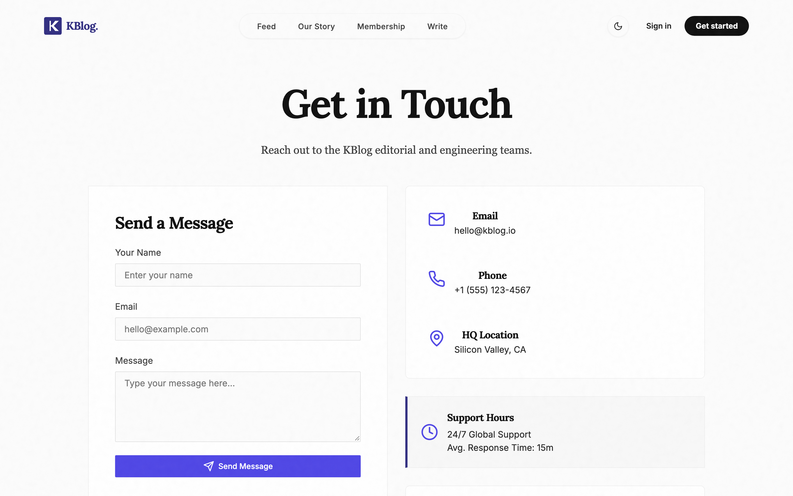
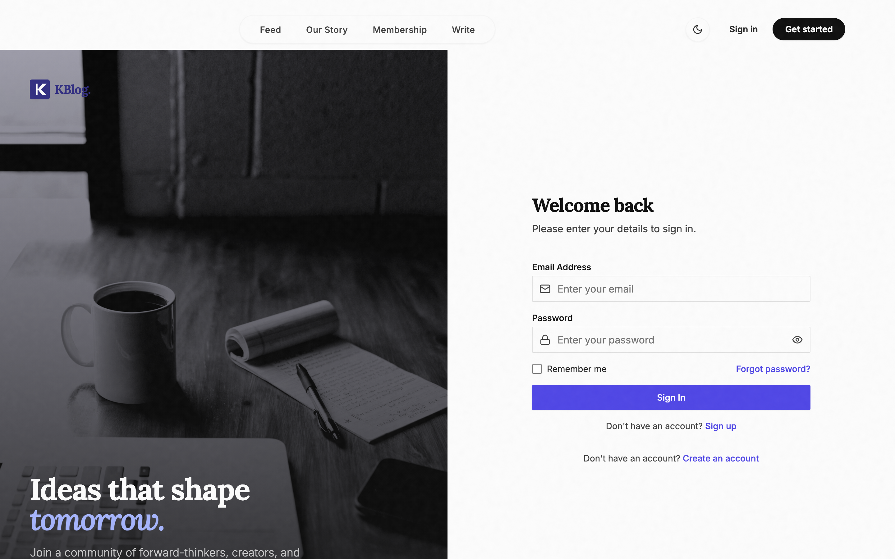

# APPENDICES

## Appendix A — Extended Screenshots

Additional real screenshots captured from the running system (see §4.7.4 for the primary evidence set).







The marketing pages (A.1–A.3) demonstrate the unauthenticated public surface: consistent layout shell, membership pitch, and contact channel — all reachable without a session per the route policy of §4.2. A.4–A.5 show the two entry flows; A.6 shows the Explore route at mobile viewport, where the bottom navigation bar replaces the desktop sidebar (responsiveness evidence for TC-NFR02).

## Appendix B — Full REST API Reference

| Method | Endpoint | Access | Handler |
|---|---|---|---|
| GET | /api/auth/check-username | auth | `checkUsernameAvailability` |
| POST | /api/auth/login | public | `loginUser` |
| GET | /api/auth/profile | auth | `getUserProfile` |
| PUT | /api/auth/profile | auth | `updateUserProfile` |
| POST | /api/auth/register | public | `registerUser` |
| GET | /api/categories | public | `getCategories` |
| PUT | /api/comments/:id | auth | `updateComment` |
| DELETE | /api/comments/:id | auth | `deleteComment` |
| POST | /api/comments/:id/like | auth | `toggleLikeComment` |
| POST | /api/comments/:id/replies | auth | `addReply` |
| POST | /api/comments/:id/replies/:replyId/like | auth | `toggleLikeReply` |
| GET | /api/submissions | opt-auth | `getSubmissions` |
| POST | /api/submissions | auth | `createSubmission` |
| GET | /api/submissions/:id | opt-auth | `getSubmissionById` |
| PUT | /api/submissions/:id | auth, author/admin | `updateSubmission` |
| DELETE | /api/submissions/:id | auth, author/admin | `deleteSubmission` |
| GET | /api/submissions/:id/comments | public | `getComments` |
| POST | /api/submissions/:id/comments | auth | `addComment` |
| POST | /api/submissions/:id/interact | auth | `interactSubmission` |
| POST | /api/submissions/:id/moderate | auth, reviewer+ | `moderateSingleSubmission` |
| POST | /api/submissions/:id/repost | auth | `toggleRepostSubmission` |
| PUT | /api/submissions/:id/status | auth, reviewer+ | `updateSubmissionStatus` |
| GET | /api/submissions/feed | opt-auth | `getSocialFeed` |
| GET | /api/submissions/moderation/audit | auth, reviewer+ | `getModerationAudit` |
| POST | /api/submissions/moderation/rescan-all | auth, reviewer+ | `rescanAllSubmissions` |
| GET | /api/submissions/popular/tags | public | `getPopularTags` |
| GET | /api/submissions/search/explore | opt-auth | `searchExplore` |
| POST | /api/submissions/upload | auth, upload | `inline` |
| GET | /api/users | auth | `inline` |
| GET | /api/users/:id | auth | `inline` |
| PUT | /api/users/:id | auth | `inline` |
| DELETE | /api/users/:id | auth | `inline` |
| POST | /api/users/:id/follow | auth | `inline` |
| PATCH | /api/users/:id/status | auth | `inline` |
| GET | /api/users/:identifier/comments | public | `inline` |
| GET | /api/users/:identifier/followers | opt-auth | `inline` |
| GET | /api/users/:identifier/following | opt-auth | `inline` |
| GET | /api/users/:identifier/likes | public | `inline` |
| GET | /api/users/:identifier/posts | public | `inline` |
| GET | /api/users/:identifier/reposts | public | `inline` |
| GET | /api/users/authors | public | `inline` |
| GET | /api/users/bookmark-folders | auth | `inline` |
| PUT | /api/users/bookmark-folders | auth | `inline` |
| DELETE | /api/users/bookmark-folders/:folderName | auth | `inline` |
| GET | /api/users/bookmarks | auth | `inline` |
| GET | /api/users/featured-authors | opt-auth | `inline` |
| GET | /api/users/profile/:identifier | opt-auth | `inline` |
| GET | /api/users/search | public | `inline` |
| POST | /api/users/upload | auth, upload | `inline` |


## Appendix C — Moderation Test Outputs

Verbatim output records of the six executed moderation test cases (Table 4.3), preserved in `evidence/moderation-tests.json`. Summary:

| Case | Input (summary) | Overall score | Grade | Triggered categories | Matched terms (count) | Interpretation |
|---|---|---|---|---|---|---|
| TC-M01 | Clean technology article | 0 | CLEAN | none | 0 | expected; no false positive on benign prose |
| TC-M02 | Mild profanity in body | 34 | FLAGGED | EXPLICIT (40) | 1 severe body (30) + 1 moderate body (10) | correct; composite 40×0.85=34, label forces FLAGGED |
| TC-M03 | Severe explicit + sexual | 89 | CRITICAL | SEXUAL, EXPLICIT | 4 | correct; dominant EXPLICIT=100 + residual → 89
| TC-M04 | Paraphrased racist/hate text | 0 | CLEAN | none | 0 | **false negative** — vocabulary outside lexicon; documented limitation |
| TC-M05 | Leetspeak-obfuscated profanity | 68 | FLAGGED | EXPLICIT (80) | 2 | correct; normalisation recovered obfuscated terms → 80×0.85=68
| TC-M06 | Adult-adjacent terminology | 85 | CRITICAL | 18+ (100) | 3 | correct; 100×0.85=85

Each record contains `labels`, per-category `scores`, `matches[]` (the exact matched term, dictionary severity, and field where it occurred), `summary`, and `scannedAt` — the same subdocument shown to human reviewers in Figure 4.8.

## Appendix D — Evaluation Instrument (for future user study)

Proposed questionnaire for cohort deployment (not yet administered):

**Part 1 — Standard SUS** (all Likert 1–5, alternating polarity):

1. I think that I would like to use this system frequently.
2. I found the system unnecessarily complex.
3. I thought the system was easy to use.
4. I think that I would need the support of a technical person to be able to use this system.
5. I found the various functions in this system were well integrated.
6. I thought there was too much inconsistency in this system.
7. I would imagine that most people would learn to use this system very quickly.
8. I found the system very cumbersome to use.
9. I felt very confident using the system.
10. I needed to learn a lot of things before I could get going with this system.

**Part 2 — Domain items**:

11. The personalised feed showed stories relevant to my interests.
12. I understood the review status of my submissions at each stage.
13. The moderation feedback given to authors was clear and fair.
14. As a reviewer, the machine-audit information helped my decisions.
15. Open response: which feature most needed improvement?

The instrument is designed for a pilot cohort of approximately 20–30 student users plus reviewers, administered after two weeks of normal use. It was not administered during this project; results therefore do not appear in Chapter Four.

## Appendix E — Pipeline Parameters (verbatim)

| Parameter | Value | Effect |
|---|---|---|
| MAX_POST_AGE_DAYS | 30 | hard age ceiling on all candidates |
| HISTORY_SEQUENCE_LENGTH | 50 | per-user context cap (interactions + comments) |
| CANDIDATE_POOL_SIZE | 150 | total candidates before filtering |
| RESULT_SIZE | 12 | items per feed page |
| IN_NETWORK_WINDOW_DAYS | 14 | recency window for followed-author posts |
| OUT_OF_NETWORK_WINDOW_DAYS | 21 | recency window for interest/recent pools |
| AUTHOR_DIVERSITY_DECAY | 0.85 | score decay per repeat author position |
| AUTHOR_DIVERSITY_FLOOR | 0.55 | minimum attenuation multiplier |


The complete `params.js` tuning table (Table 3.17 reproduces the constants). ACTION_WEIGHTS (18 entries) combine Phoenix action probabilities into the final score: favourite +1.0, reply +13.5, repost +1.0, click +0.3, profile-click +1.0, share +1.0, photo-expand +0.1, dwell +0.05, quote +1.0, follow-author +4.0, and remaining actions (block, mute, report, negative feedback variants) −74/−369 penalties where supported — unsupported actions default to zero contribution per §3.8. FEATURE_WEIGHTS (8 entries) map raw story features to scorer inputs. POPULARITY_NORMALIZATION weights engagement types (like 1, comment 2, repost 3) scaled by 50 for the popularity feature. These values were adopted from the publicly documented Home Mixer configuration and *not* re-tuned for this corpus — recorded here as a limitation and a tuning starting point for the successor project.

## Appendix F — Project Timetable

| Phase | Activities | Duration (weeks) |
|---|---|---|
| Requirements | platform survey, user needs, FR/NFR catalogue | 2 |
| Analysis | existing-system evaluation, use-case model, scope fixing | 2 |
| Design | architecture, schema, pipeline & moderation algorithms, UML | 3 |
| Implementation | backend models/routes/pipeline, frontend screens, moderation | 10 |
| Testing | unit-level verification, functional suite (§4.7), performance capture | 2 |
| Deployment & documentation | seed, PWA config, dissertation production | 2 |

Total elapsed: approximately 21 weeks, consistent with a single-semester-plus project schedule. The largest single cost was implementation, dominated by the recommendation service and the moderation integration.

## Appendix G — Installation and Local Deployment

Verified setup sequence (as executed during evidence collection):

1. `npm install` in repository root and `server/` (two lockfiles: frontend and backend).
2. Environment: `server/.env` must define `MONGO_URI`, `JWT_SECRET`, `PORT` (5005 used here), and optionally `CLOUDINARY_*` — without Cloudinary keys the upload route falls back to local `server/uploads/` storage.
3. Seed: `node server/seed.js` (creates categories, sample stories, and the test accounts listed in §4.7); `node server/seed-reposts.js` for repost fixtures.
4. Run: `npm run dev` (Vite, :5173) and `node server/index.js` (Express, :5005); Vite proxies `/api` to the backend.
5. Verify: `GET /api/health` returns 200; login with a seeded account.

Production path per `render.yaml`: static frontend on Vercel/Render, API as a Node web service, MongoDB Atlas for persistence, Cloudinary for media. The service-worker build enables installability after first load.

## Appendix H — Complete Test Matrix

| ID | Area | Requirement | Procedure | Expected | Actual |
|---|---|---|---|---|---|
| TC-A01 | Auth | FR-1 | register valid payload | account created, hashed pw | PASS |
| TC-A02 | Auth | FR-2 | login valid | JWT + session | PASS |
| TC-A03 | Auth | FR-2 | login bad password | 401 | PASS |
| TC-A04 | Auth | FR-2 | login unregistered | error | PASS |
| TC-A05 | Auth | FR-3 | incomplete username → app | redirect to setup | PASS |
| TC-A06 | Auth | NFR-5 | duplicate username register | rejected | PASS |
| TC-S01 | Stories | FR-5 | create draft | isDraft=true | PASS |
| TC-S02 | Stories | FR-5 | publish draft | status PENDING_REVIEW | PASS |
| TC-S03 | Stories | FR-6 | edit published story | creates draftOf copy | PASS |
| TC-S04 | Stories | FR-5 | read-time on save | 200-wpm value | PASS |
| TC-S05 | Stories | FR-7 | reviewer approve | PUBLISHED | PASS |
| TC-S06 | Stories | FR-7 | reviewer request revisions | REVISIONS_REQUESTED + note | PASS |
| TC-S07 | Stories | NFR-5 | student hits reviewer endpoint | 403 | PASS |
| TC-F01 | Feed | FR-12 | for-you tab | ranked items | PASS |
| TC-F02 | Feed | FR-11 | following tab | follows only, chrono | PASS |
| TC-F03 | Feed | FR-12 | own story in feed | excluded | PASS |
| TC-F04 | Feed | FR-12 | already-seen ids | suppressed | PASS |
| TC-I01 | Social | FR-8 | like story | unique upsert | PASS |
| TC-I02 | Social | FR-8 | unlike | interaction removed | PASS |
| TC-I03 | Social | FR-9 | comment | appended | PASS |
| TC-I04 | Social | FR-9 | reply + like reply | embedded update | PASS |
| TC-I05 | Social | FR-10 | bookmark → folder | stored under folder | PASS |
| TC-I06 | Social | FR-10 | delete folder | items migrate to default | PASS |
| TC-I07 | Social | FR-13 | repost | in following feeds | PASS |
| TC-M01–06 | Moderation | FR-15 | six lexicon cases | per grade | 5/6 (TC-M04 FN) |
| TC-SEC01–08 | Security | NFR-5 | §4.7.5 battery | per case | all PASS |
| TC-P01 | Perf | NFR-1 | feed latency | <100 ms budget | 15 ms PASS |
| TC-P02 | Perf | NFR-1 | bundle | reasonable | 1.1 MiB, split PASS |
| TC-NFR02 | UI | NFR-2 | mobile viewport | bottom nav | PASS |
| TC-NFR03 | UI | NFR-2 | dark mode | full theme | PASS |

## Appendix I — Glossary

| Term | Definition |
|---|---|
| Candidate | a story retrieved into the feed pipeline before scoring |
| In-network | content from authors the viewer follows |
| Out-of-network | interest/recent-matched content from non-followed authors |
| Phoenix score | per-action engagement probability (sigmoid-scaled heuristic) |
| Hydration | enriching IDs/candidates with full documents or counts |
| Re-ranking | post-scoring reorder for diversity (author attenuation) |
| Machine moderation | the deterministic lexicon/regex safety scan |
| Machine Audit | reviewer dashboard aggregating moderation records |
| Review note | reviewer-authored decision record on a submission |
| seenIds | client cursor suppressing already-served feed items |
| Draft shadow (`draftOf`) | copy of a published story edited without touching live text |
| Pending username | `pending-*` placeholder gate between registration and setup |
| Reviewer queue | PENDING_REVIEW stories awaiting human decision |
| Following feed | chronological merged timeline of posts + reposts from follows |
| Machine Audit | corpus-level moderation dashboard for reviewers |
| optionalAuth | middleware that hydrates the viewer if a token exists, else proceeds anonymously |
| Interaction uniqueness | compound index (submission, user, type) preventing duplicate engagement |

## Appendix J — Development Environment and Test Data

**Configuration surface** (names only — values are environment secrets, never committed or reproduced):

| Variable | Purpose |
|---|---|
| MONGO_URI | MongoDB connection string |
| JWT_SECRET | signing key for auth tokens |
| PORT | API listen port (5005 in development) |
| CLOUDINARY_CLOUD_NAME / API_KEY / API_SECRET | media upload credentials (optional; local fallback without) |

**Seeded test corpus** used for all measurements: ~110 published stories across the seeded categories, the follow graph, and the interaction/comment history used by the pipeline's context hydration.

**Test accounts** (seed fixtures, per the account policy for evidence capture):

| Username | Role | Used for |
|---|---|---|
| sarahchen | student | all member-facing screenshots and flows |
| sophialee | reviewer | Machine Audits / review console |
| alexj | admin | authors console |

## Appendix K — Selected API Response Shapes

Representative payloads (structure abbreviated; field names verbatim from the controllers):

```
GET /api/submissions/feed?tab=for-you&page=1&limit=20
→ { items: [ { _id, title, slug, abstract, image, readTime,
    author: { username, name, avatar },
    category, tags, likeCount, commentCount, repostCount,
    viewerLiked, viewerBookmarked, viewerReposted,
    topComments: [ { author.username, content } ] } ],
  page, totalPages, hasMore }

GET /api/submissions/moderation/audit   (reviewer+)
→ { published, verifiedClean, flagged, critical,
    adult18, racist,
    items: [ { _id, title, grade, overallScore,
      categoryScores: { SEXIST, SEXUAL, EXPLICIT, ADULT_18, RACIST },
      scannedAt } ] }

POST /api/submissions/:id/interact  { type: "LIKE"|"BOOKMARK"|"REPOST", folder? }
→ { liked|bookmarked|reposted: bool, counts }
```

## Appendix L — DFD Level-1 Process Descriptions

| Process | Responsibility | Stores touched |
|---|---|---|
| P1 Identity | registration, login, JWT issue, profile writes | D1 users |
| P2 Composition | draft/publish writes, media upload dispatch | D2 submissions, Cloudinary |
| P3 Governance | machine scan on write, review decisions, notes | D2, D4 reviewnotes |
| P4 Distribution | feed pipeline, explore/search, personalisation reads | D2, D3 interactions, D1 |
| P5 Engagement | comments/replies, like/bookmark/repost upserts | D3, D5 comments |
| P6 Administration | member management, audit aggregation | D1, D2 |

External entities: Visitor (read-only flows to P1/P4), Student (all flows), Reviewer/Admin (P3/P6), Cloudinary (media flow from P2).

## Appendix M — Pre-Deployment Checklist

Carried over from §4.6 for the deployment step: rotate committed credentials; move all secrets to platform environment vars; set `NODE_ENV=production`; confirm Cloudinary configured (else uploads fall back to ephemeral local disk); confirm Atlas IP allowlist covers the host; run seed only on a staging database; verify `/api/health`; verify service-worker registration in production build; enable HTTPS at the platform edge (tokens are Bearer credentials and must not travel plaintext).

## Appendix N — Sample Moderation Record

Abbreviated verbatim record for TC-M02 (fields as stored on `submission.moderation`):

```
grade: "FLAGGED",  overallScore: 34,
labels: ["EXPLICIT"],
categoryScores: { SEXIST: 0, SEXUAL: 0, EXPLICIT: 40, ADULT_18: 0, RACIST: 0 },
matches: [ { term: "<matched term>", severity: "severe", field: "body", count: 1 } ],
summary: "Content flagged for explicit language (1 severe match in body).",
scannedAt: "2025-…"
```

The same shape is embedded on every submission document and is what `/reviews` renders to the human reviewer — the explainability property in concrete form.

## Appendix O — Endpoint Parameter Reference

Request contracts for the principal endpoints (as implemented in the controllers):

| Endpoint | Query / Body parameters | Notes |
|---|---|---|
| GET /api/submissions | `?q, ?tag, ?category, ?author, ?status, ?page, ?limit` | `q`→`$or` text match; public callers restricted to PUBLISHED non-drafts; author callers see own drafts |
| GET /api/submissions/feed | `?tab=for-you|following, ?page, ?limit, ?seenIds` | seenIds consumed by previously-served filter |
| GET /api/submissions/search/explore | `?q, ?category, ?tag, ?page, ?limit` | `$text` when q present; facet equality otherwise |
| POST /api/submissions | body `{title, abstract, content, category, tags, image, isDraft, submit}` | moderation scan runs pre-persist |
| PUT /api/submissions/:id | body same fields | shadow-draft fork when status=PUBLISHED |
| PUT /api/submissions/:id/status | body `{status, note?}` | reviewer+; writes ReviewNote |
| POST /api/submissions/:id/interact | body `{type, folder?, quote?}` | upsert on unique triple |
| POST /api/submissions/:id/moderate | — | re-scans and overwrites subdocument |
| POST /api/submissions/upload | multipart field `image` | Cloudinary or local fallback |
| GET /api/submissions/moderation/audit | — | aggregate counters + per-item rows |
| POST /api/auth/register | body `{name, email, password}` | returns `{user, token}`, pending username |
| POST /api/auth/login | body `{email, password}` | bcrypt compare → JWT |
| GET /api/auth/check-username | `?username=` | regex + reserved + uniqueness |
| PUT /api/auth/profile | body `{name?, bio?, avatar?, coverImage?, username?, interests?}` | commits pending username |
| POST /api/users/:id/follow | — | symmetric edge toggle |
| GET /api/users/bookmarks | `?folder=` | grouped by bookmarkFolder |
| PUT /api/users/bookmark-folders | body `{name}` | creates folder |
| DELETE /api/users/bookmark-folders/:name | — | migrates items to default |
| POST /api/comments/:id/replies | body `{content}` | embedded push |
| GET /api/users/featured-authors | — | stories×20+likes×8+followers×12 |

All mutating endpoints require Bearer auth; ownership/role re-checked per §3.11.

## Appendix P — Requirements → Design → Test Traceability

| Req | Design element | Test / evidence |
|---|---|---|
| FR-1..3 | state machine Fig 3.6; authz flow Fig 3.21 | TC-A01..A06 |
| FR-5,6,7 | state machine Fig 3.5; shadow draft §3.6.2 | TC-S01..S07, TC-W01..W04 |
| FR-8,9,10,13 | schema Table 3.13-3.14; sequences Fig 3.10, 4.20, 4.24 | TC-I01..I07 |
| FR-11,12 | pipeline §3.8, Figs 3.13-3.14 | TC-F01..F04, latency 15 ms |
| FR-14 | text index §3.6.3; flow Fig 4.23 | TC-S03, API timing 0 ms |
| FR-15 | moderation §3.9, Figs 3.15, 4.19 | TC-M01..M08 |
| FR-16 | review console §4.2.1; audit endpoint | TC-M07, Fig 4.8 |
| FR-17 | admin routes Table 4.2 | TC-SEC03, Fig 4.16 |
| NFR-1 | indexes §3.6.3; code split §4.2 | Table 4.7-4.8 |
| NFR-2 | responsive/dark/a11y §4.2 | Figs 4.7, 4.17, 4.18 |
| NFR-4 | moderation record §3.9 | Fig 4.8, App. C/N |
| NFR-5 | security design §3.11 | TC-SEC01..08 |

Every requirement has at least one design realisation and one executed verification; no orphan requirements exist.

## Appendix Q — Screenshot Evidence Index

All 24 captures were taken against the running application (localhost:5173, seeded corpus) via Playwright; filenames are verbatim from `dissertation/screenshots/`.

| File | State shown | Evidence for |
|---|---|---|
| 01-landing | public home | public surface, marketing shell |
| 02-about | About page | static public route |
| 03-membership | Membership page | static public route |
| 04-contact | Contact page | static public route |
| 05-login | login form | auth entry |
| 06-signup | registration form | auth entry + terms gate |
| 07-login-validation-error | inline field errors | client validation (TC-A03) |
| 08-login-failed-state | server rejection | failed login (TC-A02) |
| 09-protected-redirect | login after guard | route protection (TC-A04) |
| 10-home-feed | authed editorial home | featured/recent/trending layout |
| 11-social-feed | /feed | pipeline output surface |
| 12-explore | Explore hub | facets + tag cloud |
| 13-bookmarks | bookmark folders | TC-I05/I06 |
| 14-my-stories | writer workspace | status grouping |
| 15-write-editor | /write | distraction-free editor |
| 16-profile | account profile | identity surface (sarahchen) |
| 17-reviews | Machine Audits | moderation dashboard (sophialee) |
| 18-authors-admin | admin console | member management (alexj) |
| 19-author-profile | public author page | social profile |
| 20-article-view | story detail | reading surface + comments |
| 21-keyboard-shortcuts | shortcuts modal | accessibility |
| 22-home-dark-mode | dark theme | TC-NFR03 |
| 23-mobile-home | 390px home | TC-NFR02 |
| 24-mobile-explore | mobile Explore | TC-NFR02 |
