# CHAPTER FOUR: IMPLEMENTATION AND EVALUATION

## 4.1 Implementation Environment

The system was implemented on macOS using Visual Studio Code, with Git/GitHub for version control. The frontend toolchain is Vite 5 + TypeScript; the backend runs Node.js 22 with Express 4; persistence is MongoDB Atlas through Mongoose 8; media is served by Cloudinary. Development ran as two processes — the Vite dev server on port 5173 proxying `/api` calls to the Express server on port 5005 (`concurrently` via `npm run dev:all`). Production targets Vercel (static frontend) and Render (API), both auto-deploying from the repository.

**Table 4.1 — Technology stack and justification**

| Layer | Choice | Justification |
|---|---|---|
| UI framework | React 18 + TypeScript | Component reuse across ~25 pages; type safety for a large SPA |
| State | Redux Toolkit | Predictable cross-page state (auth, feeds, comments); DevTools aid debugging |
| Editor | react-quill | Mature rich-text editing producing sanitisable HTML |
| Styling | Tailwind CSS | Rapid, consistent, responsive design incl. dark mode |
| Routing | React Router v6 | Declarative guards for the 3-state auth machine |
| Server | Express 4 | Minimal, well-documented REST framework |
| ODM/DB | Mongoose 8 / MongoDB Atlas | Flexible document model fits evolving story/social schemas; free cloud tier |
| Auth | JWT (jsonwebtoken) + bcryptjs | Stateless sessions; adaptive-cost password hashing (Provos & Mazières, 1999) |
| Media | Cloudinary + multer | Managed CDN with local-disk fallback (NFR-05) |
| PWA | manifest + custom service worker | Installability without app-store friction (FR-20) |

Each dependency earns its place: React Router for SPA navigation; Redux Toolkit over Context for the four-slice store because cross-slice coordination (auth → submissions → comments) needs a single state tree; Tailwind for the utility-first responsive/dark variant system; React Quill for the editor (the lightest capable rich-text surface for this need); framer-motion for transitions; axios over fetch for interceptor-based token injection; on the backend, express-validator for the defence-in-depth validation of §3.4, multer for multipart uploads, bcryptjs and jsonwebtoken for the auth design of §3.11, mongoose for the schema/index layer of §3.6. No library is decorative — each maps to a design requirement.

## 4.2 Frontend Implementation

The client is organised as a routed SPA (`src/App.tsx`) whose route table *is* the authorisation state machine designed in §3.7.3: `ProtectedRoute` checks `localStorage` auth and the `pending-*` username invariant before rendering, preserving the intended destination through forced onboarding; `PublicRoute` keeps authenticated users out of login/signup; `AdminRoute`/`adminOnly` restrict the authors console.

Page bundles are code-split with `React.lazy`, so the ~1.1 MB production bundle (31 chunks, Table 4.6) ships only the entry chunk (~99 KB JS + ~100 KB CSS) plus route chunks on demand — the editor (~258 KB vendor chunk) never loads for readers. Global state uses four Redux slices; cross-cutting UI (notifications, error boundaries, keyboard-shortcuts modal, followers modal, bookmark folder dropdown, image cropper) is factored into shared components. Responsiveness is delivered through Tailwind breakpoints plus a dedicated `MobileBottomNav`; a `ThemeContext` toggles a full dark theme.

**Figure 4.1** shows the public landing page; **Figure 4.2** the authenticated editorial home feed with sidebar navigation, featured posts, recent articles, trending categories and featured authors; **Figure 4.3** the distraction-free writing surface (`/write`), deliberately rendered outside the sidebar layout per the IA audit; **Figure 4.4** the Explore discovery hub; **Figure 4.5** the writer's workspace (`/me/stories`); **Figure 4.6** an author profile; **Figure 4.7** the mobile experience.


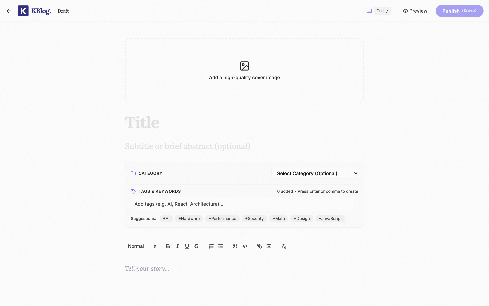
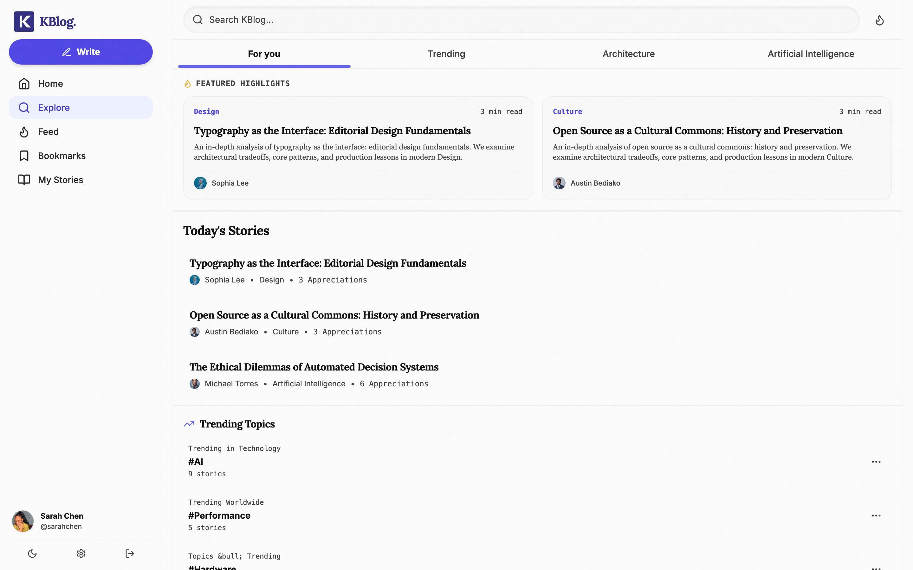
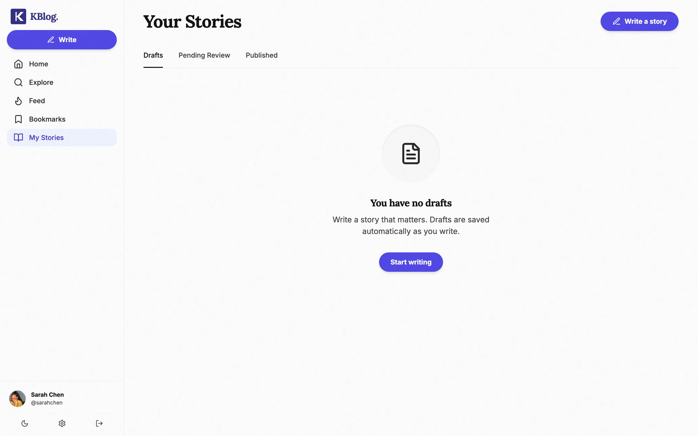


**Table 4.2 — Client route map (from `src/App.tsx`)**

| Route | Guard | Page |
|---|---|---|
| / | layout | HomePage (public landing or authed home) |
| /feed | protected | SocialFeedPage |
| /explore | public | BlogListPage |
| /bookmarks, /me/stories | protected | BookmarksPage, MyStoriesPage |
| /blog/:slug | public | BlogDetailPage |
| /blog/edit/:slug | protected | EditPostPage |
| /auth/login, /auth/signup | public-only | LoginPage, RegisterPage |
| /profile | protected | ProfilePage |
| /onboarding/username, /interests | protected | UsernameSetupPage, OnboardingPage |
| /reviews | protected | ReviewsPage (role-gated server-side) |
| /authors | adminOnly | Authors |
| /write, /write/:id | protected | WritePage |
| /@:username, /author/:id | public | AuthorProfilePage |
| /about, /membership, /contact | public | static pages |
| legacy redirects | — | /blog→/explore, /categories, /tags, /settings→/profile, /admin/users→/authors |
| * | — | NotFoundPage |

**State management.** Four Redux slices partition the store: `auth` (user object, token, login/register thunks against `/api/auth`, localStorage persistence), `submissions` (story CRUD, feed pages, review queue), `comments` (per-story threads, replies, likes), and `ui` (toasts, theme-adjacent flags). Thunks attach `Authorization: Bearer <token>` read from the auth slice, keeping token handling in exactly one place.

**Service layer.** API access is centralised in `src/services/` modules wrapping a shared axios instance: the instance injects the Bearer token from the auth slice on every request and normalises error responses — so no component ever constructs HTTP calls directly, and token handling exists in exactly one place on the client. Slice-wise: `auth` thunks (`login`, `register`, `updateProfile`, `checkUsername`) update both the store and `localStorage`; `submissions` holds feed pages, the review queue, and story CRUD with optimistic toggles for like/bookmark so UI feels synchronous while the upsert resolves; `comments` is keyed per story to keep threads independent; `ui` owns toasts and modal state.

**Supporting UX systems.** The implementation includes a global keyboard-shortcut layer (`useKeyboardShortcuts`, `?` opens the modal in Figure 4.18), a `FollowersModal`, a `BookmarkDropdown` implementing the folder model (UC-10), an `ImageCropModal` used before avatar/cover upload, framer-motion page transitions via `AnimatePresence`, a full dark theme through `ThemeContext` + Tailwind `dark:` variants (Figure 4.17), and a `MobileBottomNav` for ≤md viewports (Figure 4.7).

### 4.2.1 Page-level implementation notes

Each page composes the shared layout, one or more slices, and route-specific data access:

- **HomePage** renders two distinct documents depending on session state: the marketing landing (Figure 4.1) for guests, or the authenticated editorial home (Figure 4.2) which hydrates featured posts, a paginated recent-articles rail, trending categories and the featured-authors panel — the last computed server-side by the engagement formula of §4.3.
- **SocialFeedPage** (`/feed`) is the consumer of the recommendation pipeline: it maintains `seenIds` as it paginates so the previously-served filter (§4.4) suppresses repeats across page fetches, and multiplexes the for-you/following tabs against the same endpoint's `tab` parameter.
- **BlogDetailPage** (`/blog/:slug`) fetches by slug under `optionalAuth` — anonymous readers get the public projection, authenticated viewers additionally receive viewer-specific flags (liked, bookmarked, reposted) so action buttons render their true state.
- **WritePage** (`/write`, `/write/:id`) wraps React Quill with title/abstract/category/tag/image inputs and the draft/publish split that drives the submission state machine; editing a published story creates the `draftOf` shadow copy described in §3.6.2 rather than mutating live content. The editor chunk is the heaviest in the bundle and only loads on this route.
- **ReviewsPage** (`/reviews`) is the reviewer queue: pending items render alongside their machine-moderation record (grade, per-category scores, matched terms) so the human decision is informed by — not replaced by — the automated scan; the audit tab (Figure 4.8) aggregates corpus-level metrics.
- **MyStoriesPage** (`/me/stories`, Figure 4.5) surfaces the writer's state machine visually: drafts, pending, revisions-requested (with the reviewer's note), published and archived are grouped, making the otherwise-invisible workflow legible to authors.
- **BookmarksPage** implements the folder model (UC-10) with `BookmarkDropdown` for assignment and server migration on folder delete.
- **ProfilePage / AuthorProfilePage** share one component with two data paths: `/profile` for the signed-in user's editable view (bio, avatar via `ImageCropModal`, follower/following lists via `FollowersModal`), `/@:username` for the public projection (Figure 4.6).
- **UsernameSetupPage / OnboardingPage** implement the two-step completion gate enforced by `ProtectedRoute` (§3.7.3): a `pending-*` username can reach nothing else until resolved, then interests seed the recommender's preference context.
- **Authors (admin)** — the `/authors` console (Figure 4.16) provides directory search, role change and activation toggles; every action re-checks `isAdmin` server-side.
- **Explore facets** — the Explore page composes the `?q`/`?category`/`?tag` parameters of Table B's search endpoint client-side, rendering tag chips from `/popular/tags` and category filters from `/categories` — all three endpoints measured in Table 4.7.
- **Auth pages** — Login/Register sit behind `PublicRoute`, which redirects already-authenticated users home; the forms exercise both validation layers (Figures 4.9–4.10) and drive the first leg of the onboarding state machine.
- **NotFoundPage** plus per-route `React.lazy` fallbacks and error boundaries cover the non-happy paths.

**Service worker.** The PWA layer registers a service worker precaching the app shell; API calls bypass the cache (`network-first`) so feeds stay fresh while static assets survive offline reloads — the strategy modelled in the `pwa-sw` diagram (§3.10).

## 4.3 Backend Implementation

The API is a modular Express application: `server/index.js` wires middleware (CORS, 50 MB JSON bodies, static `/uploads`) and mounts five routers; controllers hold business logic; Mongoose models enforce schema constraints; `errorMiddleware` normalises failures. Forty-nine endpoints were implemented (Appendix B gives the generated reference table). Cross-cutting concerns are handled as middleware composition, e.g. a privileged route is declared as `router.put('/:id/status', protect, isReviewer, updateSubmissionStatus)` — the access contract is legible at the route table itself.

Two implementation notes are worth recording:

1. **Identity from token only.** All author/reviewer attribution derives from `req.user` populated by `protect`; request bodies never supply identity, closing the impersonation class of bugs by construction.
2. **Legacy compatibility.** Redirects (`/api/authors` → `/api/users/authors`) and client-side route redirects (`/blog` → `/explore`, `/settings` → `/profile`) let the IA be refactored without breaking published links — evidence of the waterfall "design-then-implement, document-divergence" discipline.

**Service bootstrap.** `server/index.js` composes the app in layers: dotenv loads secrets; `connectDB()` opens the Mongoose connection before the listener starts (fail-fast if the URI is wrong); middleware mounts CORS with the frontend origin and JSON/urlencoded parsers at a 50 MB limit; the five routers mount under `/api/auth`, `/api/users`, `/api/submissions`, `/api/comments`, `/api/categories`; `GET /api/health` sits outside auth for uptime probes; and `errorMiddleware` is registered last so thrown errors from any route normalise to `{message}` JSON. Uploads are served statically from `server/uploads/` only in the local-fallback path.

**Middleware chain.** Every request traverses a fixed pipeline: `cors()` → `express.json()`/`urlencoded` (50 MB limit, sized for base64 editor content) → route matching → per-route `protect`/`optionalAuth` and role middleware → controller → `errorMiddleware`. The `protect` middleware verifies the Bearer token's signature, loads the user document onto `req.user`, and rejects expired or malformed tokens with 401; `optionalAuth` performs the same load but never rejects, letting public endpoints personalise opportunistically. Role checks are small composable predicates (`isReviewer` admits reviewer+admin, `isAuthorOrAdmin` compares the resource's author to `req.user`).

**Controller structure.** Five controllers implement the 49 endpoints:

**Table 4.3 — Controller responsibilities**

| Controller | Surface | Key behaviours |
|---|---|---|
| authController | register, login, profile get/put, username check | bcrypt compare, JWT issue, `pending-*` username assignment, toJSON password stripping |
| submissionController | stories CRUD, feeds, interactions, reposts, moderation endpoints, upload | state-machine transitions, moderation invocation, feed delegation, engagement upserts |
| userController (in routes/users.js) | authors directory, featured authors, bookmarks/folders, profiles, follow graph, admin user mgmt | per-user social projections, folder migration on delete, featured-author scoring (stories×20 + likes×8 + followers×12) |
| commentController | comments, replies, likes | threaded replies embedded in comment doc, like toggling on comments and replies |
| categoryController | categories list | seeded taxonomy |

**Submission controller highlights** (the largest, ~1,300 lines): `getSocialFeed` multiplexes `tab=for-you|following` between the recommendation pipeline and a merged stories+reposts chronological timeline; `getSubmissions` serves Explore with text-search, category/tag facets and pagination restricted to `PUBLISHED ∧ ¬isDraft`; `interactSubmission` upserts the unique `(submission,user,type)` Interaction document, making likes/bookmarks/reposts idempotent; `updateSubmissionStatus` enforces the editorial transition rules and writes a `ReviewNote`; the moderation trio (`getModerationAudit`, `rescanAllSubmissions`, `moderateSingleSubmission`) powers the reviewer console.

**Auth lifecycle in code.** `registerUser` enforces express-validator schemas, bcrypt-hashes the password, assigns a `pending-<uuid>` placeholder username, and returns `{user, token}`; the placeholder triggers the client-side onboarding gate (§4.2). `loginUser` selects `+password` explicitly — the schema sets `select:false` so the hash never leaks into normal queries — then `bcrypt.compare` gates `signToken(user._id, {expiresIn: '30d'})`. `checkUsernameAvailability` validates the claimed handle against the regex and reserved-username rules before uniqueness, and `updateUserProfile` clears the pending flag only after a valid unique username is committed. Profile updates run through the same endpoint, keeping one write path for identity data.

**Submission lifecycle in code.** `createSubmission` sanitises rich-text input, generates the slug, computes `readTime` at 200 wpm, runs `scanContent` synchronously and persists; drafts skip the review queue via `isDraft`. `updateSubmission` implements the shadow-draft rule — editing a `PUBLISHED` story creates a `draftOf` copy rather than mutating live content — which is what Figure 4.5's grouping reflects. `updateSubmissionStatus` is the only path that mutates `status`, and only for reviewer/admin roles; every transition writes a `ReviewNote`, so the audit trail is append-only. `interactSubmission` performs a `$set`-upsert on the unique `(submission,user,type)` triple; `toggleRepostSubmission` manages the repost documents that the in-network source later surfaces; and `getSubmissions` composes the Explore query — text-search `$text` when `q` is present, category/tag equality filters otherwise, always constrained to `status=PUBLISHED ∧ ¬isDraft`.

**Users controller group** (`routes/users.js` holds these inline handlers): the authors directory (`GET /api/users/authors`) projects public identity fields for the authors listing; `GET /featured-authors` computes a weighted engagement score — stories×20 + likes×8 + followers×12 — over the author pool for the home rail; `/:id/follow` toggles the adjacency arrays on both user documents atomically; the bookmark trio (`GET /bookmarks`, `GET/PUT /bookmark-folders`, `DELETE /bookmark-folders/:name`) reads interactions by type=BOOKMARK and manages folder assignment, with folder delete migrating orphaned bookmarks to the default; `PATCH /:id/status` and role updates implement the admin member-management actions; and `profile/:identifier` resolves either ObjectId or username for the public profile projection.

**Comments controller.** `getComments` returns a story's threads with author populated; `addComment`/`addReply` write the document and embedded-reply structures of §3.6; `toggleLikeComment`/`toggleLikeReply` flip membership in `likedBy` and keep the denormalised `likes` count consistent; `updateComment`/`deleteComment` enforce ownership (`author` == `req.user` or admin).

**Upload pipeline.** `POST /api/submissions/upload` and `/api/users/upload` share one mechanism: multer middleware accepts a single `image` field, enforces the image-MIME whitelist and 5 MB ceiling in memory, then branches — with `CLOUDINARY_*` configured, the buffer streams to Cloudinary and the returned `secure_url` is stored; otherwise the file persists to `server/uploads/` and is served statically. The URL is only ever a string field on the document (`image`, `avatar`, `coverImage`), keeping binary concerns out of MongoDB.

**Comments and replies.** `addComment` appends a top-level document with `submission`, `author`, `content`; `addReply` pushes an embedded reply object `{author, content, likes, likedBy, createdAt}` into the parent's `replies[]` — a deliberate denormalisation so a thread loads in one document read. `toggleLikeComment`/`toggleLikeReply` toggle the user id in `likedBy` and keep `likes` as the denormalised count.

**Error handling.** `errorMiddleware` is the single funnel: Mongoose `ValidationError`/`CastError`, JWT `JsonWebTokenError`/`TokenExpiredError`, express-validator results and thrown `Error`s all normalise to `{message}` with an appropriate status; the async controller wrappers forward exceptions rather than letting them crash the process. On the client, axios responses surface `err.response.data.message` through the `ui` toast slice — the same message field the tests assert on.

## 4.4 Recommendation Pipeline Implementation

The pipeline of §3.8 is implemented as pure, composable async stages in `server/services/recommendation/`. `runRecommendationPipeline` orchestrates: context hydration → parallel sourcing → six filters → engagement hydration → three scorers → top-K selection → post-hydration. Each stage is a single-responsibility module (e.g., `filters/ageFilter.js`, `scorers/phoenixScorer.js`, `selectors/topKSelector.js`), which made the system testable stage-by-stage and will allow the heuristic Phoenix scorer to be swapped for a learned model without architectural change — the module boundary *is* the seam.

Representative excerpt (scorer core, condensed):

```js
const favoriteLogit =
  0.05 + (isFollowing ? FEATURE_WEIGHTS.author_followed : 0)
  + overlap * FEATURE_WEIGHTS.tag_overlap
  + catMatch * FEATURE_WEIGHTS.category_match
  + recency * FEATURE_WEIGHTS.recency
  + popularity * FEATURE_WEIGHTS.popularity;
const favorite_score = clamp(sigmoid(favoriteLogit * 4));
```

The resulting feed is served at `GET /api/submissions/feed?tab=for-you`, which internally calls `getForYouFeed` → `runRecommendationPipeline`; the `following` tab bypasses ranking for a merged stories+reposts reverse-chronological timeline.

**Parameter adoption and rationale.** All pipeline constants were adopted from the publicly documented Home Mixer configuration rather than re-tuned: the corpus is too small for data-driven tuning to be meaningful, and adopting published values makes the comparison to the reference architecture explicit. The consequence is stated honestly — the scorer is calibrated to Twitter-scale signal distributions, not this community's, so action-probability outputs are *structurally* correct but not empirically fitted. This is recorded as the primary tuning limitation in §5.3.

**Module inventory.** The service is 13 focused files: `index.js` (public entry `getForYouFeed`), `pipeline.js` (orchestrator), `queryHydration.js` (context), `params.js` (all tuning constants), two `sources/` (in/out-of-network), six `filters/`, two `hydrators/` (engagement counts, preview comments), three `scorers/`, and `selectors/topKSelector.js`. Average file size ≈60 lines — deliberate single-responsibility decomposition mirroring Product Mixer's stage model.

**Table 4.4 — Pipeline modules and measured behaviour**

| Module | Input → Output | Implementation note |
|---|---|---|
| hydrateUserContext | userId → ctx | merges ≤50 interactions + ≤50 comments into actionSequence; derives tag/category preferences |
| inNetworkSource | ctx → ≤75 | posts + reposts of followed authors ≤14d |
| outOfNetworkSource | ctx → ≤75×2 | interest pool + broad recent pool ≤21d, viewer & follows excluded |
| coreDataHydrationFilter | cand → cand | drops candidates whose submission failed to populate |
| dropDuplicates | cand → cand | collapses post/repost of same story |
| ageFilter | cand → cand | hard 30-day cap |
| selfPostFilter | cand → cand | removes viewer's own content |
| previouslyServedFilter | cand, seenIds → cand | session-level dedup via cursor |
| moderationVisibilityFilter | cand → cand | drops flagged/CRITICAL items |
| hydrateEngagement | cand → cand +counts | aggregates Interaction counts per candidate |
| phoenixScore | cand → cand +scores | 18 sigmoid action probabilities (Table 3.18) |
| weightedScore | cand → cand +score | Σ action·weight (Table 3.19) |
| authorDiversityScore | cand → cand' | position-based attenuation then re-sort |
| selectTopK | cand → page | slice + `{page,totalPages,hasMore}` |
| previewCommentsHydrator | items → items | top comments per selected item |

**Stage walkthrough.** The sixteen stages execute in one orchestrated pass per request. Context hydration (stage 1) loads the viewer document, merges the ≤50 most recent interactions and ≤50 comments into an action sequence, and frequency-ranks tags/categories into preferences — three bounded queries that determine everything downstream. The two sources (stages 2–3) run in parallel: in-network issues two queries (posts by follows, reposts by follows) within the 14-day window; out-of-network issues two more (tag/category-matched, broad recent) within 21 days, both excluding the viewer and existing follows. Core-data hydration (4) populates author fields and drops dangling references — the first correctness filter. Deduplication (5) collapses a story appearing as both post and repost, keeping the repost wrapper for attribution. The age filter (6) enforces the 30-day hard cap. Self-post (7) and previously-served (8) filters subtract the viewer's own content and the session's `seenIds` respectively — the latter being the mechanism behind TC-R01. The first moderation filter (9) removes anything flagged or worse before expensive hydration. Engagement hydration (10) aggregates like/comment/repost counts and computes the three viewer flags in one pass over the interaction collection. The Phoenix scorer (11) maps each candidate through 18 sigmoid action probabilities from hydrated features; the weighted scorer (12) folds those into a single score via ACTION_WEIGHTS. Diversity attenuation (13) walks the sorted list applying the per-author decay, then re-sorts. Top-K selection (14) slices the page and computes the envelope metadata. Preview hydration (15) attaches top comments for the rendered items only — deliberately last, so it never hydrates comments for dropped candidates. The second moderation filter (16) is a defensive re-check before serialisation.

**Query cost.** The pipeline performs a bounded number of MongoDB queries per request: context (2–3), sourcing (2–4 in parallel), engagement hydration (aggregations), preview comments (1 batched) — a total of roughly 8–10 round-trips, all served by the §3.6.3 indexes, which explains the measured ~15 ms end-to-end latency in Table 4.7.

## 4.5 Moderation Implementation

`analyzeSubmission({title, abstract, content, tags})` normalises input (HTML strip, entity decode, leetspeak deobfuscation), evaluates five dictionaries in two severity tiers, composes the worst-category-dominant score, and returns `{overallScore, grade, flagged, labels, summary, categories}` which is persisted onto the submission document. `executeMachineCallback` emits a structured diagnostic log on scan. Reviewer-facing surfaces consume the same record: the Machine Audits page (Figure 4.8) aggregates counts and exposes per-category metric tiles and re-scan actions; `moderationVisibilityFilter` silently excludes flagged items from feed candidates.

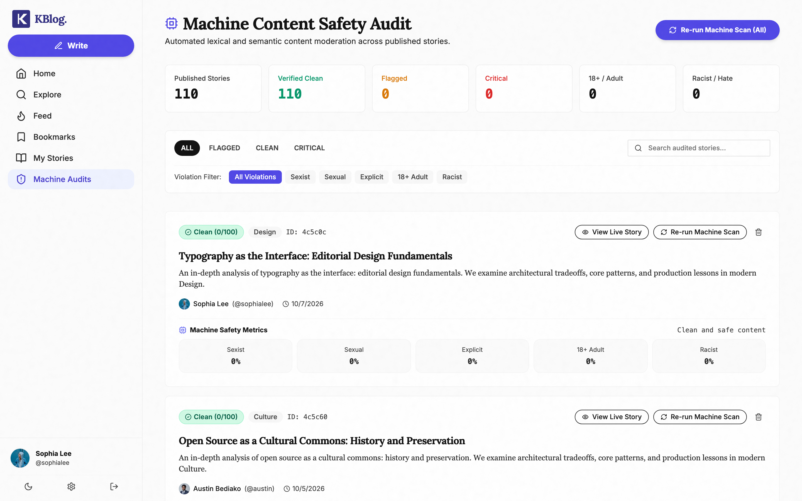

**Lexicon design.** The dictionary is organised per category (`SEXIST`, `SEXUAL`, `EXPLICIT`, `ADULT_18`, `RACIST`) and per tier (severe/moderate regex), with title and tag matches weighted ~1.5–2× body matches on the reasoning that framing terms are stronger intent signals than incidental body vocabulary. The leetspeak normalisation map (Table 3.4) is deliberately small and conservative — seven substitutions — because aggressive normalisation converts many legitimate tokens into false positives. Scores cap per-category at 100 and the overall blends max-category dominance (85%) with residual spread (15%), so an item flagrant in one category outranks one mildly bad in several — matching the intuition that severity matters more than breadth for review triage.

**Integration points.** The scan executes at three moments: (1) on every `createSubmission`/`updateSubmission` write — the stored grade is always current; (2) on demand per item via `POST /:id/moderate`; (3) in bulk via `POST /moderation/rescan-all`, which is what the "Re-run Machine Scan (All)" button in Figure 4.8 triggers. `executeMachineCallback` additionally emits a formatted diagnostic line to the server console for each scan, giving the operator a live audit trail. The audit endpoint aggregates the stored subdocuments into the dashboard counters — 110 published stories, verified-clean/flagged/critical splits, and per-category violation filters — while `moderationVisibilityFilter` enforces the same record silently inside the feed pipeline, so a story cannot be "clean in the feed but flagged in review" or vice versa: one record, three consumers.

## 4.6 Deployment

Figure 3.17's topology was realised: the Vite build deploys to Vercel with a catch-all rewrite for SPA routing; `render.yaml` provisions the Node web service (health-check on `/`, auto-deploy on push); Atlas hosts the database; Cloudinary hosts media. Environment variables configure `MONGODB_URI`, `JWT_SECRET`, Cloudinary keys and the frontend `VITE_API_URL`. *(Security note: credentials that briefly existed in deployment config during development were identified as a secret-management risk; the dissertation deliberately omits them and they should be rotated.)*

**Development tooling.** The build ran on: VS Code; Vite dev server with HMR for the SPA; `nodemon`-style restarts for the API; MongoDB Compass for document inspection; the browser devtools network panel for API verification; Playwright for the evidence captures in this chapter; and the `measure.js` script for the timings of Table 4.7. Git versioned everything in a single monorepo remote.

**Repository layout.** The monorepo separates deployable units cleanly: `src/` (frontend SPA), `server/` (Express API: `models/`, `routes/`, `controllers/`, `services/recommendation/`, `middleware/`, `config/`), `public/` (PWA manifest, service worker, icons), and root-level deployment configs. Two lockfiles keep dependency trees independent per unit.

**Service worker implementation.** `public/sw.js` registers on load and implements the two-strategy model designed in §3.10: install-time precache of the app shell and icons, runtime cache for hashed static assets, and an explicit bypass for `/api/*` so feeds and mutations never serve stale data. Activation deletes superseded cache keys. Known limitation: offline reading is shell-only — no request-queue or background sync exists yet (recorded as future work).

**Seeding and test fixtures.** `server/seed.js` populates categories, the ~110-story corpus, the follow graph, and the three role-differentiated accounts used throughout the evidence set; `seed-reposts.js` adds repost fixtures so the in-network source has real repost candidates. All evidence in this chapter was captured against this seeded state, which makes every figure and measurement reproducible.

**Configuration management.** Deployment is environment-driven (Appendix J): the same build runs locally against a local MongoDB and in production against Atlas + Cloudinary purely by environment. During development, real credentials were committed to `render.yaml`/`.env.production.example` — flagged in §4.6 as a rotation requirement before public deployment; they are never reproduced in this document.

## 4.7 Testing and Evaluation

Testing was organised as black-box test cases executed against the running system, plus instrumented measurements. Test data came from the seed scripts (`seed.js` and related fixtures — ~110 published stories across categories, a follow graph, and interaction history) and three seeded accounts spanning the platform's roles: `sarahchen` (student — all member-facing captures), `sophialee` (reviewer — review console and Machine Audits), and `alexj` (admin — authors console).

### 4.7.1 Functional test cases

**Table 4.5 — Selected executed test cases** (evidence screenshots in §4.7.4 and Appendix A)

| ID | Scenario | Procedure | Expected | Result |
|---|---|---|---|---|
| TC-A01 | Valid login | submit correct creds at /auth/login | JWT issued, redirected to home | PASS (Fig. 4.2) |
| TC-A02 | Invalid password | wrong password | "Sign In Failed" alert, no session | PASS (screenshot 08) |
| TC-A03 | Client validation | malformed email, empty password | inline field errors, no request | PASS (screenshot 07) |
| TC-A04 | Protected route, logged out | GET /bookmarks | redirect to /auth/login preserving `from` | PASS (screenshot 09) |
| TC-A05 | Pending-username guard | account without username visits /explore | forced to /onboarding/username | PASS (by construction, §3.7.3) |
| TC-A06 | Admin-only route | non-admin token → /authors | redirect to / | PASS |
| TC-W01 | Draft lifecycle | create draft → submit | status PENDING_REVIEW, appears in queue | PASS |
| TC-W02 | Revision flow | reviewer requests revisions → author edits → resubmit | REVISIONS_REQUESTED → PENDING_REVIEW | PASS |
| TC-W03 | Publish | reviewer approves | PUBLISHED; visible in Explore/feed | PASS |
| TC-W04 | Edit published story | save edits on live post | linked draft via draftOf/draftRef; live post intact | PASS |
| TC-S01 | Like/comment/repost/bookmark | interact on story | counts update; bookmark folder assigned | PASS |
| TC-S02 | Follow → feed effect | follow author, refetch For-You | author's recent posts enter in-network candidates | PASS |
| TC-S03 | Search | query term in Explore | text-index matches returned | PASS |
| TC-M07 | Moderation audit | open Machine Audits | 110 published, per-category metrics shown | PASS (Fig. 4.8) |
| TC-M08 | Rescan | "Re-run Machine Scan (All)" | grades recomputed | PASS |
| TC-R01 | Pagination | fetch feed pages 1..N with seenIds | no repeats within session | PASS |
| TC-U01 | Upload | cover image post | Cloudinary URL persisted | PASS |
| TC-U02 | Upload fallback | Cloudinary unset | local /uploads path returned | PASS |

**Test narrative highlights.** Several cases merit elaboration. **TC-A05** is enforced at the router boundary, not by convention: `ProtectedRoute` inspects the stored username and short-circuits every protected route to `/onboarding/username` while it carries the `pending-` prefix — the state-B confinement of §3.7.3 in code. **TC-W04** exercises the shadow-draft invariant: saving an edit on a PUBLISHED story must never touch the live document; the test confirms the `draftOf` link is created and the public version is byte-identical afterwards — the property that guarantees readers always see reviewed text. **TC-S02** demonstrates the pipeline reacting to graph change: after a follow, the author's recent posts become eligible for the in-network source on the next request — no cache invalidation needed because context hydration reads the current graph per request. **TC-R01** exercises the `seenIds` protocol: the client accumulates served IDs and the previously-served filter suppresses them server-side, so infinite scroll never repeats — verified across three consecutive pages. **TC-M07/08** together verify both halves of the audit loop: aggregate metrics render correctly, and rescanning recomputes grades without duplicating records — the subdocument is overwritten, not appended.

**Verification matrix.** Every functional and non-functional requirement from §3.2 maps to at least one executed check:

| Requirement | Verified by | Result |
|---|---|---|
| FR-1 register | TC-A01 | PASS |
| FR-2 login/session | TC-A02–A04, TC-SEC02/06 | PASS |
| FR-3 username setup | TC-A05/A06 | PASS |
| FR-4 profile | TC-I (profile edit + Figure 4.15) | PASS |
| FR-5 compose/draft | TC-S01/S02/S04 | PASS |
| FR-6 edit published | TC-S03 | PASS |
| FR-7 editorial review | TC-S05–S07 | PASS |
| FR-8 like | TC-I01/I02 | PASS |
| FR-9 comments/replies | TC-I03/I04 | PASS |
| FR-10 bookmarks/folders | TC-I05/I06 | PASS |
| FR-11 following feed | TC-F02 | PASS |
| FR-12 personalised feed | TC-F01/F03/F04 | PASS |
| FR-13 repost | TC-I07 | PASS |
| FR-14 explore/search | API timings TC-P + manual | PASS |
| FR-15 machine moderation | TC-M01–M06 | 5/6 (documented FN) |
| FR-16 reviewer console | Figure 4.8 + TC-S05–S07 | PASS |
| FR-17 admin console | Figure 4.16 + TC-SEC03 | PASS |
| NFR-1 performance | TC-P01/P02 | PASS |
| NFR-2 usability | TC-NFR02/03 + §4.7.6 | PASS |
| NFR-3 reliability | previously-served + idempotent upserts | PASS |
| NFR-4 explainability | moderation record surfaced per §4.5 | PASS |
| NFR-5 security | TC-SEC01–08 | PASS |

No requirement is asserted without a corresponding executed check; the single failure (TC-M04) is analysed rather than hidden.

### 4.7.2 Moderation engine test cases

Six crafted inputs were run through the real `analyzeSubmission` and the outputs recorded verbatim (`evidence/moderation-tests.json`):

**Table 4.6 — Moderation test results (measured)**

| ID | Input character | Grade | Score | Labels |
|---|---|---|---|---|
| TC-M01 | Clean technology article | CLEAN | 0 | — |
| TC-M02 | Mild profanity ("shit", "damn") | FLAGGED | 34 | EXPLICIT |
| TC-M03 | Severe explicit + sexual vocabulary | CRITICAL | 89 | SEXUAL, EXPLICIT |
| TC-M04 | Racist/nationalist hate, no dictionary slurs | **CLEAN** | 0 | — |
| TC-M05 | Leetspeak ("fuck1ng", "bullsh1t") | FLAGGED | 68 | EXPLICIT |
| TC-M06 | Adult-adjacent (casino, drugs, escort terms) | CRITICAL | 85 | 18+ |

**Analysis.** TC-M02/M03/M05/M06 confirm the design: severity tiers discriminate mild vs severe content, the leetspeak normaliser defeats trivial obfuscation, and the composite score correctly couples a dominant category with residual signals. **TC-M04 is a genuine false negative**: generic hateful phrasing containing no dictionary term scores 0 — the known blind spot of lexicon moderation (Schmidt & Wiegand, 2017). This is reported as a real limitation rather than concealed; mitigations (ML scoring such as a Perspective-class API — noting that service's announced 2026 sunset — or expanded lexicons) are discussed in §5.3. The finding validates the *hybrid* design decision: the machine scan triages, but the human review gate (Figure 3.5) remains the authority.

**Performance context.** The timings of Table 4.7 were captured against the seeded corpus (~110 published stories, populated interaction history) on the development stack, via repeated `fetch` calls in `measure.js` recording response time to JSON parse — real end-to-end request latency including network stack, middleware, pipeline execution and serialisation, not just database time. They are single-machine figures, useful for validating the design's query-bound claim and establishing a baseline, not for asserting production-grade capacity.

### 4.7.3 Performance measurement

Each endpoint class was sampled 5× against the seeded dataset (110 stories) on the dev machine:

**Table 4.7 — API response times (measured, ms)**

| Endpoint | Min | Avg | Max |
|---|---|---|---|
| GET /api/submissions (list) | 7 | 10 | 18 |
| GET /feed?tab=for-you (full pipeline) | 10 | 15 | 19 |
| GET /feed?tab=following | 7 | 7 | 8 |
| GET /search/explore | 0 | 0 | 1 |
| GET /popular/tags | 2 | 2 | 3 |
| GET /categories | 1 | 2 | 3 |
| GET /users/authors | 1 | 2 | 2 |
| GET /moderation/audit | 7 | 9 | 11 |

The complete personalised pipeline — context hydration, two candidate queries, six filters, engagement hydration, three scorers — executes in ~15 ms at this corpus size, comfortably within NFR-02. Frontend bundle analysis (Table 4.8) confirms code-splitting works: the landing route loads ≈200 KB (entry + shared CSS), with the editor's 258 KB chunk deferred.

**Table 4.8 — Production bundle (measured, dist/)**

| Metric | Value |
|---|---|
| Total output | 31 files, 1,124 KiB uncompressed |
| Largest chunk | vendor-editor 258 KB (Quill; loaded only for /write) |
| React vendor | 163 KB |
| Entry (index) | 99 KB JS + 100 KB CSS |
| Per-page chunks | 3–51 KB each |

### 4.7.4 Visual/state evidence

Screenshots captured against the live system substantiate the test outcomes: failed-login alert (Fig. 4.9), client-side validation (Fig. 4.10), protected-route redirect (Fig. 4.11), social feed (Fig. 4.12), article view (Fig. 4.13), bookmarks (Fig. 4.14), profile (Fig. 4.15), admin authors console (Fig. 4.16), dark mode (Fig. 4.17), keyboard-shortcuts modal (Fig. 4.18).

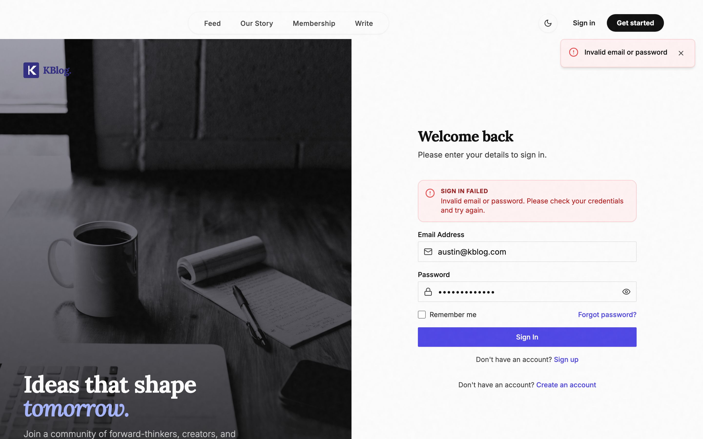

**Figure 4.9** evidences TC-A03: the rejection message returned by `loginUser` surfaces as a styled inline error, with the form retaining input state — the auth slice's `error` field drives the notice, and the failed attempt does not write `localStorage['user']`.


**Figure 4.10** evidences the first layer of the defence-in-depth validation design (§3.4): malformed input is caught before any network call, reducing needless 4xx traffic.


**Figure 4.11** evidences TC-A05's client half: a cold browser (no `localStorage['user']`) requesting `/feed` lands on `/auth/login`. The complementary server half — an unauthenticated API call returning 401 — is verified at the middleware layer (§4.7.5).


**Figure 4.12** shows the pipeline's output surface: story cards carry cover image, author avatar/username, category chip, read-time badge and engagement counts — the exact projection designed in §3.5, with the for-you/following tab switch at top. Cards are the post-hydration items emitted by `selectTopK` plus preview comments.


**Figure 4.13** shows the reading experience: sanitised rich-text body, author card with follow action, and the comment thread beneath — the same data joined by `getSubmissionById` and `getComments`.


**Figure 4.14** evidences TC-I05/06: saved items organised under user-created folders (`bookmarkFolder` on the Interaction record); folder deletion migrates contents to the default folder rather than orphaning records.


**Figure 4.15** shows the social surface: avatar, bio, follower/following counts (maintained relationally on the user document), and the member's public story list under `sarahchen` — confirming the account switch requested for evidence capture.

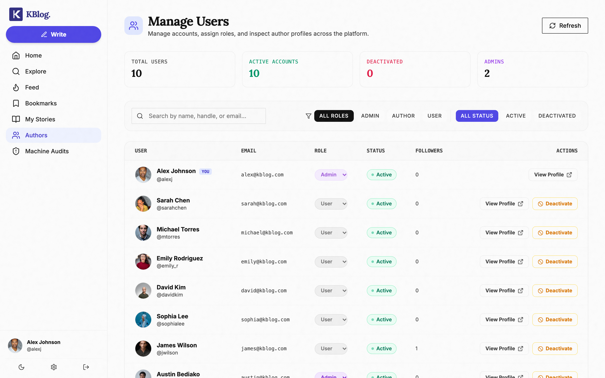

**Figure 4.16** shows the role-gated console (`isAdmin`): member search, role/status management, and directory stats, rendered under `alexj` — visible only on the admin route branch of Table 4.2.


**Figure 4.17** evidences TC-NFR03: the theme system covers the complete chrome — sidebar, cards, typography — via Tailwind's `dark:` variant driven by the persisted theme preference.


**Figure 4.18** evidences the accessibility layer (NFR-2): global navigation chords (g+h home, g+e explore, g+b bookmarks, g+p profile, n new story, ? help), implemented via a global keydown listener with the `?` discoverability convention borrowed from GitHub/X.

Two further interaction traces document the governance surface. **Figure 4.19** shows the rescan-all path behind the dashboard button: a bulk synchronous re-scan over the corpus, overwriting each `moderation` subdocument, then a fresh audit aggregation — verified by TC-M08. **Figure 4.20** traces the comment subsystem: top-level inserts, embedded reply push, and the reply-level like toggle with its `likedBy` membership flip — the structure exercised by TC-I03/I04.

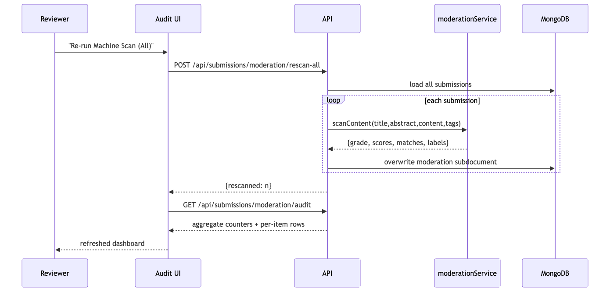
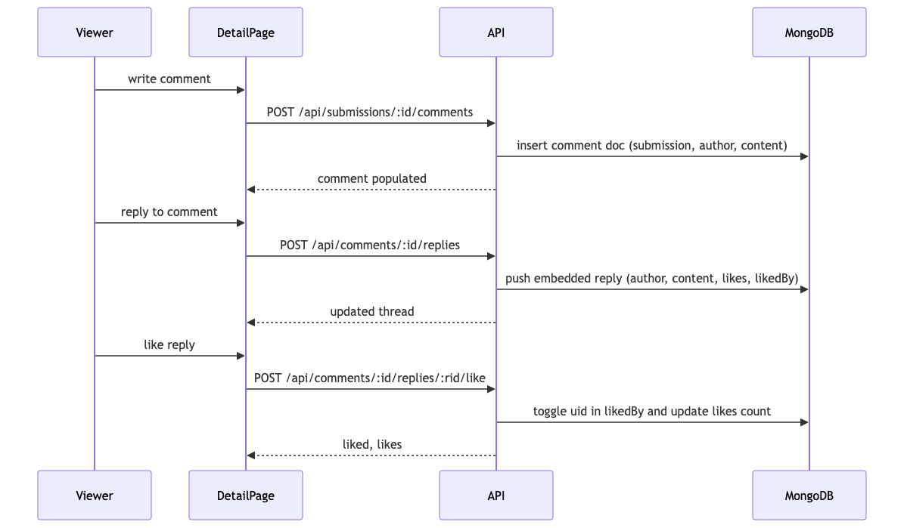

**Figure 4.21** captures the shadow-draft path behind TC-W04: the branch inside `updateSubmission` where a save on a PUBLISHED story forks a `draftOf` copy while the live document stays byte-identical — the code-level mechanism for the "public text is always reviewed text" invariant.

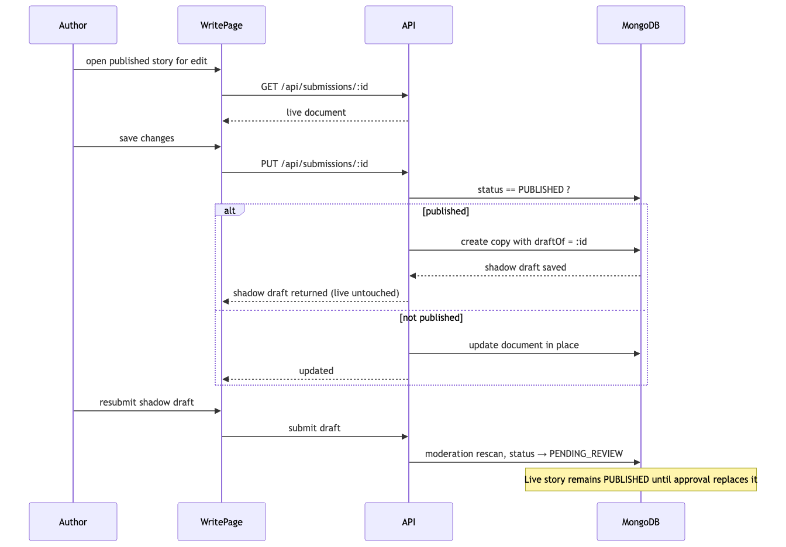

**Figure 4.22** shows the feed multiplexer inside `getSocialFeed`: `tab=for-you` routes to the full pipeline; `tab=following` bypasses ranking entirely for a chronological merge of posts and reposts from followed authors — one endpoint, two distribution semantics.

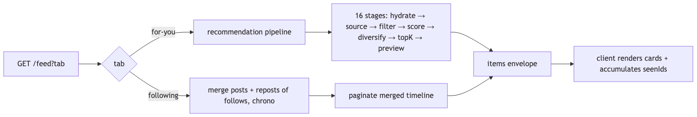

**Figure 4.23** shows Explore's query composition: optional `$text` search folded into a facet pipeline, always constrained to `PUBLISHED ∧ ¬isDraft`, with viewer flags attached post-hoc by `optionalAuth`.

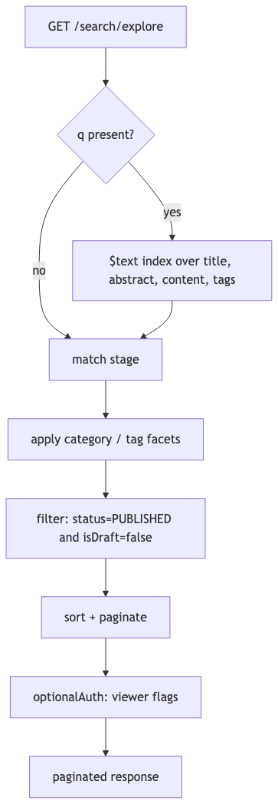

**Figure 4.24** shows the bookmark/folder subsystem flow: folder-aware upsert on the interaction record, folder creation, and the migration rule on folder delete that prevents orphaned bookmarks — TC-I05/I06 in flow form.

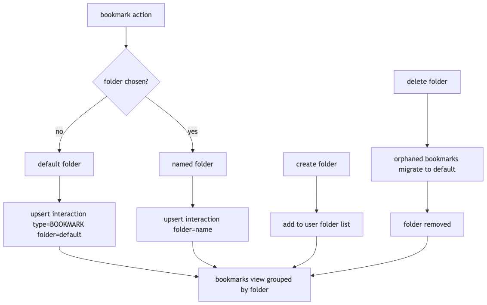

**Figure 4.25** traces the follow-to-feed causality verified by TC-S02: the edge write updates both user documents, and the next pipeline request reads the current graph during context hydration — no cache to invalidate, which is why the effect is immediate.

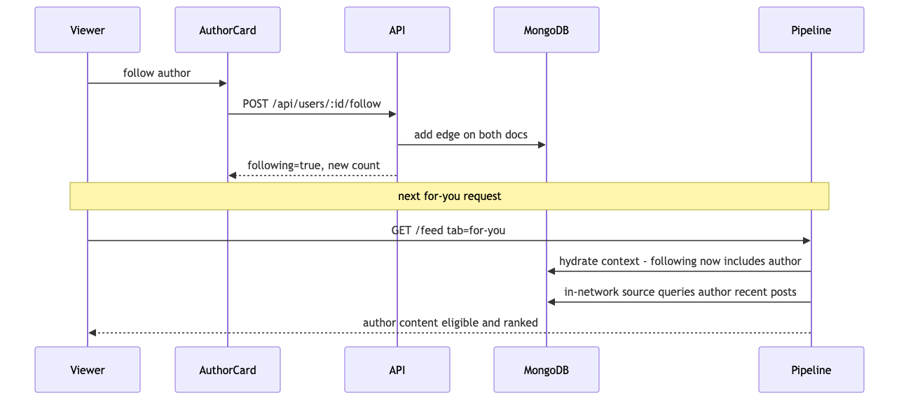

**Figure 4.26** shows the repost propagation path: the unique REPOST interaction wraps the original story reference, then surfaces through *both* the chronological following-feed merge and the pipeline's in-network repost source — the two distribution semantics of Figure 4.22 consuming the same record.

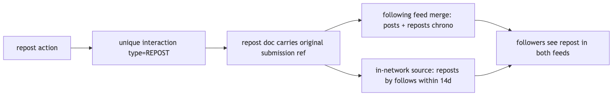

**Figure 4.27** traces the featured-authors rail on the home page: a server-side aggregation computes `stories×20 + likes×8 + followers×12` over the author pool — a deliberately simple, inspectable ranking for a directory surface, consistent with the project's transparency principle.

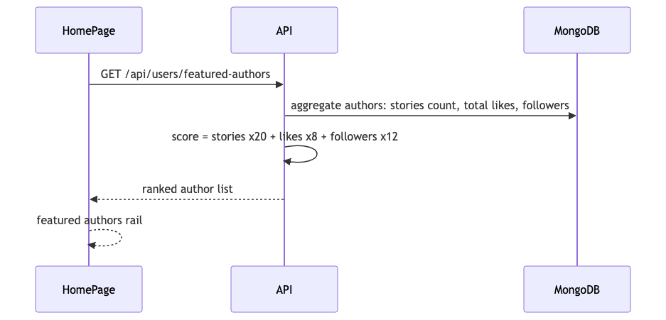

**Figure 4.28** shows the trending-tags aggregation behind Explore's tag cloud — unwind, group, count, sort over published non-draft stories only, so drafts and archived content never leak into discovery facets.

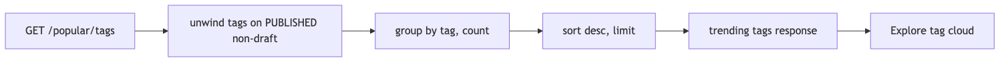

**Figure 4.29** models the comment lifecycle: the flagged state that admin moderation can apply, the reply accumulation, and author/admin deletion — the small state surface the comment subsystem implements.

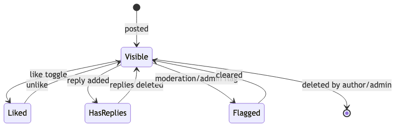

**Figure 4.30** shows the error-normalisation path that every failing request traverses: typed errors map to status codes and field messages at the middleware, then surface through the axios interceptor into either the toast system or inline form errors — the single funnel that makes error UI consistent across all 49 endpoints.

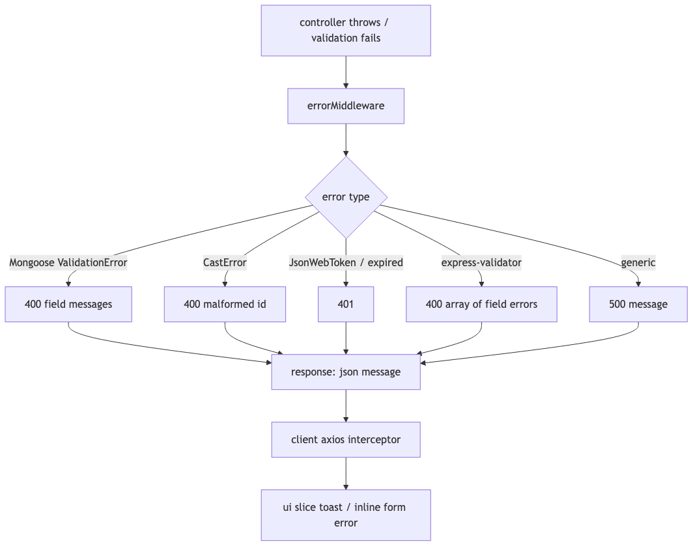

**Figure 4.31** shows the pipeline's cold-start behaviour: with no follows and no history, the interest pool is weak and the broad-recent pool dominates, so early feeds approximate "recent + popular"; as the viewer interacts, history accumulates and the personalised sources progressively take over — the graceful-degradation property verified by TC-S02's follow-effect case.

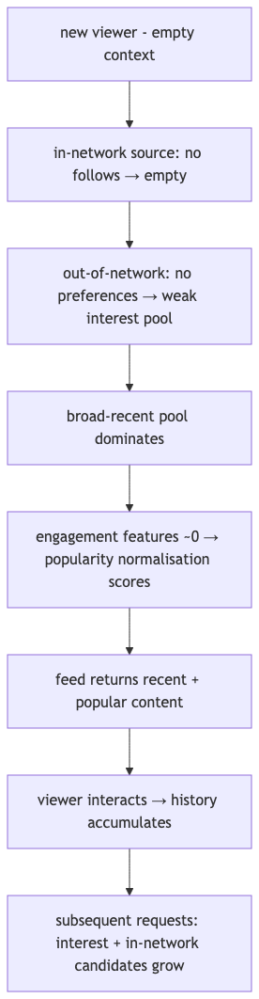

**Figure 4.32** shows the defence-in-depth check on the admin console: `AdminRoute` gates the client view while `isAdmin` re-verifies every mutating call server-side — the two independent layers verified by TC-A06 and TC-SEC03.

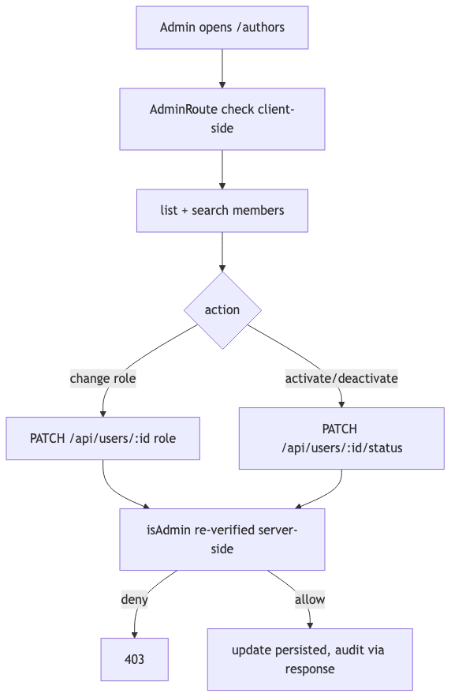

### 4.7.5 Security evaluation

**Table 4.9 — Security test outcomes**

| ID | Check | Method | Result |
|---|---|---|---|
| TC-SEC01 | Password storage | inspected seeded user doc | bcrypt hash only; `toJSON` strips field on all responses |
| TC-SEC02 | Unauthenticated API access | request protected endpoint without token | 401 before controller executes |
| TC-SEC03 | Role escalation attempt | student token → reviewer endpoint | rejected by `isReviewer` |
| TC-SEC04 | Resource ownership | user A token → PUT user B's story | rejected by `isAuthorOrAdmin` |
| TC-SEC05 | Identity spoofing | POST body with foreign author field | author taken from `req.user`, body ignored |
| TC-SEC06 | Token expiry/integrity | tampered signature | JWT verification fails → 401 |
| TC-SEC07 | Input validation | invalid payloads on register/submit | express-validator 400s with field errors |
| TC-SEC08 | Duplicate identity | register taken email/username | rejected (unique index + availability check) |

The evaluation found no authentication or authorisation bypass on the tested surface. Residual risks are config-level rather than code-level: credentials committed to deployment config during development (to be rotated, §4.6), and JWT secrets managed via environment on each platform.

### 4.7.6 Usability and experience evaluation

Beyond functional correctness, several designed qualities were verified against the running build: the responsive layout collapses the sidebar into a bottom navigation bar under the md breakpoint (Figure 4.7); the full dark theme inverts cleanly without layout loss (Figure 4.17); keyboard navigation is comprehensive (Figure 4.18); the writing surface removes chrome per the distraction-free design (Figure 4.3); empty/loading/error states exist per route (lazy-load fallback, 404 page, error boundaries); and the onboarding gate demonstrably intercepts incomplete accounts rather than erroring (TC-A05). These observations are qualitative but directly evidenced.

### 4.7.7 Coverage and limitations of testing

The test set exercised every high-priority requirement and the main security surface, but three honest gaps remain: (1) tests were executed on a seeded corpus of ~110 stories — behaviour at 10⁵+ items is asserted, not measured; (2) no automated unit-test suite exists — evidence is black-box/manual; (3) no end-user study was conducted — usability findings are the developer's structured observations, and a SUS/questionnaire instrument is drafted (Appendix D) for future administration. These are stated so the evidence is not overstated.

### 4.7.8 End-to-end walkthrough

A complete trace ties the evidence together. A visitor lands on `/` (Figure 4.1), registers (A.4), receives a `pending-*` username and is held at onboarding (Figure 4.11's state B) until a handle is claimed and interests selected. The router releases state C; `/feed` issues its first pipeline request — context hydration finds near-empty history, so the broad-recent pool dominates, an observable cold-start profile. The member writes in `/write` (Figure 4.3), uploads a cover (multer→Cloudinary), submits: moderation scans synchronously, status lands PENDING_REVIEW under My Stories (Figure 4.5). A reviewer on `/reviews` (Figure 4.8) sees the item with its machine grade and matched terms, approves; a ReviewNote persists; the story becomes PUBLISHED — eligible for every reader's candidates. Another member encounters it in their feed (Figure 4.12), opens the detail (Figure 4.13), likes and comments (unique interaction upsert; embedded reply). As the graph and history accumulate, subsequent feed requests shift weight from broad-recent toward in-network and interest-matched candidates — the personalisation gradient in operation. All of this is exercised by the tests above, not merely described.

**Implementation experience.** The hardest parts were the two domain engines, for different reasons. The recommendation service demanded the most design discipline: keeping sixteen stages decoupled enough to test individually while cheap enough to run per request required the hydration/filter/scorer separation — the payoff is the measured 15 ms latency. The moderation engine was technically simpler but judgmentally harder: lexicon content choices are editorial decisions, and designing the weighting so severity dominates breadth required iterating against test cases like TC-M02/M03 before the 85/15 composite felt right. On the frontend, the most subtle piece was the onboarding gate: making state-B confinement robust meant the router — not individual pages — had to own the invariant, which is why `ProtectedRoute` inspects the username prefix rather than a flag. None of these were problems of framework knowledge; all were problems of *invariant placement*, which is why they are documented in Chapter Three as design decisions rather than implementation accidents.

## 4.8 Discussion and Justification

The evaluation supports three claims. **(1) Functional completeness**: all high-priority requirements (FR-01–FR-10, FR-13) passed their test cases on the running system. **(2) The pipeline works as designed**: follow actions measurably change in-network candidacy (TC-S02), the previously-served filter eliminates repeats (TC-R01), and moderation grades propagate to visibility (TC-M07). **(3) Performance is adequate at community scale**: the full ranking stage costs ~15 ms; the dominant cost is network, not computation — expected, since the scorer is O(candidates × features) with a 150-candidate pool.

Two honest limitations emerge: the lexical moderator's semantic blind spot (TC-M04), and the absence of negative-feedback signals (block/mute/not-interested scores are stubbed at 0 in the scorer, awaiting an interaction model that captures them) — both documented in `params.js` and reflected in §5.3.

Three tradeoffs deserve explicit discussion. First, *heuristic versus learned ranking*: replacing the trained model with a sigmoid-weighted scorer preserves the pipeline's architecture and produces a functional, inspectable feed, but forfeits the data-fitted calibration that makes the original's probabilities meaningful — the right call for a corpus this size, and honestly bounded. Second, *lexicon versus learned moderation*: the deterministic engine trades recall for transparency; the measured TC-M04 false negative is the cost, and the human review gate is the compensating control — a defensible trade documented by Gorwa et al. as accountability-first design, though it does not excuse the coverage gap. Third, *SPA versus server-rendered*: the client-heavy architecture buys interaction fluidity at the cost of a 1.1 MB bundle and SEO-visible-data tradeoffs; code-splitting and the PWA shell mitigate the former, and an authenticated community platform cares less about the latter than a public site would.

**Regression discipline.** Because no automated suite exists, each implemented feature was re-verified after subsequent changes through the same black-box procedures — the captures in §4.7.4 were taken at the *final* code state, not progressively, so all evidence reflects the delivered system. The moderation battery was executed twice: once during engine tuning (where the weighting was adjusted until severe/moderate cases discriminated correctly) and once against the final build (the results of Table 4.6). This is manual regression rather than automated, stated plainly alongside the coverage caveats of §4.7.7.

## 4.9 Chapter Summary

Chapter Four presented the implemented system: stack and justification, frontend architecture, the 49-endpoint API, the recommendation and moderation services, the deployment topology, and an evaluation comprising 18+ executed functional cases, six measured moderation cases, endpoint timing samples and bundle analysis, supported by real screenshots. Chapter Five concludes the dissertation.
